# Fluxos Principais do Bot Alloha

## Visão Geral da Jornada do Cliente

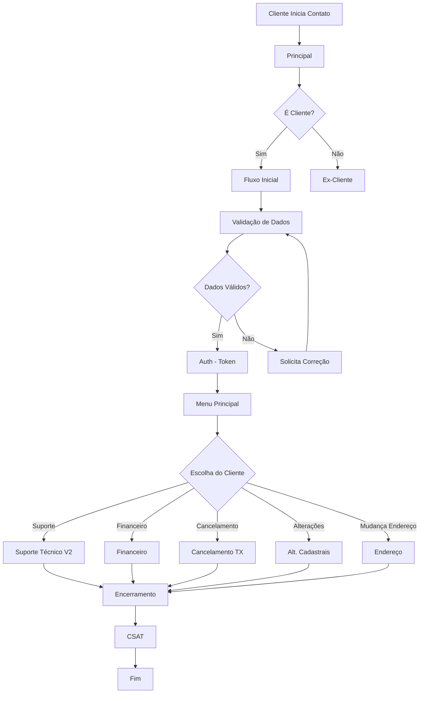

---

## 1. Fluxo Principal (`principal`)

O ponto de entrada do bot, responsável por identificar a intenção inicial do cliente.

### Estrutura

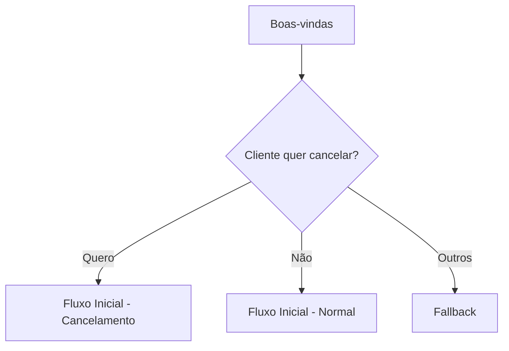

### Componentes

| Tipo | Quantidade |
| --- | --- |
| Mensagens | 2 |
| Múltipla Escolha | 1 |
| Lógicas | 6 |

### Opções do Menu Inicial

- **Quero!** - Direciona para cancelamento
- **Não** - Continua atendimento normal
- **Outros** - Fallback

---

## 2. Fluxo Inicial (`fluxo-inicial`)

Responsável pela identificação e validação inicial do cliente.

### Estrutura

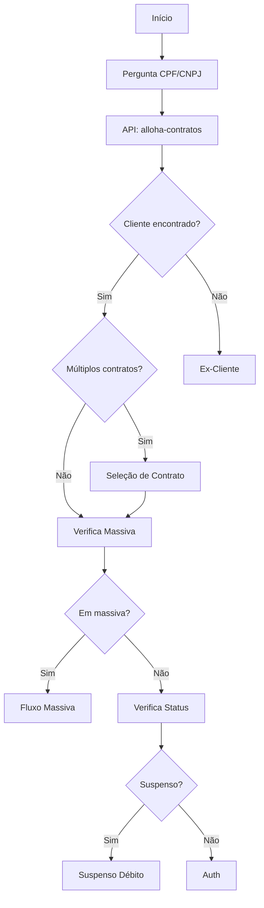

### Componentes

| Tipo | Quantidade |
| --- | --- |
| Mensagens | 10 |
| Perguntas | 4 |
| Múltipla Escolha | 3 |
| Lógicas | 33 |

### APIs Utilizadas

- `alloha-contratos` - Busca contratos do cliente
- `alloha-massiva-v2` - Verifica se há incidente massivo
- `alloha-id` - Busca ID do cliente

---

## 3. Autenticação (`auth`)

Gera e valida token de acesso para operações sensíveis.

### Estrutura

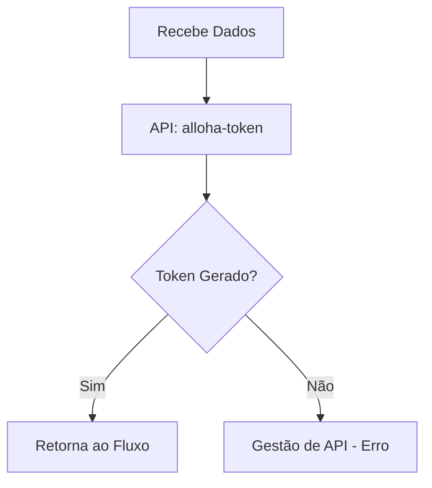

### APIs Utilizadas

- `alloha-token` - Gera token de autenticação

---

## 4. Menu Principal (`menu-principal`)

Hub central de navegação do bot.

### Estrutura

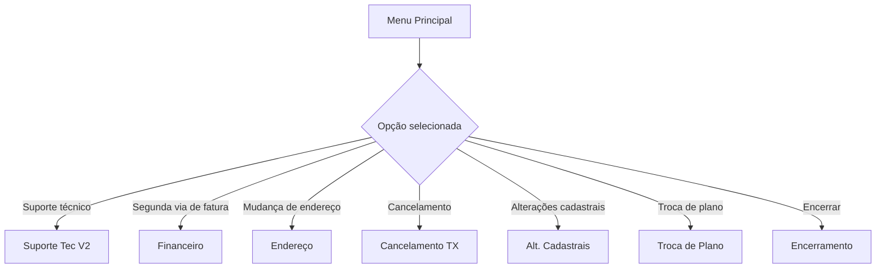

### Opções Disponíveis

| Opção | Fluxo Destino |
| --- | --- |
| Suporte técnico | `suporte-tec-v2` |
| Segunda via de fatura | `financeiro` |
| Mudança de endereço | `endereco` |
| Cancelamento | `cancelamento-tx` |
| Alterações cadastrais | `alt-cadastrais` |
| Troca de plano | `troca-de-plano` |

---

## 5. Validação de Dados (`validacao-dados`)

Valida e confirma dados do cliente antes de operações sensíveis.

### Estrutura

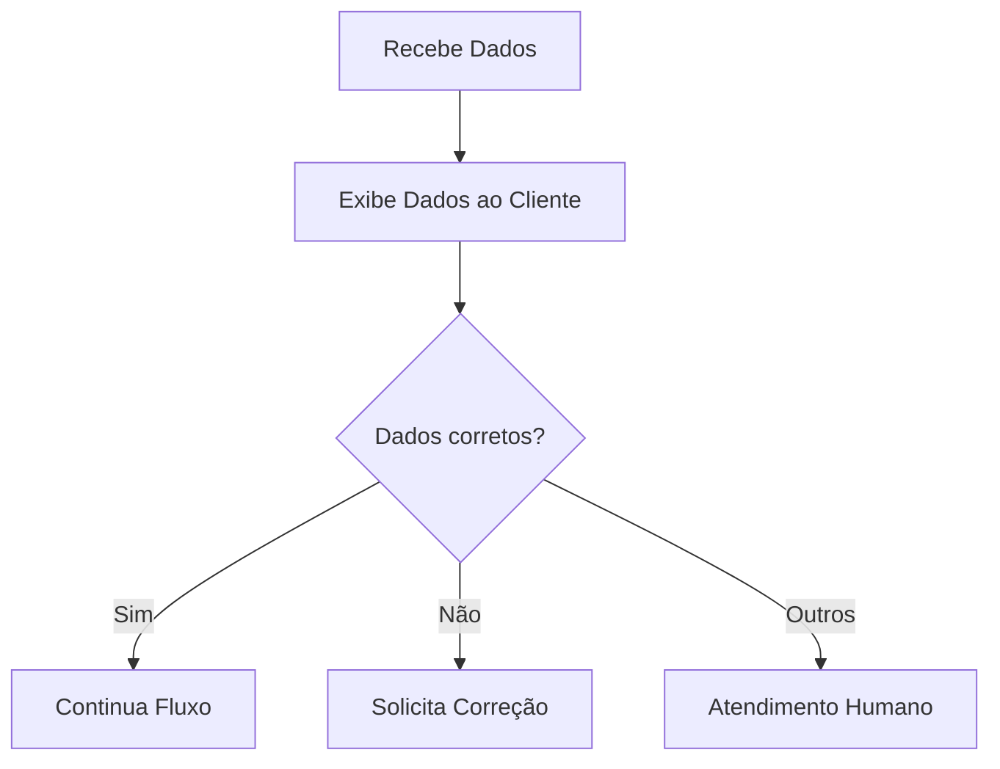

### Componentes

| Tipo | Quantidade |
| --- | --- |
| Mensagens | 3 |
| Perguntas | 2 |
| Múltipla Escolha | 1 |
| Lógicas | 6 |

---

## 6. Validação de Token (`validacao-token`)

Valida token SMS enviado ao cliente para operações seguras.

### Estrutura

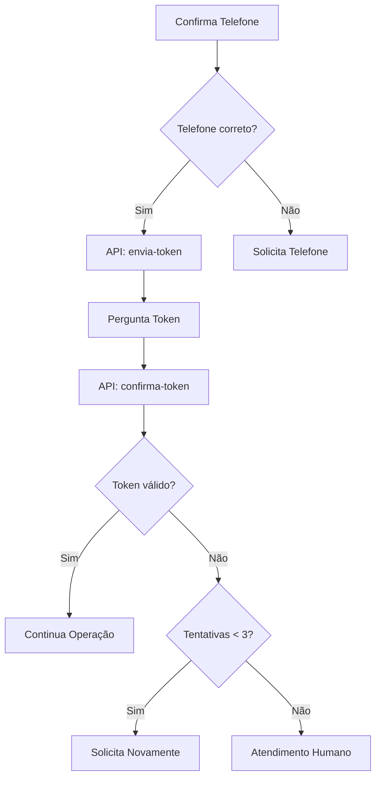

### APIs Utilizadas

- `envia-token` - Envia SMS com token
- `confirma-token` - Valida token informado
- `verifica-validacao` - Verifica status da validação

---

## 7. Encerramento (`encerramento`)

Finaliza o atendimento e limpa variáveis de sessão.

### Estrutura

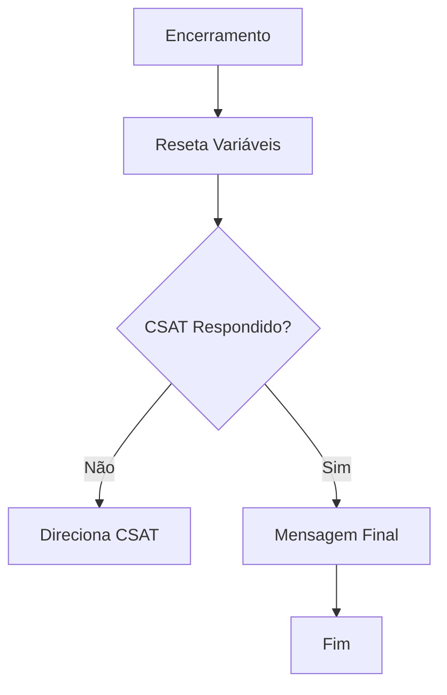

### Componentes

| Tipo | Quantidade |
| --- | --- |
| Lógicas | 8 |

---

## 8. CSAT (`csat`)

Pesquisa de satisfação do cliente.

### Estrutura

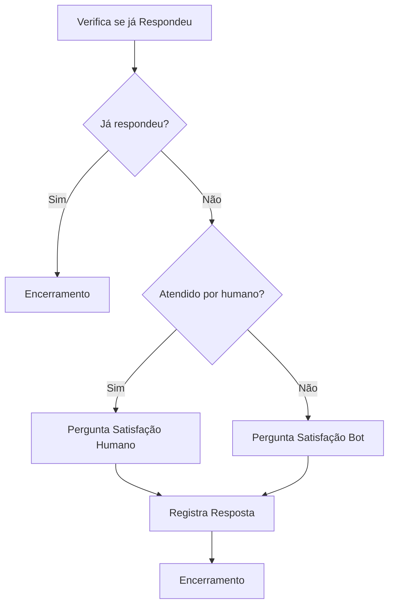

### Opções de Resposta

- **Sim** - Satisfeito
- **Não** - Insatisfeito
- **Outros** - Comentário livre

---

## 9. Fallback (`fallback`)

Tratamento de mensagens não reconhecidas.

### Estrutura

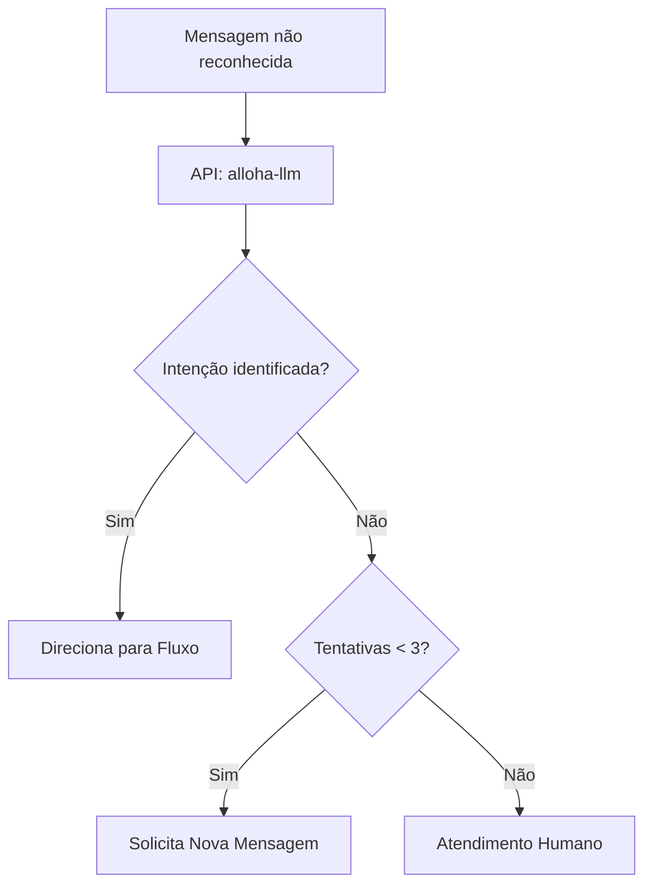

### APIs Utilizadas

- `alloha-llm` - Análise de linguagem natural com LLM

---

## 10. Gestão de API (`gestao-api`)

Tratamento centralizado de erros de API.

### Estrutura

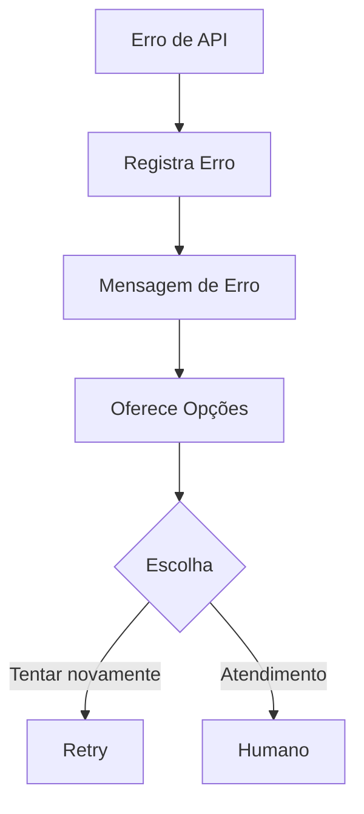

---

## Variáveis de Contexto Principais

| Variável | Descrição | Escopo |
| --- | --- | --- |
| `vars.cpf` | CPF do cliente | Global |
| `vars.customer_id` | ID do cliente | Global |
| `vars.contract_number` | Número do contrato | Global |
| `vars.token` | Token de autenticação | Sessão |
| `vars.protocol` | Protocolo de atendimento | Sessão |
| `vars.phone` | Telefone do cliente | Global |
| `vars.csat_respondido` | Flag de CSAT respondido | Sessão |

---

## Próximo: [02-fluxo-financeiro.md](./02-fluxo-financeiro.md)
