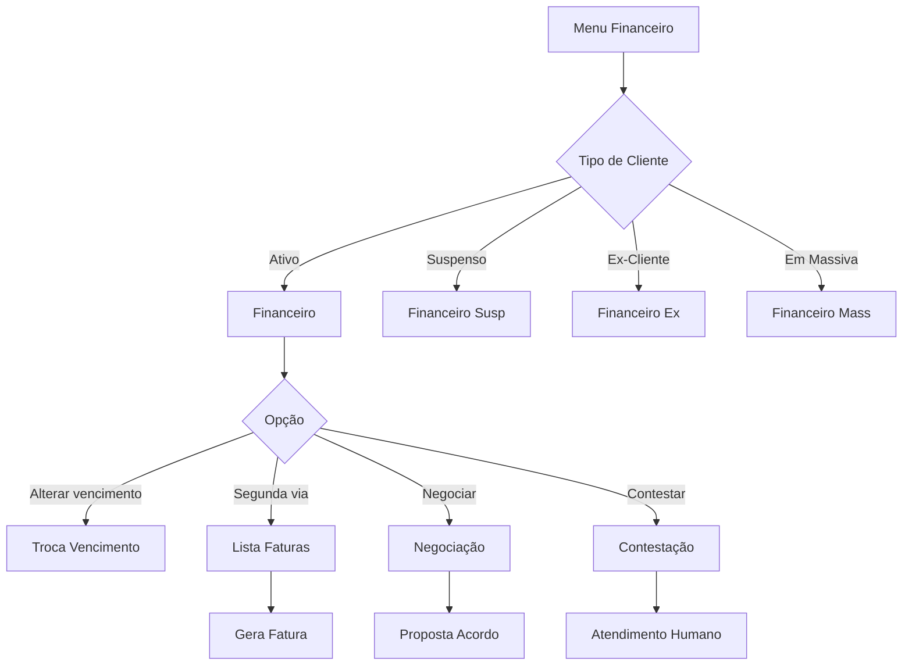
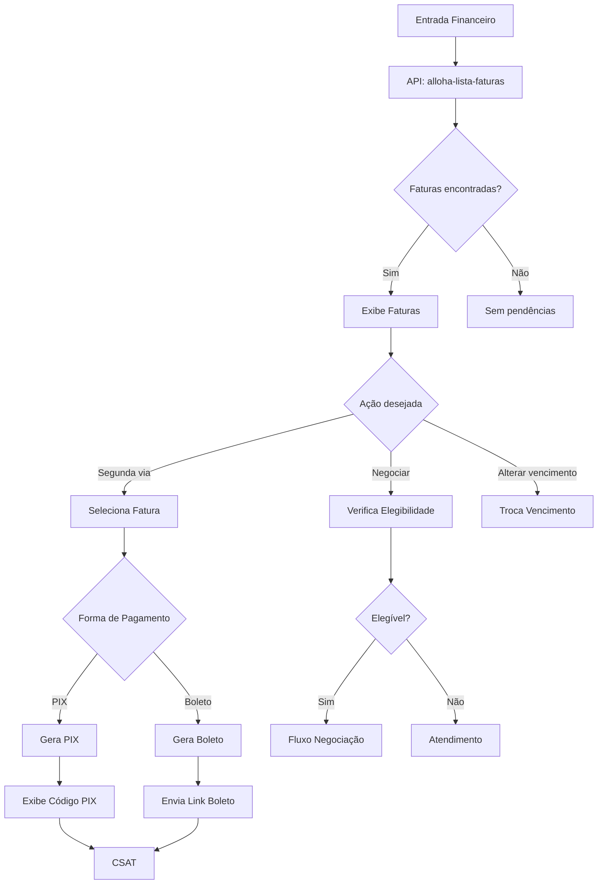
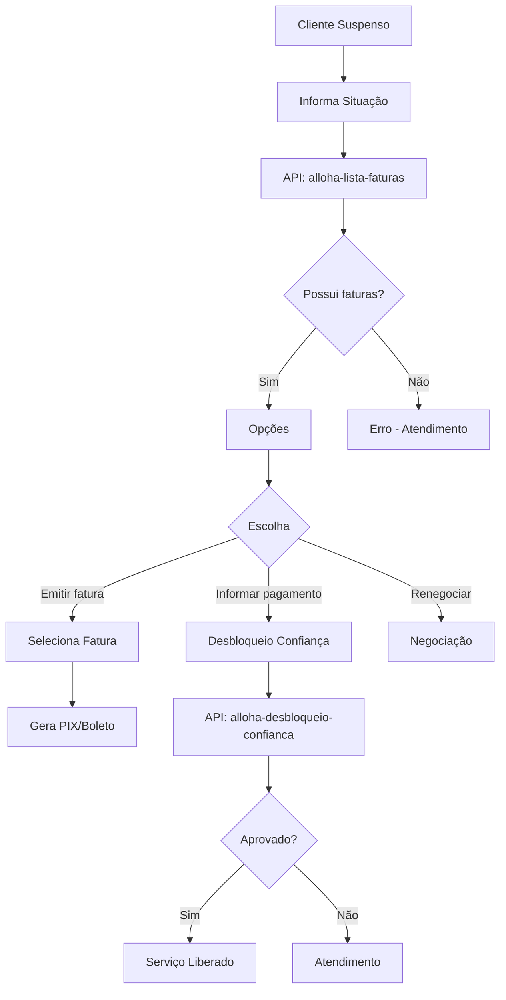
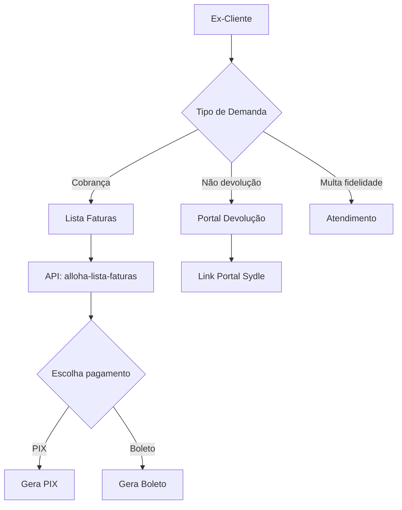
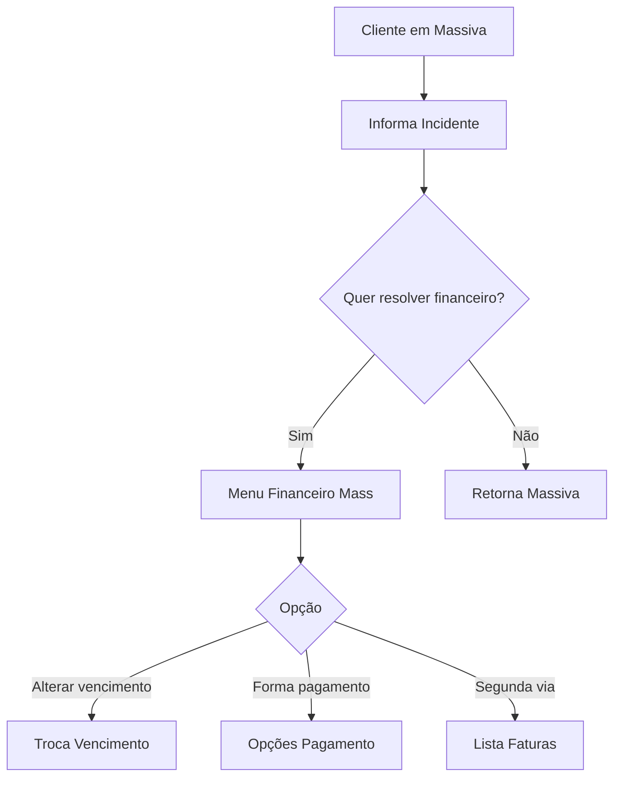
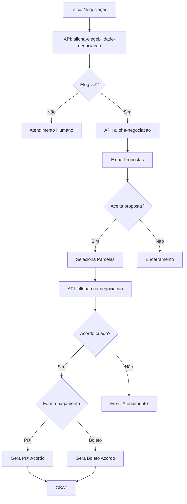
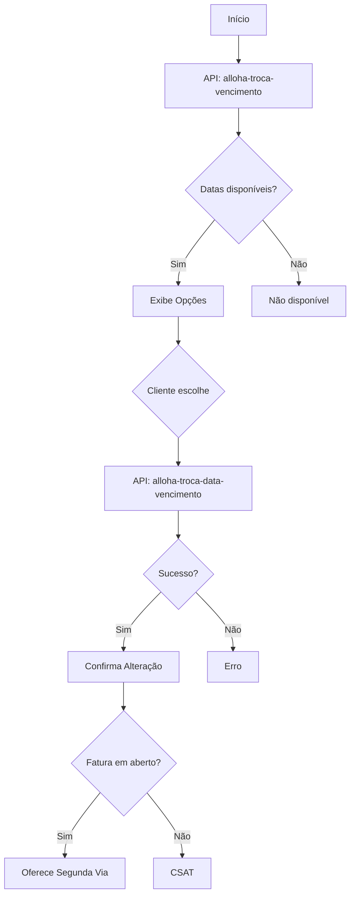
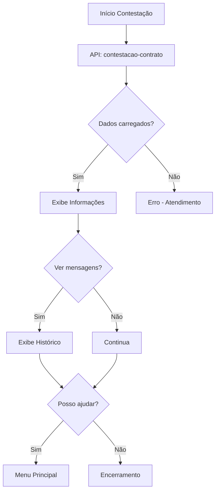

# Fluxo Financeiro do Bot Alloha

## Visão Geral

O módulo financeiro gerencia todas as operações relacionadas a faturas, pagamentos, negociações e contestações.



---

## 1. Financeiro (`financeiro`)

Fluxo principal para clientes ativos com pendências financeiras.

### Menu de Opções

| Opção | Descrição | Destino |
| --- | --- | --- |
| Alterar vencimento | Troca data de vencimento | `troca-venciment` |
| Forma de pagamento | Opções de pagamento | Menu interno |
| Segunda via de fatura | Emissão de boleto/PIX | Geração fatura |
| Voltar ao menu | Retorna ao menu principal | `menu-principal` |

### Fluxograma Detalhado



### APIs Utilizadas

| API | Método | Descrição |
| --- | --- | --- |
| `alloha-lista-faturas` | POST | Lista faturas do contrato |
| `alloha-elegebilidade-negociacao` | POST | Verifica elegibilidade para acordo |
| `alloha-gera-protocolo` | POST | Gera protocolo de atendimento |

### Componentes

| Tipo | Quantidade |
| --- | --- |
| Mensagens | 15 |
| Perguntas | 1 |
| Múltipla Escolha | 11 |
| Lógicas | 42 |

---

## 2. Financeiro Suspenso (`financeiro-susp`)

Fluxo para clientes com serviço suspenso por inadimplência.

### Fluxograma



### Opções do Menu

- **Informar pagamento** - Desbloqueio por confiança
- **Emitir segunda via** - Gera nova fatura
- **Renegociar débitos** - Inicia negociação

### APIs Utilizadas

| API | Descrição |
| --- | --- |
| `alloha-lista-faturas` | Lista faturas pendentes |
| `alloha-desbloqueio-confianca` | Solicita desbloqueio |
| `alloha-desbloqueio-comprovante` | Envia comprovante de pagamento |

---

## 3. Financeiro Ex-Cliente (`financeiro-ex`)

Fluxo para ex-clientes com pendências.

### Fluxograma



### Opções do Menu

- **Cobrança** - Faturas em aberto
- **Não devolução** - Devolução de valores
- **Multa por fidelidade** - Contestação

### Portal de Devolução

Link: `https://portal-gigamaisfibra.sydle.com/devolucao-de-credito`

---

## 4. Financeiro Massiva (`financeiro-mass`)

Fluxo financeiro durante incidentes massivos.

### Fluxograma



---

## 5. Negociação (`negociacao`)

Fluxo de renegociação de débitos.

### Fluxograma Detalhado



### APIs Utilizadas

| API | Descrição |
| --- | --- |
| `alloha-elegebilidade-negociacao` | Verifica se pode negociar |
| `alloha-negociacao` | Busca propostas disponíveis |
| `alloha-cria-negociacao` | Formaliza acordo |
| `llm-negocia` | LLM para negociação inteligente |
| `llm-negocia-similarity` | Análise de intenção |

### Parâmetros da Negociação

```json
{
  "auth": "token",
  "contract_number": "123456",
  "cpf_cnpj": "12345678900",
  "customer_id": "CUS123",
  "phone": "11999999999",
  "protocol": "PROT123",
  "id_negotiation": "NEG001",
  "id_parcel_group": "PARC01",
  "invoices": ["FAT001", "FAT002"],
  "parcel_quantity": 3
}
```

---

## 6. Troca de Vencimento (`troca-venciment`)

Alteração da data de vencimento das faturas.

### Fluxograma



### APIs Utilizadas

| API | Descrição |
| --- | --- |
| `alloha-troca-vencimento` | Lista datas disponíveis |
| `alloha-troca-data-vencimento` | Efetua a troca |

---

## 7. Contestação Financeira (`contestacao-fin`)

Fluxo para contestação de cobranças.

### Fluxograma



---

## Filas de Atendimento Financeiro

| Situação | Fila |
| --- | --- |
| Cobrança geral | Giga-cobrança-chat |
| Cobrança ATEX | Giga_Atex_Cobrança_Chat |
| Cobrança NCC | GIGA_COBRANÇA_NCC_CHAT |
| Fatura SAC | Giga_sac_fatura_chat |
| Reajuste | Giga_sac_reajuste_chat |

---

## Variáveis do Módulo Financeiro

| Variável | Descrição |
| --- | --- |
| `vars.faturas` | Lista de faturas |
| `vars.fatura_selecionada` | Fatura escolhida |
| `vars.valor_total` | Valor total devido |
| `vars.proposta_aceita` | Proposta de negociação |
| `vars.parcelas` | Número de parcelas |
| `vars.pix_code` | Código PIX gerado |
| `vars.boleto_url` | URL do boleto |

---

## Próximo: [03-fluxo-suporte-tecnico.md](./03-fluxo-suporte-tecnico.md)
