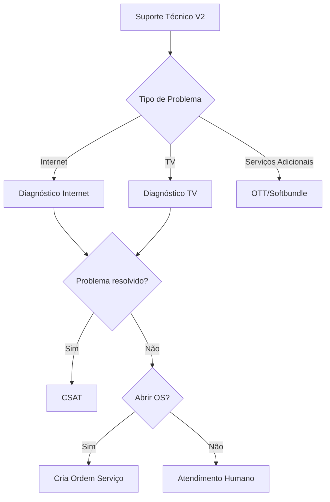
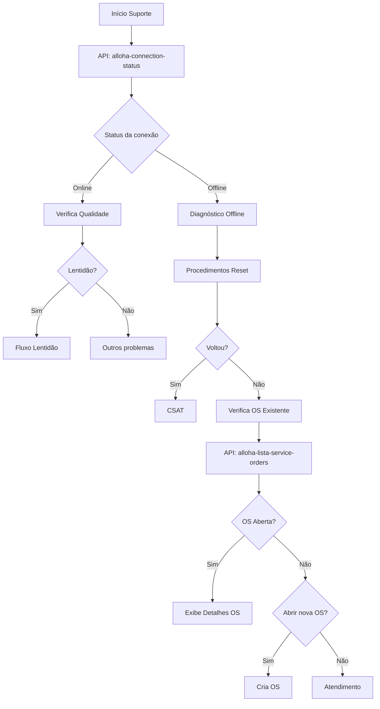
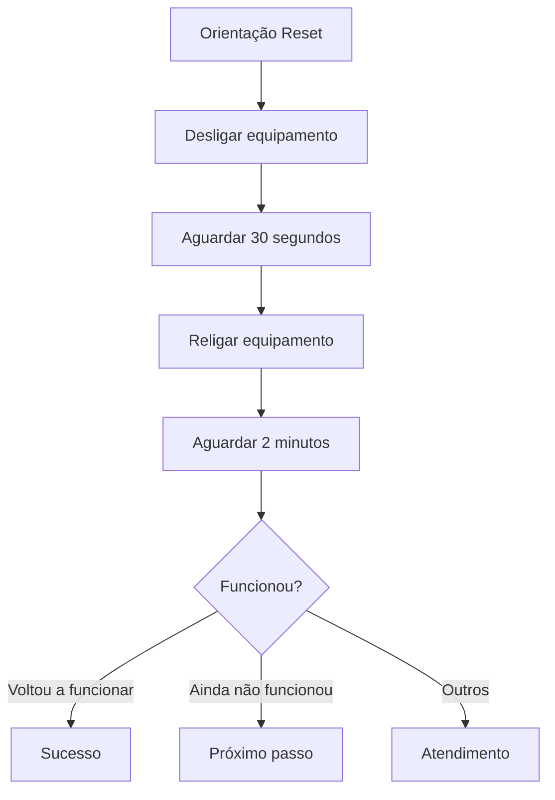
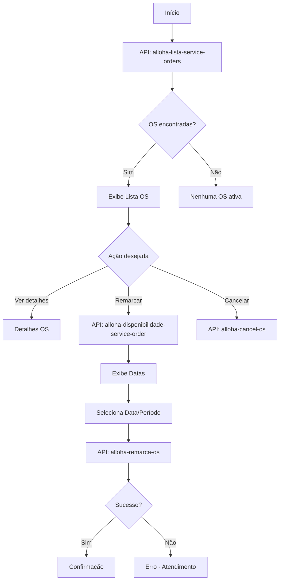
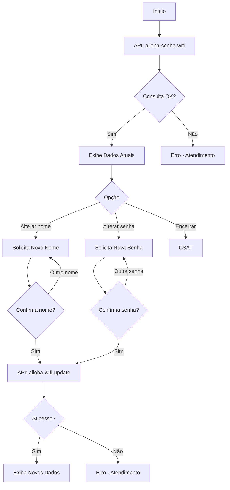
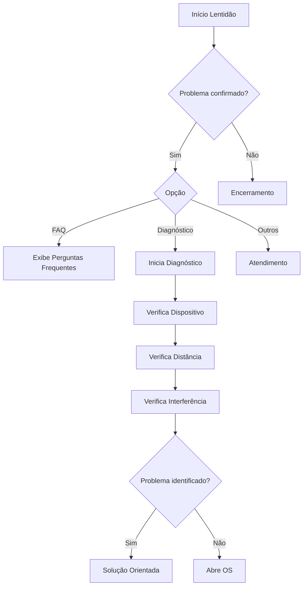
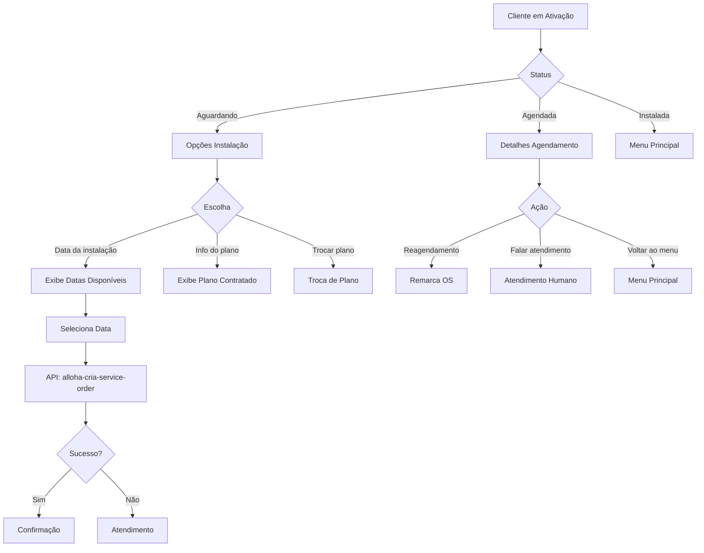
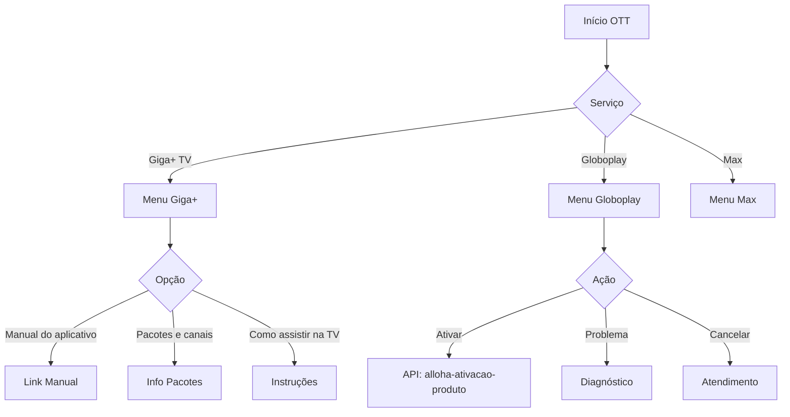
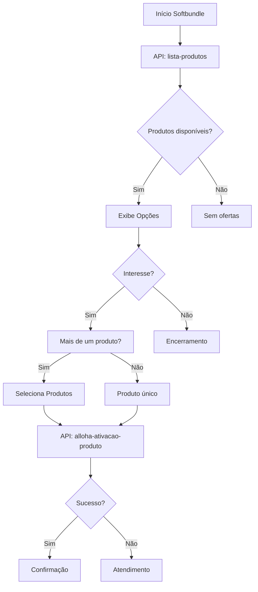

# Fluxo de Suporte Técnico do Bot Alloha

## Visão Geral

O módulo de suporte técnico é o mais extenso do bot, com 116 blocos, oferecendo diagnóstico e resolução de problemas de conexão, TV e serviços adicionais.



---

## 1. Suporte Técnico V2 (`suporte-tec-v2`)

### Menu Principal de Suporte

| Opção | Ícone | Descrição |
| --- | --- | --- |
| Internet | 🌐 | Problemas de conexão |
| TV | 📺 | Problemas com TV |
| Serviços adicionais | ➕ | OTT, streaming |

### Fluxograma de Diagnóstico



### Procedimentos de Reset



### APIs Utilizadas

| API | Descrição |
| --- | --- |
| `alloha-connection-status` | Verifica status da conexão |
| `alloha-lista-service-orders` | Lista ordens de serviço |
| `alloha-cria-service-order` | Abre nova ordem de serviço |
| `alloha-cancel-os` | Cancela ordem de serviço |
| `alloha-remarca-os` | Remarca visita técnica |
| `alloha-disponibilidade-service-order` | Verifica disponibilidade de agenda |

### Componentes

| Tipo | Quantidade |
| --- | --- |
| Mensagens | 18 |
| Perguntas | 1 |
| Múltipla Escolha | 10 |
| Lógicas | 56 |

---

## 2. Consulta de Reparo (`cons-de-reparo`)

Consulta e acompanhamento de ordens de serviço existentes.

### Fluxograma



### Parâmetros de Ordem de Serviço

```json
{
  "auth": "token",
  "contract_number": "123456",
  "cpf": "12345678900",
  "customer_id": "CUS123",
  "phone": "11999999999",
  "protocol": "PROT123",
  "id_motive": "MOT01",
  "id_service": "SVC01",
  "day": "2024-01-15",
  "period": "MANHA",
  "observation": "Cliente relatou sem conexão"
}
```

---

## 3. Senha WiFi (`senha-wifi`)

Alteração de nome e senha da rede WiFi.

### Fluxograma



### APIs Utilizadas

| API | Descrição |
| --- | --- |
| `alloha-senha-wifi` | Consulta dados WiFi atuais |
| `alloha-wifi-update` | Atualiza nome/senha WiFi |

### Parâmetros de Atualização WiFi

```json
{
  "auth": "token",
  "contract_number": "123456",
  "cpf": "12345678900",
  "customer_id": "CUS123",
  "phone": "11999999999",
  "protocol": "PROT123",
  "id": "WIFI001",
  "nome": "MinhaRedeWiFi",
  "senha": "senhanova123",
  "serial": "SN123456",
  "type": "2.4GHz"
}
```

---

## 4. Lentidão (`lentidao`)

Diagnóstico específico para problemas de velocidade.

### Fluxograma



### Menu de Opções

| Opção | Ícone | Descrição |
| --- | --- | --- |
| FAQ | 🔍 | Perguntas frequentes |
| Diagnóstico | 📝 | Diagnóstico guiado |
| Outros | - | Atendimento humano |

---

## 5. Fluxo de Ativação (`fluxo-ativacao`)

Acompanhamento de instalação para novos clientes.

### Fluxograma



### APIs Utilizadas

| API | Descrição |
| --- | --- |
| `alloha-disponibilidade-service-order` | Agenda disponível |
| `alloha-cria-service-order` | Agenda instalação |
| `alloha-remarca-os` | Remarca instalação |

---

## 6. OTT - Serviços de Streaming (`ott`)

Suporte para serviços de streaming adicionais.

### Serviços Disponíveis

| Serviço | Opções de Suporte |
| --- | --- |
| Giga+ TV | Manual, Pacotes, Como assistir |
| Globoplay | Ativação, Problemas, Cancelamento |
| Max | Ativação, Problemas, Cancelamento |

### Fluxograma



### APIs Utilizadas

| API | Descrição |
| --- | --- |
| `alloha-ativacao-produto` | Ativa produto OTT |
| `recomendacao-ott` | Recomenda serviços |
| `confirma-recomendacao-ott` | Confirma recomendação |
| `lista-produtos` | Lista produtos disponíveis |

---

## 7. Softbundle (`softbundle`)

Pacotes combinados de serviços.

### Fluxograma



---

## Filas de Atendimento Técnico

| Situação | Fila |
| --- | --- |
| Suporte Geral | Giga_Sac_Suporte_Chat |
| OTT | Giga_Sac_OTT_CHAT |
| OTT ATEX | Giga_Atex_OTT_Chat |
| Reincidente | Giga-Reincidente-CHAT |
| Reincidente ATEX | Giga_Atex_Reincidente_Chat |

---

## Motivos de Ordem de Serviço

| ID | Motivo |
| --- | --- |
| MOT01 | Sem conexão |
| MOT02 | Lentidão |
| MOT03 | Intermitência |
| MOT04 | Problema equipamento |
| MOT05 | Mudança de cômodo |

---

## Variáveis do Módulo Suporte

| Variável | Descrição |
| --- | --- |
| `vars.connection_status` | Status da conexão |
| `vars.os_list` | Lista de OS |
| `vars.os_selecionada` | OS escolhida |
| `vars.data_agendamento` | Data selecionada |
| `vars.periodo` | Período (manhã/tarde) |
| `vars.wifi_nome` | Nome da rede WiFi |
| `vars.wifi_senha` | Senha WiFi |

---

## Próximo: [04-fluxo-negociacao.md](./04-fluxo-negociacao.md)
