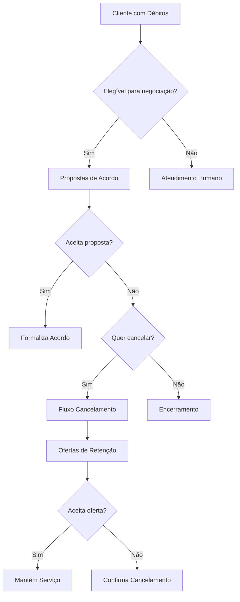
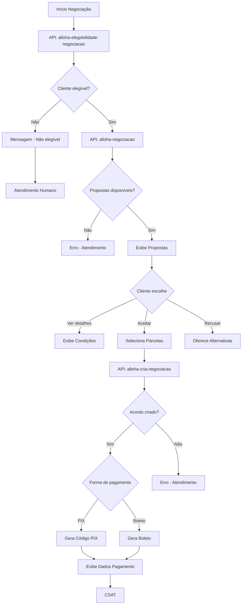
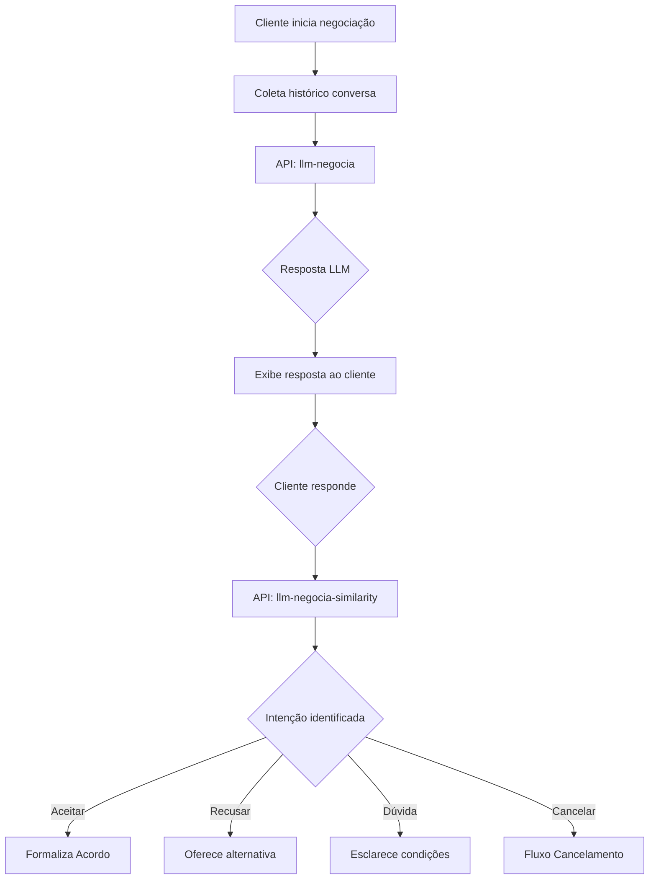
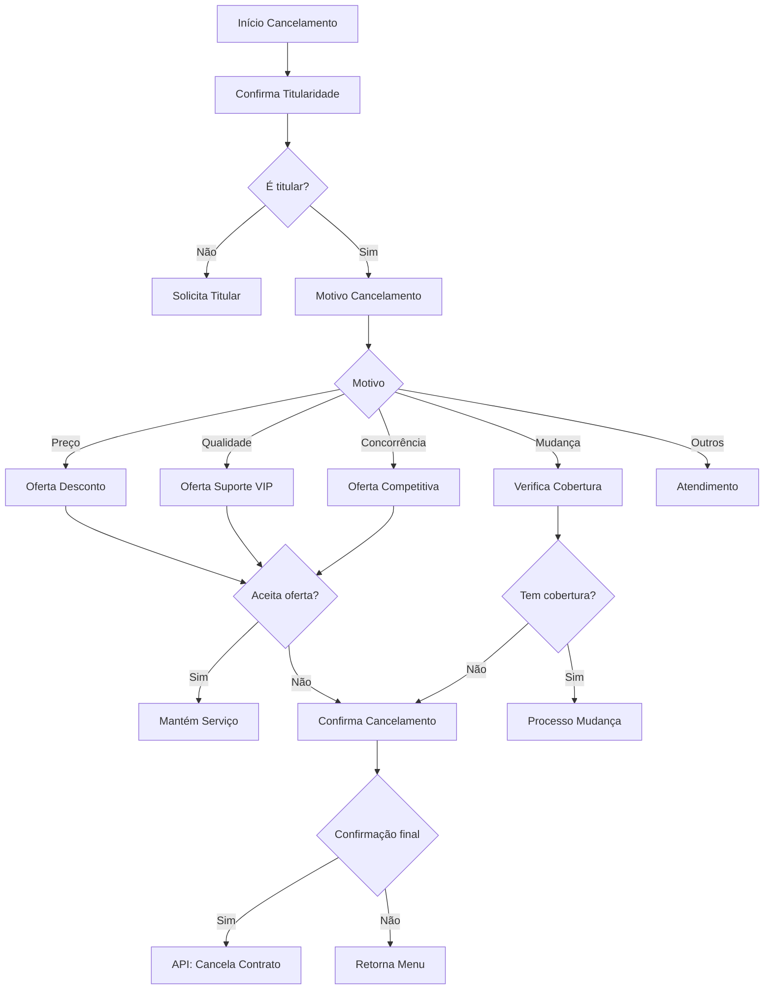
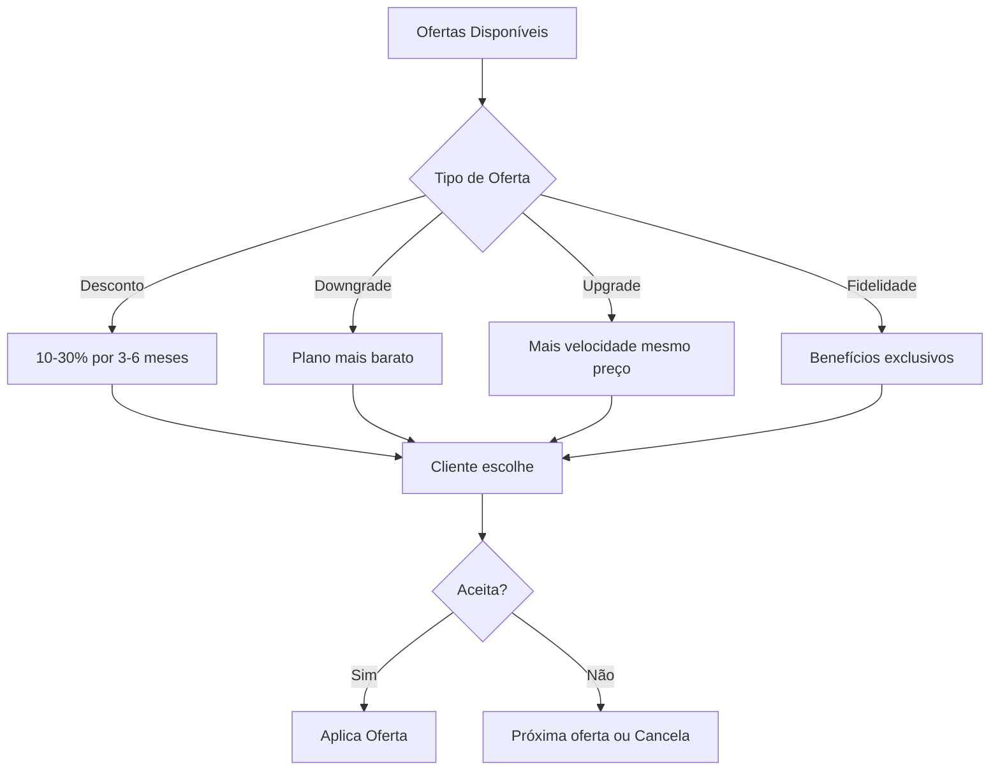
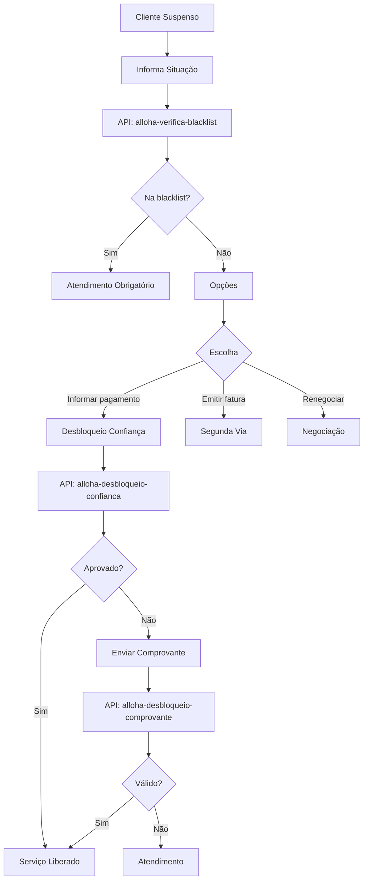
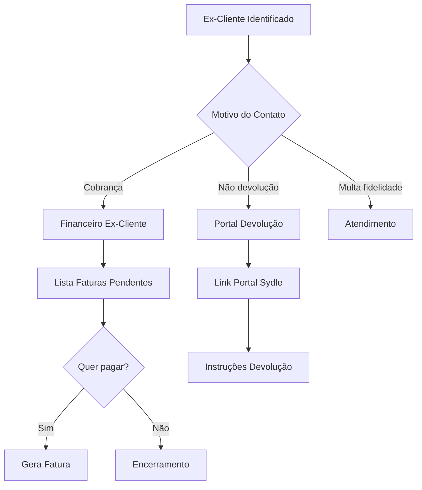
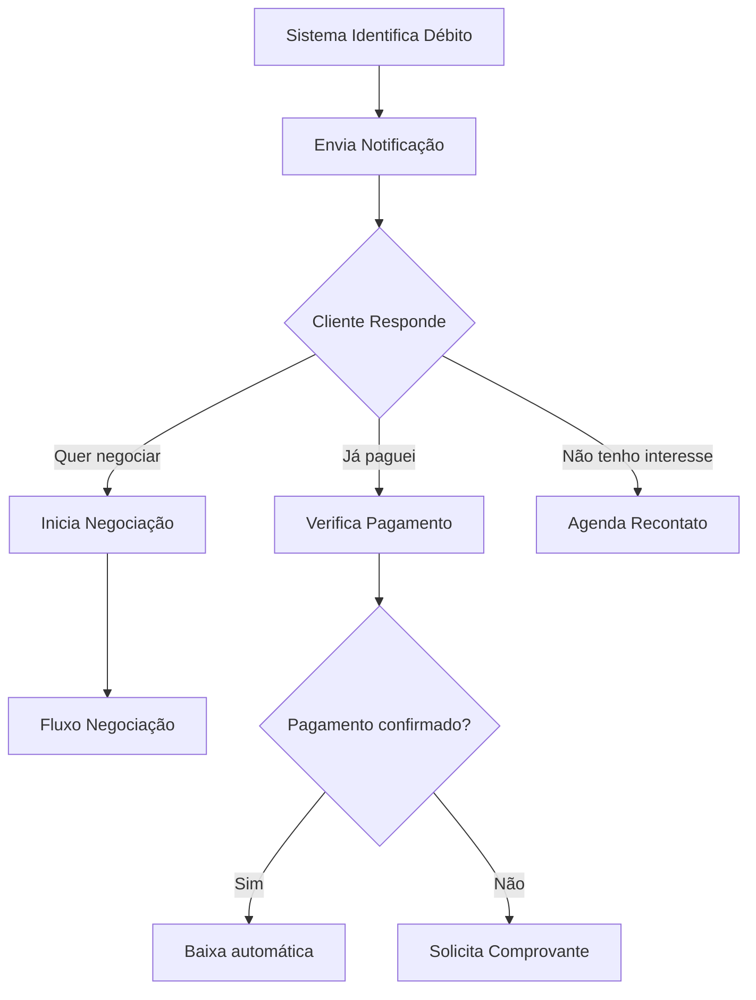

# Fluxo de Negociação e Cancelamento do Bot Alloha

## Visão Geral

Este documento detalha os fluxos de negociação de débitos, retenção de clientes e processo de cancelamento.



---

## 1. Negociação de Débitos (`negociacao`)

### Fluxo Completo de Negociação



### Estrutura da Proposta de Negociação

```json
{
  "id_negotiation": "NEG123456",
  "total_debt": 450.00,
  "proposals": [
    {
      "id_parcel_group": "PARC01",
      "description": "À vista com 30% desconto",
      "parcel_quantity": 1,
      "parcel_value": 315.00,
      "total_value": 315.00,
      "discount_percentage": 30
    },
    {
      "id_parcel_group": "PARC02",
      "description": "3x sem juros",
      "parcel_quantity": 3,
      "parcel_value": 150.00,
      "total_value": 450.00,
      "discount_percentage": 0
    },
    {
      "id_parcel_group": "PARC03",
      "description": "6x com juros",
      "parcel_quantity": 6,
      "parcel_value": 85.00,
      "total_value": 510.00,
      "discount_percentage": -13
    }
  ]
}
```

### APIs Utilizadas na Negociação

| API | Método | Descrição |
| --- | --- | --- |
| `alloha-elegebilidade-negociacao` | POST | Verifica se cliente pode negociar |
| `alloha-negociacao` | POST | Busca propostas disponíveis |
| `alloha-cria-negociacao` | POST | Formaliza o acordo |
| `llm-negocia` | POST | IA para conversação de negociação |
| `llm-negocia-similarity` | POST | Análise de intenção do cliente |

### Parâmetros de Criação de Acordo

```json
{
  "auth": "token_autenticacao",
  "contract_number": "123456",
  "cpf_cnpj": "12345678900",
  "customer_id": "CUS123",
  "phone": "11999999999",
  "protocol": "PROT20240115001",
  "id_negotiation": "NEG123456",
  "id_parcel_group": "PARC01",
  "invoices": ["FAT001", "FAT002", "FAT003"],
  "parcel_quantity": 1,
  "negotiation": {
    "discount": 30,
    "conditions": "À vista"
  }
}
```

---

## 2. Negociação com LLM (`llm-negocia`)

O bot utiliza um modelo de linguagem para negociações mais complexas.

### Fluxo com IA



### Parâmetros LLM

```json
{
  "history": [
    {"role": "assistant", "content": "Olá! Vi que você tem débitos..."},
    {"role": "user", "content": "Quero pagar, mas está difícil"}
  ],
  "pergunta": "Posso parcelar em mais vezes?",
  "resp": "sim",
  "buttons": ["Aceitar proposta", "Ver outras opções", "Falar com atendente"]
}
```

---

## 3. Cancelamento (`cancelamento-tx`)

### Fluxo de Cancelamento com Retenção



### Menu de Motivos de Cancelamento

| Opção | Tratamento |
| --- | --- |
| Preço alto | Ofertas de desconto/downgrade |
| Mudança de endereço | Verifica cobertura no novo endereço |
| Qualidade do serviço | Oferece suporte prioritário |
| Oferta da concorrência | Proposta competitiva |
| Não utilizo mais | Planos mais econômicos |
| Outros | Atendimento humano |

### Ofertas de Retenção



---

## 4. Suspensão por Débito (`suspenso-debito`)

### Fluxo para Clientes Suspensos



### Desbloqueio por Confiança

Condições:
- Primeira vez nos últimos 6 meses
- Débito inferior a R$ 500,00
- Tempo de cliente superior a 3 meses

### Parâmetros de Desbloqueio

```json
{
  "auth": "token",
  "contract_number": "123456",
  "cpf": "12345678900",
  "customer_id": "CUS123",
  "phone": "11999999999",
  "protocol": "PROT123"
}
```

### Parâmetros de Comprovante

```json
{
  "auth": "token",
  "contract_number": "123456",
  "invoce_code": "FAT123456",
  "file_name": "comprovante.pdf",
  "file_extension": "pdf",
  "file_url": "https://storage.../comprovante.pdf"
}
```

---

## 5. Ex-Cliente (`ex-cliente`)

### Fluxo para Ex-Clientes



### Opções para Ex-Clientes

| Demanda | Tratamento |
| --- | --- |
| Cobrança indevida | Análise e estorno |
| Devolução de valores | Portal de autoatendimento |
| Multa de fidelidade | Atendimento humano para análise |
| Retorno como cliente | Verificação de disponibilidade |

---

## 6. Fluxo de Notificação de Negociação (`notifica-neg`)

### Notificações Proativas



### Parâmetros de Notificação

```json
{
  "auth": "token",
  "contract_number": "123456",
  "cpf": "12345678900",
  "customer_id": "CUS123",
  "phone": "11999999999",
  "protocol": "PROT123",
  "negotiation_type": "proactive",
  "debt_amount": 350.00,
  "days_overdue": 15
}
```

---

## Filas de Atendimento - Negociação

| Situação | Fila |
| --- | --- |
| Negociação geral | Giga-cobrança-chat |
| Cancelamento | Giga_Retencao_Chat |
| Ex-cliente | GIGA_COBRANÇA_NCC_CHAT |
| Reincidente | Giga-Reincidente-CHAT |

---

## Variáveis do Módulo

| Variável | Descrição |
| --- | --- |
| `vars.elegivel_negociacao` | Se cliente pode negociar |
| `vars.propostas` | Lista de propostas |
| `vars.proposta_selecionada` | Proposta escolhida |
| `vars.acordo_id` | ID do acordo formalizado |
| `vars.motivo_cancelamento` | Razão do cancelamento |
| `vars.oferta_retencao` | Oferta de retenção |
| `vars.blacklist` | Se está na blacklist |

---

## Próximo: [05-apis-integracoes.md](./05-apis-integracoes.md)
