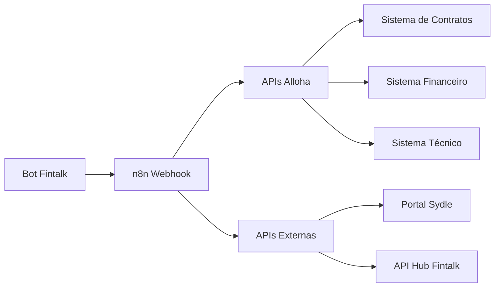
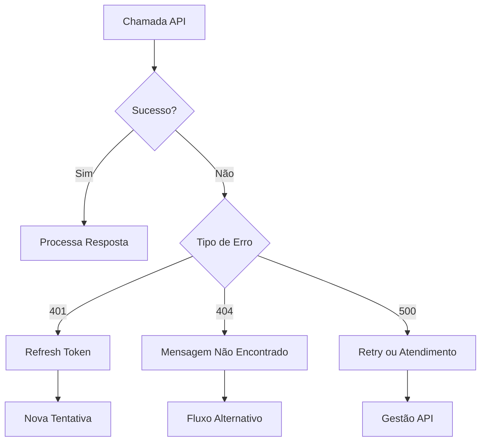

# APIs e Integrações do Bot Alloha

## Visão Geral da Arquitetura



### Endpoint Base

```
https://n8n-prd-webhook.fintalk.io/webhook/2.0/prd
```

---

## Catálogo Completo de APIs

### 1. APIs de Autenticação e Identificação

#### `alloha-token`
Gera token de autenticação para operações sensíveis.

| Propriedade | Valor |
| --- | --- |
| Método | POST |
| Autenticação | Bearer Token |

**Parâmetros:**
```json
{
  "auth": "string - Token de sessão",
  "cpf": "string - CPF do cliente",
  "phone": "string - Telefone",
  "customer_id": "string - ID do cliente",
  "protocol": "string - Protocolo de atendimento"
}
```

#### `alloha-id`
Busca identificador único do cliente.

**Parâmetros:**
```json
{
  "auth": "string",
  "cpf": "string",
  "phone": "string",
  "customer_id": "string",
  "id": "string",
  "protocol": "string"
}
```

#### `alloha-contratos`
Lista contratos associados ao CPF.

**Parâmetros:**
```json
{
  "auth": "string",
  "cpf": "string",
  "phone": "string"
}
```

**Resposta esperada:**
```json
{
  "success": true,
  "contracts": [
    {
      "contract_number": "123456",
      "status": "ATIVO",
      "plan": "500 MEGA",
      "address": "Rua Exemplo, 123"
    }
  ]
}
```

---

### 2. APIs de Validação

#### `envia-token`
Envia token SMS para validação.

**Parâmetros:**
```json
{
  "auth": "string",
  "contact": "string - Número para envio",
  "contract_number": "string",
  "cpf": "string",
  "customer_id": "string",
  "phone": "string",
  "protocol": "string",
  "type": "string - SMS ou WhatsApp"
}
```

#### `confirma-token`
Valida token informado pelo cliente.

**Parâmetros:**
```json
{
  "auth": "string",
  "contact": "string",
  "contract_number": "string",
  "cpf": "string",
  "customer_id": "string",
  "phone": "string",
  "protocol": "string",
  "token": "string - Token digitado"
}
```

#### `verifica-validacao`
Verifica status de validação do cliente.

**Parâmetros:**
```json
{
  "auth": "string",
  "contact": "string",
  "contract_number": "string",
  "cpf": "string",
  "customer_id": "string",
  "phone": "string",
  "protocol": "string"
}
```

#### `alloha-verifica-blacklist`
Verifica se cliente está em blacklist.

**Parâmetros:**
```json
{
  "auth": "string",
  "contract_number": "string",
  "cpf": "string",
  "customer_id": "string",
  "phone": "string",
  "protocol": "string"
}
```

---

### 3. APIs Financeiras

#### `alloha-lista-faturas`
Lista faturas do contrato.

**Parâmetros:**
```json
{
  "auth": "string",
  "contract_number": "string",
  "cpf": "string",
  "customer_id": "string",
  "phone": "string",
  "protocol": "string",
  "intent": "string - Tipo de consulta",
  "retention": "boolean - Se é retenção"
}
```

**Resposta esperada:**
```json
{
  "success": true,
  "invoices": [
    {
      "id": "FAT001",
      "due_date": "2024-01-15",
      "value": 150.00,
      "status": "PENDENTE",
      "barcode": "23793.38128...",
      "pix_code": "00020126..."
    }
  ]
}
```

#### `consulta-faturas-pagas`
Lista faturas já pagas.

**Parâmetros:**
```json
{
  "auth": "string",
  "contract": "string",
  "cpf": "string",
  "customer_id": "string",
  "phone": "string",
  "protocol": "string"
}
```

#### `busca-pdf-fatura-paga`
Busca PDF de fatura paga.

**Parâmetros:**
```json
{
  "auth": "string",
  "contract_number": "string",
  "cpf": "string",
  "customer_id": "string",
  "phone": "string",
  "protocol": "string",
  "idFatura": "string"
}
```

#### `alloha-troca-vencimento`
Lista datas disponíveis para vencimento.

**Parâmetros:**
```json
{
  "auth": "string",
  "contract_id": "string",
  "cpf": "string",
  "customer_id": "string",
  "phone": "string",
  "protocol": "string"
}
```

#### `alloha-troca-data-vencimento`
Efetua troca de data de vencimento.

**Parâmetros:**
```json
{
  "auth": "string",
  "contract_id": "string",
  "cpf": "string",
  "customer_id": "string",
  "phone": "string",
  "protocol": "string"
}
```

---

### 4. APIs de Negociação

#### `alloha-elegebilidade-negociacao`
Verifica se cliente pode negociar.

**Parâmetros:**
```json
{
  "auth": "string",
  "contract_number": "string",
  "cpf": "string",
  "cpf_cnpj": "string",
  "customer_id": "string",
  "phone": "string",
  "protocol": "string"
}
```

#### `alloha-negociacao`
Busca propostas de negociação.

**Parâmetros:**
```json
{
  "auth": "string",
  "contract_number": "string",
  "cpf": "string",
  "cpf_cnpj": "string",
  "customer_id": "string",
  "phone": "string",
  "protocol": "string"
}
```

#### `alloha-cria-negociacao`
Formaliza acordo de negociação.

**Parâmetros:**
```json
{
  "auth": "string",
  "contract_number": "string",
  "cpf": "string",
  "cpf_cnpj": "string",
  "customer_id": "string",
  "phone": "string",
  "protocol": "string",
  "id_negotiation": "string",
  "id_parcel_group": "string",
  "invoices": ["string"],
  "parcel_quantity": "number",
  "negotiation": "object"
}
```

---

### 5. APIs de Desbloqueio

#### `alloha-desbloqueio-confianca`
Solicita desbloqueio por confiança.

**Parâmetros:**
```json
{
  "auth": "string",
  "contract_number": "string",
  "cpf": "string",
  "customer_id": "string",
  "phone": "string",
  "protocol": "string"
}
```

#### `alloha-desbloqueio-comprovante`
Envia comprovante de pagamento.

**Parâmetros:**
```json
{
  "auth": "string",
  "contract_number": "string",
  "invoce_code": "string",
  "file_name": "string",
  "file_extension": "string",
  "file_url": "string"
}
```

---

### 6. APIs de Suporte Técnico

#### `alloha-connection-status`
Verifica status da conexão.

**Parâmetros:**
```json
{
  "auth": "string",
  "contract_number": "string",
  "cpf": "string",
  "customer_id": "string",
  "phone": "string",
  "protocol": "string"
}
```

#### `alloha-senha-wifi`
Consulta dados WiFi.

**Parâmetros:**
```json
{
  "auth": "string",
  "contract_number": "string",
  "cpf": "string",
  "customer_id": "string",
  "phone": "string",
  "protocol": "string"
}
```

#### `alloha-wifi-update`
Atualiza nome/senha WiFi.

**Parâmetros:**
```json
{
  "auth": "string",
  "contract_number": "string",
  "cpf": "string",
  "customer_id": "string",
  "phone": "string",
  "protocol": "string",
  "id": "string",
  "nome": "string",
  "senha": "string",
  "serial": "string",
  "type": "string"
}
```

---

### 7. APIs de Ordens de Serviço

#### `alloha-lista-service-orders`
Lista ordens de serviço.

**Parâmetros:**
```json
{
  "auth": "string",
  "contrato": "string",
  "cpf": "string",
  "customer_id": "string",
  "phone": "string",
  "protocol": "string",
  "id_motive": "string",
  "only_executed": "boolean"
}
```

#### `alloha-disponibilidade-service-order`
Verifica agenda disponível.

**Parâmetros:**
```json
{
  "auth": "string",
  "contract_number": "string",
  "cpf": "string",
  "customer_id": "string",
  "phone": "string",
  "protocol": "string",
  "area_code": "string",
  "booking_code": "string",
  "bucket": "string",
  "id_service": "string",
  "first_available_date": "string",
  "max_limit_days": "number",
  "start_date": "string",
  "workzone_code": "string"
}
```

#### `alloha-cria-service-order`
Cria nova ordem de serviço.

**Parâmetros:**
```json
{
  "auth": "string",
  "contract_number": "string",
  "cpf": "string",
  "customer_id": "string",
  "phone": "string",
  "protocol": "string",
  "area_code": "string",
  "booking_code": "string",
  "bucket": "string",
  "day": "string",
  "id": "string",
  "id_motive": "string",
  "id_service": "string",
  "observation": "string",
  "period": "string"
}
```

#### `alloha-remarca-os`
Remarca ordem de serviço.

**Parâmetros:**
```json
{
  "auth": "string",
  "contract_number": "string",
  "cpf": "string",
  "customer_id": "string",
  "phone": "string",
  "protocol": "string",
  "area_code": "string",
  "booking_code": "string",
  "bucket": "string",
  "day": "string",
  "id": "string",
  "id_motive": "string",
  "id_service": "string",
  "observation": "string",
  "period": "string"
}
```

#### `alloha-cancel-os`
Cancela ordem de serviço.

**Parâmetros:**
```json
{
  "auth": "string",
  "contract_number": "string",
  "cpf": "string",
  "customer_id": "string",
  "phone": "string",
  "protocol": "string",
  "id": "string"
}
```

---

### 8. APIs de Planos e Produtos

#### `alloha-planos`
Lista planos disponíveis.

**Parâmetros:**
```json
{
  "auth": "string",
  "contract_number": "string",
  "cpf": "string",
  "customer_id": "string",
  "phone": "string",
  "protocol": "string"
}
```

#### `alloha-novo-plano`
Solicita troca de plano.

**Parâmetros:**
```json
{
  "auth": "string",
  "contract_id": "string",
  "cpf": "string",
  "customer_id": "string",
  "phone": "string",
  "protocol": "string"
}
```

#### `alloha-remover-plano`
Remove plano/produto.

**Parâmetros:**
```json
{
  "auth": "string",
  "contract_number": "string",
  "contract_id": "string",
  "Contrato": "string",
  "cpf": "string",
  "customer_id": "string",
  "phone": "string",
  "protocol": "string",
  "plan_code": "string",
  "plan_name": "string",
  "campaign_code": "string"
}
```

#### `elegebilidade-planos`
Verifica elegibilidade para planos.

**Parâmetros:**
```json
{
  "auth": "string",
  "contract_number": "string"
}
```

#### `lista-produtos`
Lista produtos disponíveis.

**Parâmetros:**
```json
{
  "auth": "string",
  "contrato": "string",
  "cpf": "string",
  "customer_id": "string",
  "phone": "string",
  "protocol": "string"
}
```

---

### 9. APIs de OTT e Streaming

#### `alloha-ativacao-produto`
Ativa produto OTT.

**Parâmetros:**
```json
{
  "auth": "string",
  "contrato": "string",
  "cpf": "string",
  "customer_id": "string",
  "phone": "string",
  "protocol": "string",
  "ottid": "string",
  "provider": "string"
}
```

#### `recomendacao-ott`
Recomenda serviços OTT.

**Parâmetros:**
```json
{
  "auth": "string",
  "contrato": "string",
  "cpf": "string",
  "customer_id": "string",
  "phone": "string",
  "protocol": "string"
}
```

#### `confirma-recomendacao-ott`
Confirma recomendação OTT.

**Parâmetros:**
```json
{
  "auth": "string",
  "contrato": "string",
  "cpf": "string",
  "customer_id": "string",
  "phone": "string",
  "protocol": "string",
  "id": "string",
  "resposta": "string"
}
```

---

### 10. APIs de Endereço

#### `disponibilidade-cep`
Verifica cobertura por CEP.

**Parâmetros:**
```json
{
  "auth": "string",
  "contrato": "string",
  "cpf": "string",
  "customer_id": "string",
  "phone": "string",
  "protocol": "string",
  "zipcode": "string"
}
```

#### `alloha-disponibilidade-endereco`
Verifica disponibilidade de endereço.

**Parâmetros:**
```json
{
  "auth": "string",
  "contract_number": "string",
  "area_code": "string",
  "booking_code": "string",
  "bucket": "string",
  "id_service": "string",
  "first_available_date": "string",
  "max_limit_days": "number",
  "start_date": "string",
  "workzone_code": "string"
}
```

#### `verifica-disp-casa`
Verifica disponibilidade para casa.

**Parâmetros:**
```json
{
  "auth": "string",
  "contrato": "string",
  "cpf": "string",
  "customer_id": "string",
  "phone": "string",
  "protocol": "string",
  "zipcode": "string",
  "street": "string",
  "number": "string",
  "district": "string",
  "city": "string",
  "state": "string"
}
```

#### `verifica-condominio`
Verifica se é condomínio.

**Parâmetros:**
```json
{
  "auth": "string",
  "contrato": "string",
  "cpf": "string",
  "customer_id": "string",
  "phone": "string",
  "protocol": "string",
  "zipcode": "string",
  "street": "string",
  "number": "string",
  "district": "string",
  "city": "string",
  "state": "string"
}
```

#### `verifica-disp-condominio`
Verifica disponibilidade em condomínio.

**Parâmetros:**
```json
{
  "auth": "string",
  "contrato": "string",
  "cpf": "string",
  "customer_id": "string",
  "phone": "string",
  "protocol": "string",
  "zipcode": "string",
  "street": "string",
  "number": "string",
  "district": "string",
  "city": "string",
  "state": "string",
  "condominium_full_code": "string",
  "condominium_block_full_code": "string"
}
```

#### `mudanca-endereco`
Efetua mudança de endereço.

**Parâmetros:**
```json
{
  "auth": "string",
  "contract_number": "string",
  "cpf": "string",
  "phone": "string",
  "protocol": "string",
  "cep": "string",
  "street": "string",
  "number": "string",
  "complement": "string",
  "district": "string",
  "city": "string",
  "ibge_city_code": "string",
  "condominio_id": "string",
  "condominium": "string",
  "transmission_type": "string",
  "area_code": "string",
  "booking_code": "string",
  "bucket": "string",
  "day": "string",
  "period": "string",
  "id": "string",
  "id_motive": "string",
  "observation": "string"
}
```

---

### 11. APIs de Massiva

#### `alloha-massiva-v2`
Verifica incidente massivo.

**Parâmetros:**
```json
{
  "auth": "string",
  "contract_number": "string",
  "contrato": "string",
  "cpf": "string",
  "customer_id": "string",
  "phone": "string",
  "protocol": "string"
}
```

#### `alloha-massiva-externa-dev`
Verifica massiva externa.

**Parâmetros:**
```json
{
  "auth": "string"
}
```

---

### 12. APIs de Protocolo e Monitoramento

#### `alloha-gera-protocolo`
Gera protocolo de atendimento.

**Parâmetros:**
```json
{
  "auth": "string",
  "contract_number": "string",
  "contrato": "string",
  "cpf_cnpj": "string",
  "customer_id": "string",
  "numero": "string",
  "observation": "string"
}
```

#### `alloha-monitor-end`
Monitora fim de atendimento.

**Parâmetros:**
```json
{
  "auth": "string",
  "contract_number": "string",
  "contrato": "string",
  "cpf": "string",
  "customer_id": "string",
  "phone": "string",
  "protocol": "string",
  "flow": "string",
  "numero": "string"
}
```

#### `pega-telefone`
Busca telefone do cliente.

**Parâmetros:**
```json
{
  "auth": "string",
  "contract_number": "string",
  "cpf": "string",
  "customer_id": "string",
  "phone": "string",
  "protocol": "string"
}
```

---

### 13. APIs de LLM e IA

#### `alloha-llm`
Processamento de linguagem natural.

**Parâmetros:**
```json
{
  "template": "string - Template de prompt",
  "pergunta": "string - Pergunta do usuário",
  "history": "array - Histórico da conversa",
  "param": "string - Parâmetro adicional",
  "extras": "object - Dados extras"
}
```

#### `llm-negocia`
LLM para negociação.

**Parâmetros:**
```json
{
  "history": "array",
  "pergunta": "string",
  "resp": "string"
}
```

#### `llm-negocia-similarity`
Análise de similaridade em negociação.

**Parâmetros:**
```json
{
  "history": "array",
  "pergunta": "string",
  "resp": "string",
  "buttons": "array"
}
```

---

### 14. APIs de NPS

#### `nps-start`
Inicia pesquisa NPS.

**Parâmetros:**
```json
{
  "auth": "string"
}
```

#### `nps-answer`
Registra resposta NPS.

**Parâmetros:**
```json
{
  "auth": "string",
  "id": "string",
  "question": "string",
  "answer": "string"
}
```

#### `nps-complete`
Finaliza pesquisa NPS.

**Parâmetros:**
```json
{
  "auth": "string",
  "id": "string"
}
```

---

### 15. APIs de Elegibilidade

#### `valida-elegibilidade-contrato`
Valida elegibilidade do contrato.

**Parâmetros:**
```json
{
  "auth": "string",
  "contrato": "string",
  "cpf": "string",
  "customer_id": "string",
  "phone": "string",
  "protocol": "string"
}
```

#### `contestacao-contrato`
Contestação de contrato.

**Parâmetros:**
```json
{
  "auth": "string",
  "contract": "string",
  "customer_id": "string"
}
```

---

## Códigos de Resposta Comuns

| Código | Descrição |
| --- | --- |
| 200 | Sucesso |
| 400 | Parâmetros inválidos |
| 401 | Token inválido/expirado |
| 404 | Recurso não encontrado |
| 500 | Erro interno |

## Tratamento de Erros



---

## Próximo: [06-entidades-variaveis.md](./06-entidades-variaveis.md)
