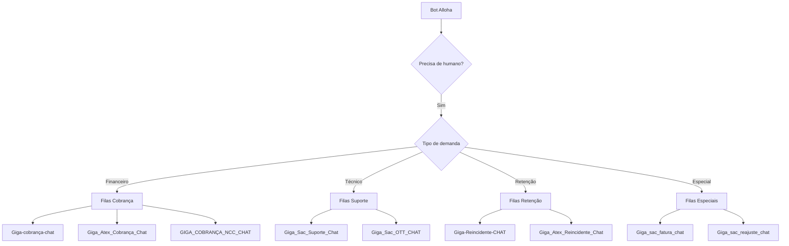
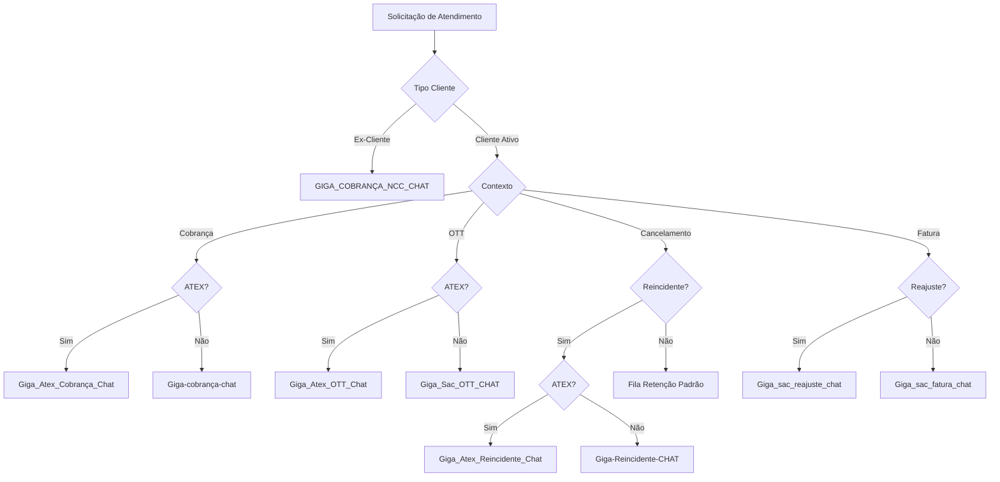
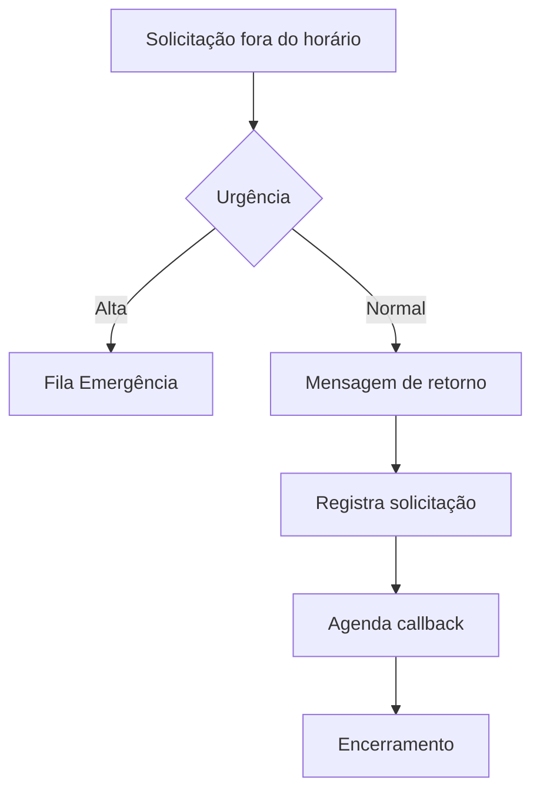
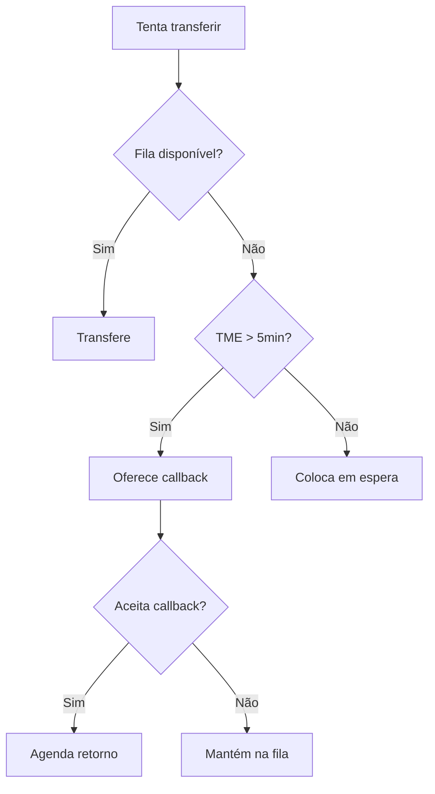

# Filas de Atendimento Humano do Bot Alloha

## Visão Geral

O bot pode transferir clientes para atendimento humano através de diversas filas especializadas, cada uma com foco em um tipo específico de demanda.



---

## Filas de Cobrança

### `Giga-cobrança-chat`
**Fila principal de cobrança**

| Propriedade | Valor |
| --- | --- |
| Identificador | FilaCobranca |
| Horário | Comercial |
| Prioridade | Média |

**Casos de uso:**
- Negociação de débitos
- Dúvidas sobre cobrança
- Solicitação de segunda via
- Acordos de pagamento

### `Giga_Atex_Cobrança_Chat`
**Fila de cobrança ATEX (atendimento especializado)**

| Propriedade | Valor |
| --- | --- |
| Identificador | FilaCobrancaAtex |
| Horário | Comercial |
| Prioridade | Alta |

**Casos de uso:**
- Clientes VIP
- Casos complexos de cobrança
- Escalações

### `GIGA_COBRANÇA_NCC_CHAT`
**Fila de cobrança NCC (Não Clientes/Ex-clientes)**

| Propriedade | Valor |
| --- | --- |
| Identificador | FilaCobrancaNCC |
| Horário | Comercial |
| Prioridade | Média |

**Casos de uso:**
- Ex-clientes com débitos
- Cobranças de multas
- Devolução de equipamentos

---

## Filas de Fatura

### `Giga_sac_fatura_chat`
**Fila de SAC para questões de fatura**

| Propriedade | Valor |
| --- | --- |
| Identificador | FilaFatura / FilaFaturaSac |
| Horário | Comercial |
| Prioridade | Média |

**Casos de uso:**
- Contestação de valores
- Dúvidas sobre faturas
- Problemas com emissão

### `Giga_sac_reajuste_chat`
**Fila para questões de reajuste**

| Propriedade | Valor |
| --- | --- |
| Identificador | FilaReajuste |
| Horário | Comercial |
| Prioridade | Média |

**Casos de uso:**
- Dúvidas sobre reajuste anual
- Contestação de reajuste
- Negociação de valores

---

## Filas de OTT (Streaming)

### `Giga_Sac_OTT_CHAT`
**Fila de suporte para serviços OTT**

| Propriedade | Valor |
| --- | --- |
| Identificador | FilaOTT |
| Horário | Comercial |
| Prioridade | Média |

**Casos de uso:**
- Problemas com Giga+ TV
- Ativação de Globoplay
- Suporte ao Max
- Cancelamento de OTT

### `Giga_Atex_OTT_Chat`
**Fila ATEX para OTT**

| Propriedade | Valor |
| --- | --- |
| Identificador | FilaOTTAtex |
| Horário | Comercial |
| Prioridade | Alta |

**Casos de uso:**
- Casos complexos de OTT
- Clientes prioritários

---

## Filas de Retenção

### `Giga-Reincidente-CHAT`
**Fila para clientes reincidentes**

| Propriedade | Valor |
| --- | --- |
| Identificador | FilaReincidente |
| Horário | Comercial |
| Prioridade | Alta |

**Casos de uso:**
- Clientes que já tentaram cancelar antes
- Segunda tentativa de cancelamento
- Clientes insatisfeitos recorrentes

### `Giga_Atex_Reincidente_Chat`
**Fila ATEX para reincidentes**

| Propriedade | Valor |
| --- | --- |
| Identificador | FilaReincidenteAtex |
| Horário | Comercial |
| Prioridade | Crítica |

**Casos de uso:**
- Escalação de retenção
- Casos urgentes de cancelamento

---

## Lógica de Roteamento



---

## Critérios para ATEX

O cliente é direcionado para fila ATEX quando:

1. **Tempo de Cliente**: Acima de 24 meses
2. **Valor do Plano**: Acima de determinado valor
3. **Histórico**: Cliente com reclamações anteriores
4. **Escalação**: Solicitação de supervisor
5. **Reincidência**: Terceira tentativa de resolução

---

## Mensagens de Transferência

### Transferência para Cobrança
```
Entendi! Vou te transferir para um especialista em cobrança que poderá te ajudar melhor com essa questão.

Por favor, aguarde um momento enquanto conecto você a um atendente.
```

### Transferência para Suporte
```
Vou te transferir para nossa equipe de suporte técnico especializado.

Em breve um atendente estará disponível para te ajudar.
```

### Transferência para Retenção
```
Entendo sua situação. Vou te conectar com um especialista que tem autonomia para analisar seu caso e encontrar a melhor solução.

Aguarde um momento, por favor.
```

---

## Informações Passadas para o Atendente

Quando o cliente é transferido, as seguintes informações são enviadas:

| Informação | Descrição |
| --- | --- |
| `customer_id` | ID do cliente |
| `contract_number` | Número do contrato |
| `cpf` | CPF do cliente |
| `phone` | Telefone |
| `protocol` | Protocolo do atendimento |
| `intent` | Intenção identificada |
| `history` | Resumo da conversa |
| `status` | Status do contrato |
| `faturas` | Faturas em aberto |

---

## Horários de Atendimento

| Tipo | Dias | Horário |
| --- | --- | --- |
| Comercial | Seg-Sex | 08:00 - 20:00 |
| Comercial | Sáb | 08:00 - 14:00 |
| Emergência | 24/7 | Contínuo |

### Fora do Horário



---

## Métricas de Fila

| Métrica | Meta | Descrição |
| --- | --- | --- |
| TME | < 60s | Tempo médio de espera |
| TMA | < 10min | Tempo médio de atendimento |
| Taxa Abandono | < 5% | Clientes que desistem |
| FCR | > 80% | Resolução no primeiro contato |

---

## Integração com Five9

O bot utiliza a integração com Five9 para transferência de chamadas:

```json
{
  "rocketChat": {
    "rocketID": "fila_id",
    "msgSuccess": "Transferência realizada com sucesso",
    "msgFailure": "Não foi possível transferir. Tente novamente."
  }
}
```

### Parâmetros de Transferência

| Parâmetro | Descrição |
| --- | --- |
| `fila` | ID da fila de destino |
| `prioridade` | Nível de prioridade |
| `skill` | Habilidade requerida |
| `contexto` | Dados do atendimento |

---

## Tratamento de Indisponibilidade



---

## Conclusão

O sistema de filas do Bot Alloha é projetado para:

1. **Especialização**: Cada fila atende demandas específicas
2. **Priorização**: Clientes críticos têm atendimento prioritário
3. **Contexto**: Informações relevantes são passadas ao atendente
4. **Disponibilidade**: Alternativas quando filas estão indisponíveis

---

## Navegação

- [README.md](./README.md)
- [01-fluxos-principais.md](./01-fluxos-principais.md)
- [05-apis-integracoes.md](./05-apis-integracoes.md)
