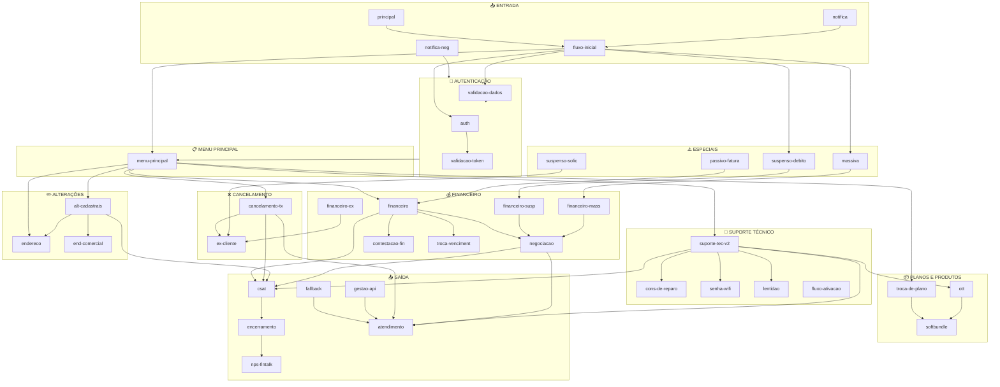
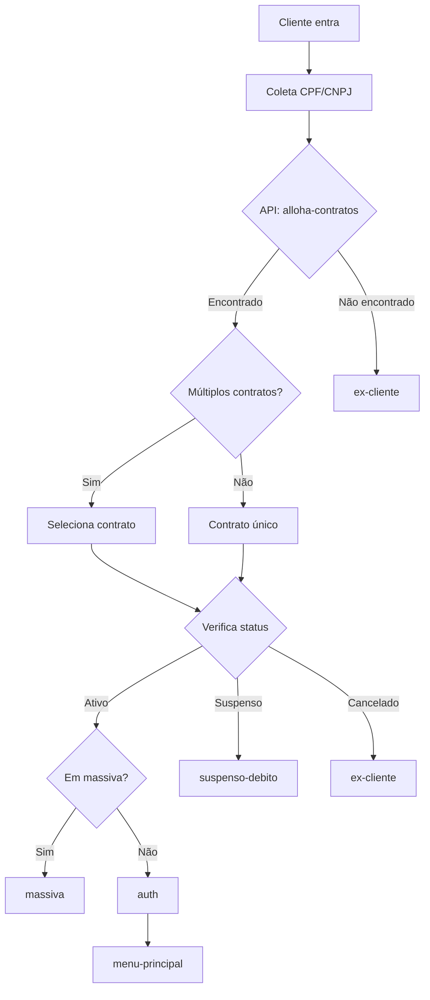
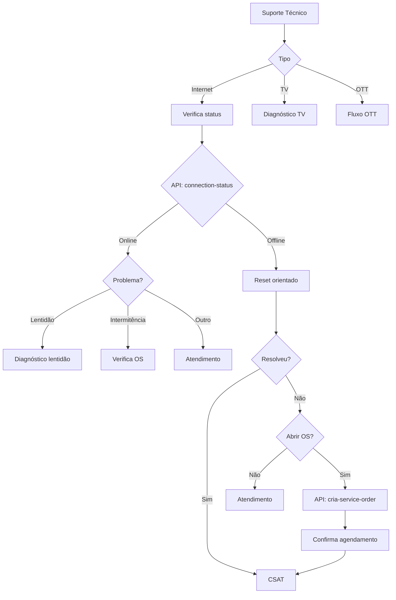
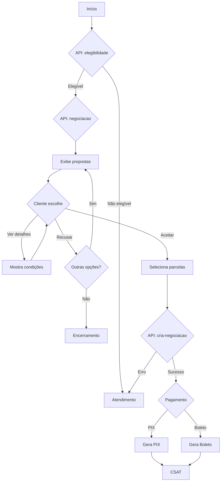
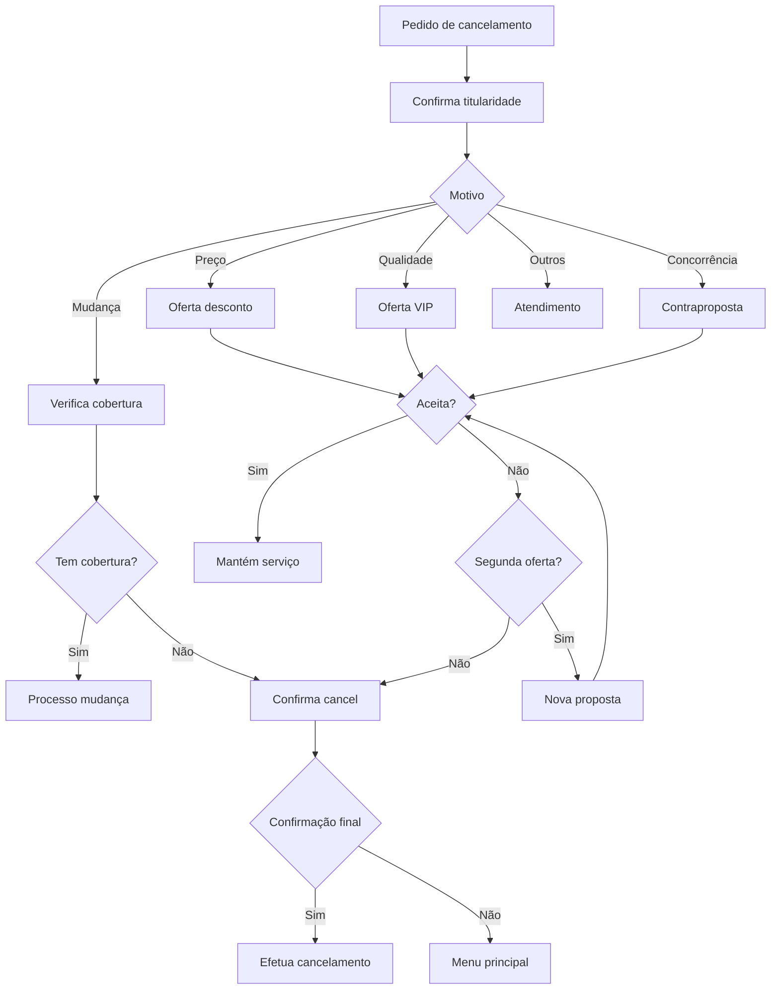
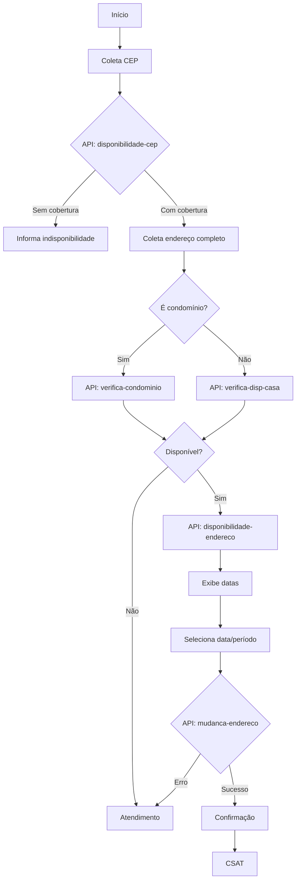

# Fluxograma Geral do Bot Alloha

## Arquitetura Completa do Bot

---

## Fluxo de Identificação do Cliente

---

## Fluxo de Resolução de Problemas Técnicos

---

## Fluxo de Negociação de Débitos

---

## Fluxo de Cancelamento com Retenção

---

## Fluxo de Mudança de Endereço

---

## Legenda dos Fluxos

| Símbolo | Significado |
| --- | --- |
| 📥 | Ponto de entrada |
| 🔐 | Autenticação/Validação |
| 📋 | Menu de navegação |
| 💰 | Operações financeiras |
| 🔧 | Suporte técnico |
| 📦 | Planos e produtos |
| ✏️ | Alterações cadastrais |
| ❌ | Cancelamento |
| ⚠️ | Fluxos especiais |
| 📤 | Saída/Encerramento |

---

## Estatísticas do Bot

| Métrica | Valor |
| --- | --- |
| Total de Fluxos | 38 |
| Total de Blocos | ~1.500 |
| APIs Integradas | 52 |
| Filas de Atendimento | 10 |
| Entidades NLU | 4 |

---

## Navegação

- [README.md](./README.md)
- [01-fluxos-principais.md](./01-fluxos-principais.md)
- [05-apis-integracoes.md](./05-apis-integracoes.md)
