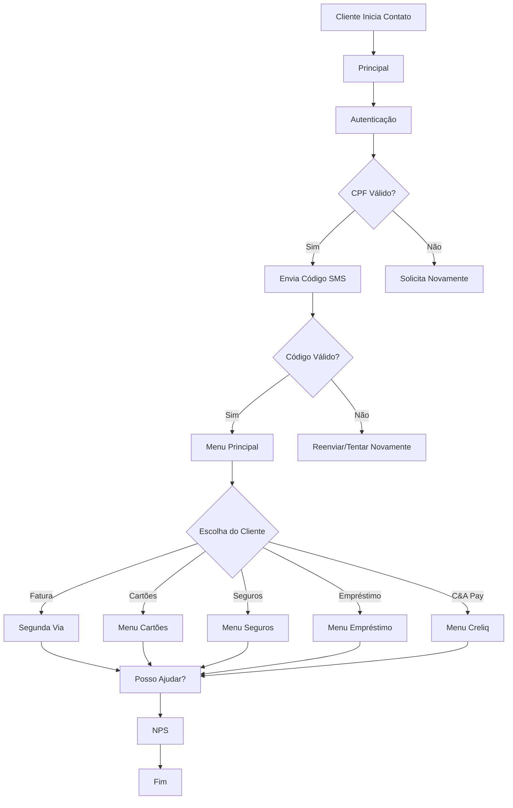
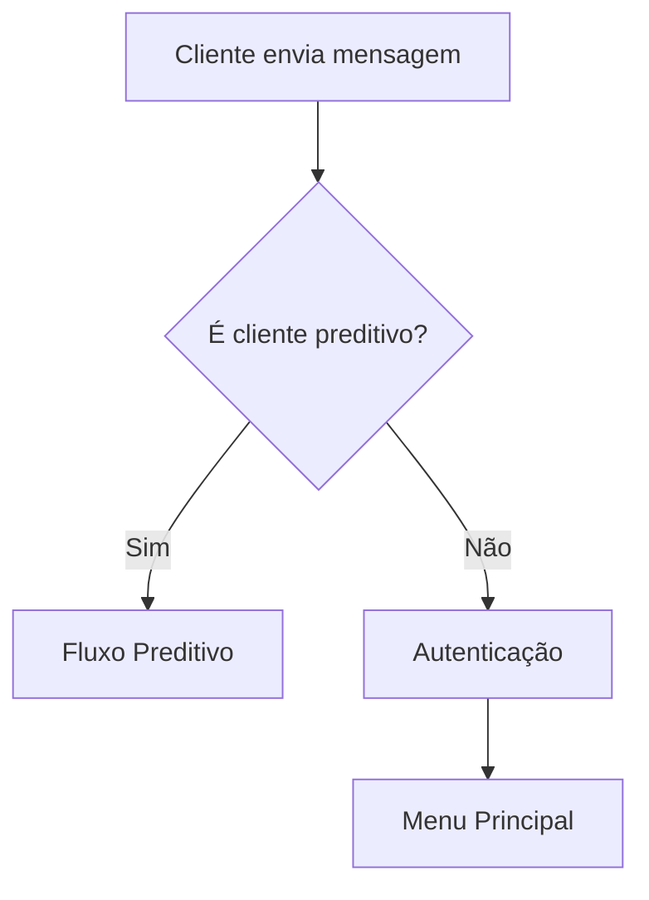
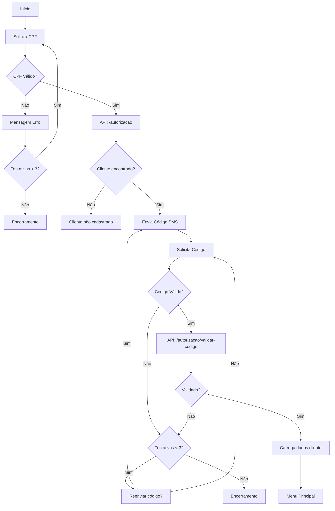
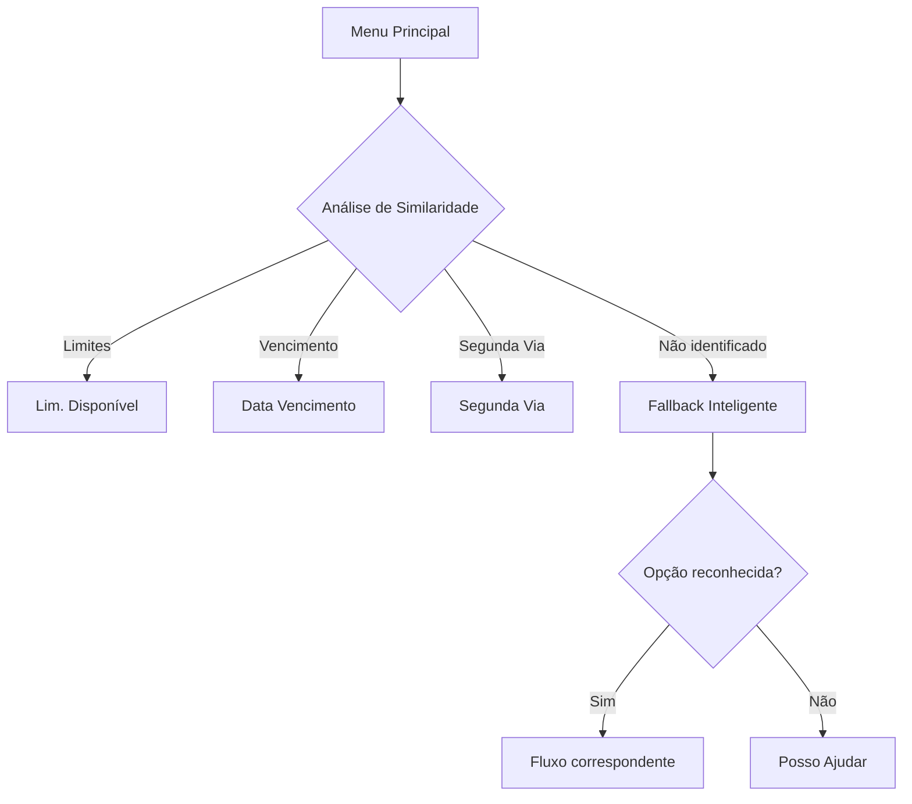
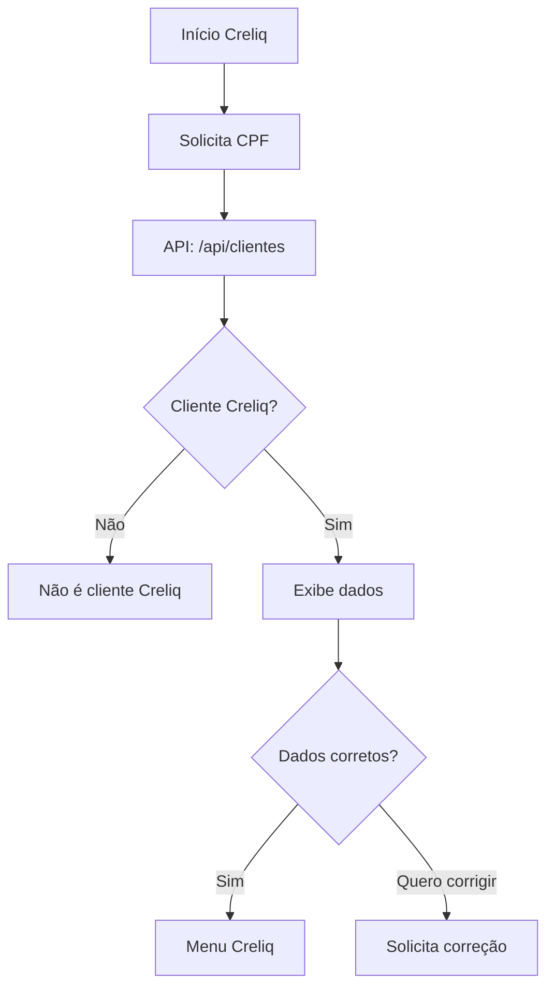
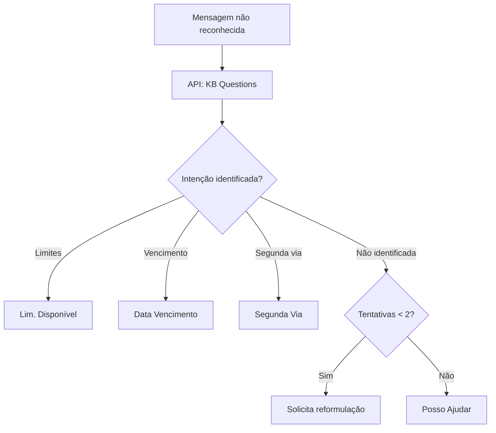
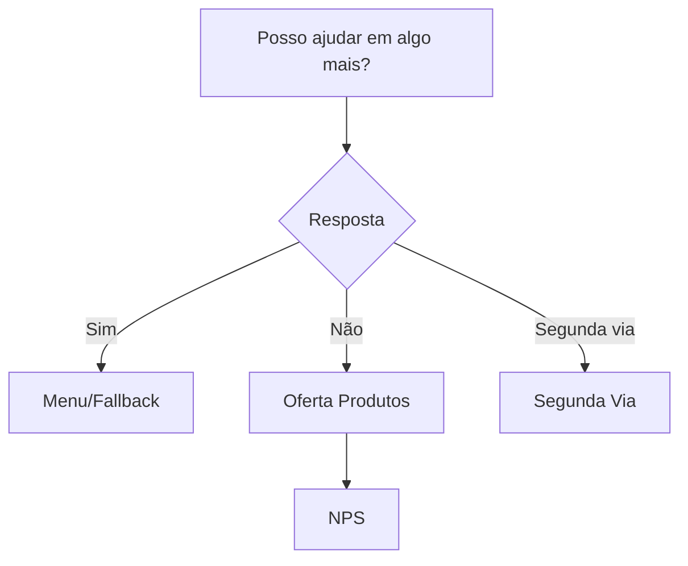
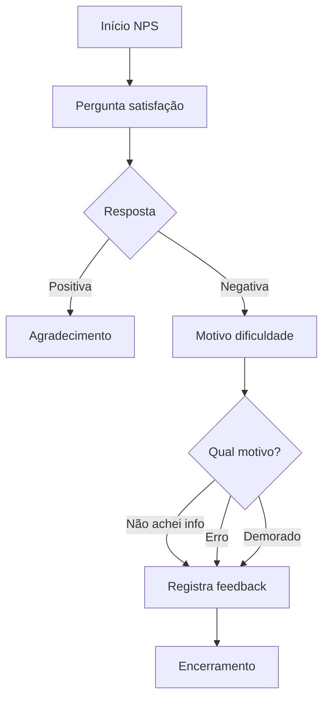
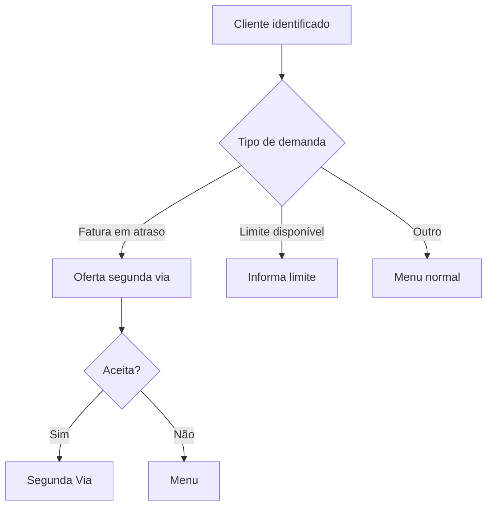

# Fluxos Principais do Bot C&A

## Visão Geral da Jornada do Cliente

---

## 1. Fluxo Principal (`principal`)

O ponto de entrada do bot, responsável por direcionar o cliente para autenticação.

### Estrutura

### Componentes

| Tipo | Quantidade |
| --- | --- |
| Blocos totais | 8 |

---

## 2. Autenticação (`autenticacao`)

Fluxo mais extenso do bot, responsável pela validação do cliente via CPF e código SMS.

### Fluxograma Detalhado

### APIs Utilizadas

| API | Método | Descrição |
| --- | --- | --- |
| `/autorizacao` | POST | Inicia autenticação e envia SMS |
| `/autorizacao/validar-codigo` | POST | Valida código informado |
| `/cliente` | GET | Carrega dados do cliente |
| `/cliente/creliq` | GET | Verifica se é cliente Creliq |

### Componentes

| Tipo | Quantidade |
| --- | --- |
| Perguntas | 4 |
| Lógicas | 26 |
| Total | 121 |

### Variáveis de Sessão

| Variável | Descrição |
| --- | --- |
| `vars.cpf` | CPF do cliente |
| `vars.token` | Token de autenticação |
| `vars.nome` | Nome do cliente |
| `vars.celular` | Celular cadastrado |
| `vars.isCreliq` | Se é cliente C&A Pay |

---

## 3. Menu Principal (`menu`)

Hub central de navegação do bot.

### Estrutura

### Opções Reconhecidas por Similaridade

| Intenção | Fluxo Destino |
| --- | --- |
| limites | `lim-disponivel` |
| data vencimento | `data-vencimento` |
| segunda via | `segunda-via` |
| cartões | `cartoes` |
| seguros | `seguros` |
| empréstimo | `emprestimo` |
| c&a pay | `menu-pre-creliq` |

### Componentes

| Tipo | Quantidade |
| --- | --- |
| Múltipla Escolha | 2 |
| Lógicas | 14 |
| Total | 40 |

---

## 4. Autenticação C&A Pay (`aut-pre-creliq`)

Autenticação específica para clientes do C&A Pay (Creliq).

### Fluxograma

### APIs Utilizadas

| API | Método | Descrição |
| --- | --- | --- |
| `/oauth/token` | POST | Autenticação Creliq |
| `/api/clientes` | GET | Busca cliente Creliq |

### Componentes

| Tipo | Quantidade |
| --- | --- |
| Mensagens | 2 |
| Perguntas | 8 |
| Múltipla Escolha | 1 |
| Lógicas | 7 |
| Total | 54 |

---

## 5. Fallback Inteligente (`fb-inteligente`)

Tratamento de mensagens não reconhecidas com análise de similaridade.

### Fluxograma

### APIs Utilizadas

| API | Descrição |
| --- | --- |
| `https://kb-prd.fintalk.io/questions` | Knowledge Base para análise de intenção |

### Componentes

| Tipo | Quantidade |
| --- | --- |
| Mensagens | 4 |
| Perguntas | 1 |
| Múltipla Escolha | 1 |
| Lógicas | 20 |
| Total | 35 |

---

## 6. Posso Ajudar (`posso-ajudar`)

Fluxo de retorno após conclusão de atendimento.

### Fluxograma

### Opções de Resposta

| Resposta | Ação |
| --- | --- |
| Sim | Retorna ao menu |
| Não | Oferta de produtos e NPS |
| Segunda via | Direciona para emissão |

### Componentes

| Tipo | Quantidade |
| --- | --- |
| Mensagens | 2 |
| Múltipla Escolha | 3 |
| Lógicas | 10 |
| Total | 23 |

---

## 7. NPS (`nps`)

Pesquisa de satisfação ao final do atendimento.

### Fluxograma

### Perguntas do NPS

1. **Facilidade de uso**: Fácil / Difícil / Outros
2. **Motivo dificuldade** (se difícil):
  - Não achei informação
  - Deu mensagem de erro
  - Muito demorado

### Componentes

| Tipo | Quantidade |
| --- | --- |
| Mensagens | 3 |
| Perguntas | 2 |
| Múltipla Escolha | 3 |
| Lógicas | 15 |
| Total | 28 |

---

## 8. Preditivo (`preditivo`)

Atendimento preditivo para clientes identificados com demandas específicas.

### Fluxograma

### Componentes

| Tipo | Quantidade |
| --- | --- |
| Mensagens | 10 |
| Múltipla Escolha | 2 |
| Lógicas | 20 |
| Total | 42 |

---

## 9. FAQ (`faq`)

Central de perguntas frequentes sobre diversos assuntos.

### Categorias

| Categoria | Fluxo Destino |
| --- | --- |
| Assistência Odontológica | `assist-odonto` |
| Assistência Saúde | `assist-saude` |
| Bolsa Protegida + Assistência | `bol-prot-assist` |
| Bolsa Protegida | `bolsa-protegida` |
| Garantia Estendida | `garantia-estend` |
| Parcela Premiada | `parcela-premiad` |
| Proteção Premiada | `protecao-premia` |
| Seguro Celular | `seguro-celular` |

### Componentes

| Tipo | Quantidade |
| --- | --- |
| Lógicas | 1 |
| Total | 58 |

---

## 10. LGPD (`lgpd`)

Informações sobre proteção de dados.

### Conteúdo

- Informações sobre coleta de dados
- Direitos do titular
- Como exercer direitos
- Contato do DPO

---

## Variáveis de Contexto Principais

| Variável | Descrição | Escopo |
| --- | --- | --- |
| `vars.cpf` | CPF do cliente | Global |
| `vars.token` | Token de autenticação | Sessão |
| `vars.nome` | Nome do cliente | Global |
| `vars.celular` | Telefone do cliente | Global |
| `vars.isCreliq` | Se é cliente C&A Pay | Sessão |
| `vars.limiteDisponivel` | Limite disponível | Sessão |
| `vars.dataVencimento` | Data de vencimento | Sessão |
| `vars.faturaAberta` | Se há fatura em aberto | Sessão |

---

## Próximo: [02-fluxo-financeiro-cartao.md](./02-fluxo-financeiro-cartao.md)
