# Fluxo Financeiro - Cartão C&A

## Visão Geral

O módulo financeiro do Cartão C&A gerencia todas as operações relacionadas a faturas, limites, parcelas e cobranças.

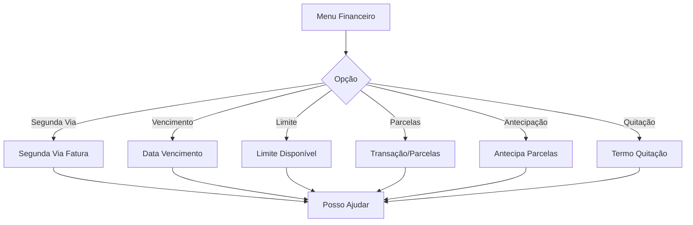

---

## 1. Segunda Via de Fatura (`segunda-via`)

Emissão de segunda via da fatura do Cartão C&A.

### Fluxograma Detalhado

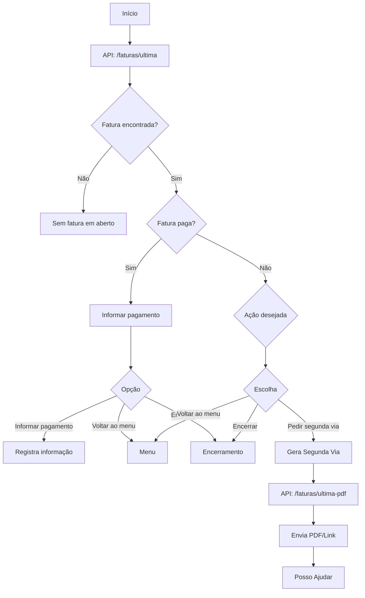

### Opções do Menu

| Opção | Descrição |
| --- | --- |
| Informar pagamento | Cliente já pagou |
| Pedir segunda via | Gera nova fatura |
| Voltar ao menu | Retorna ao menu principal |
| Encerrar | Finaliza atendimento |

### APIs Utilizadas

| API | Método | Descrição |
| --- | --- | --- |
| `/faturas/ultima` | GET | Consulta última fatura |
| `/faturas/ultima-pdf` | GET | Gera PDF da fatura |
| `/faturas/contas/` | GET | Lista faturas por conta |

### Componentes

| Tipo | Quantidade |
| --- | --- |
| Mensagens | 7 |
| Múltipla Escolha | 3 |
| Lógicas | 7 |
| Total | 52 |

---

## 2. Data de Vencimento (`data-vencimento`)

Consulta e alteração da data de vencimento da fatura.

### Fluxograma

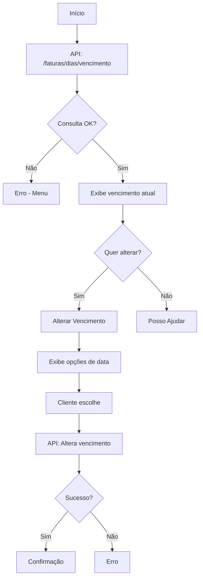

### APIs Utilizadas

| API | Método | Descrição |
| --- | --- | --- |
| `/faturas/dias/vencimento` | GET | Lista datas disponíveis |

### Componentes

| Tipo | Quantidade |
| --- | --- |
| Lógicas | 2 |
| Total | 47 |

---

## 3. Alteração de Vencimento (`alterar-vencime`)

Efetua a alteração da data de vencimento.

### Fluxograma

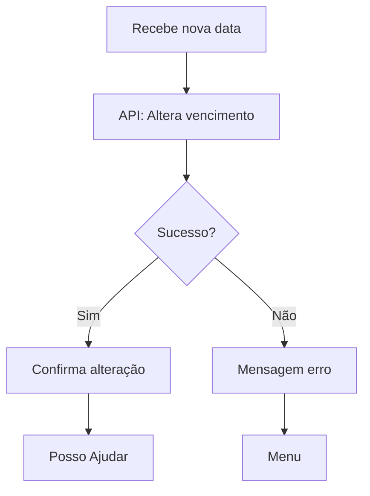

### Componentes

| Tipo | Quantidade |
| --- | --- |
| Lógicas | 2 |
| Total | 20 |

---

## 4. Limite Disponível (`lim-disponivel`)

Consulta do limite disponível no cartão.

### Fluxograma

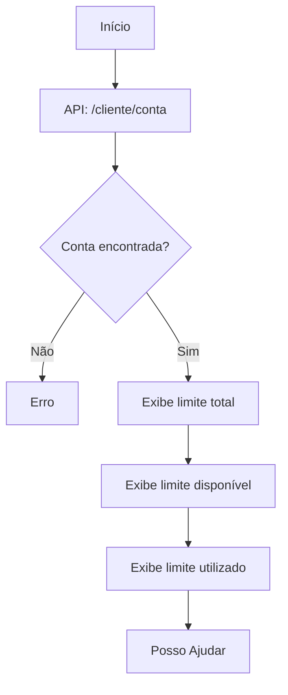

### APIs Utilizadas

| API | Método | Descrição |
| --- | --- | --- |
| `/cliente/conta` | GET | Consulta dados da conta |

### Informações Exibidas

| Informação | Descrição |
| --- | --- |
| Limite Total | Valor total do limite |
| Limite Disponível | Valor disponível para uso |
| Limite Utilizado | Valor já utilizado |

### Componentes

| Tipo | Quantidade |
| --- | --- |
| Lógicas | 9 |
| Total | 41 |

---

## 5. Transação e Alteração (`transacao-alt`)

Gerenciamento de transações e parcelamentos.

### Fluxograma

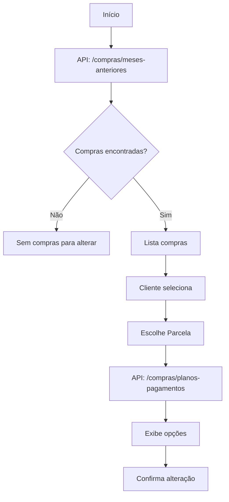

### APIs Utilizadas

| API | Método | Descrição |
| --- | --- | --- |
| `/compras/meses-anteriores` | GET | Lista compras anteriores |
| `/compras/planos-pagamentos` | GET | Opções de parcelamento |
| `/v2/compras/planos-pagamentos` | GET | Opções v2 |
| `/compras/${idCompra}` | GET | Detalhes da compra |
| `/v2/compras/${idCompra}` | PUT | Altera parcelamento |

### Componentes

| Tipo | Quantidade |
| --- | --- |
| Lógicas | 4 |
| Total | 42 |

---

## 6. Escolha de Parcela (`escolhe-parcela`)

Seleção de parcelas para alteração.

### Fluxograma

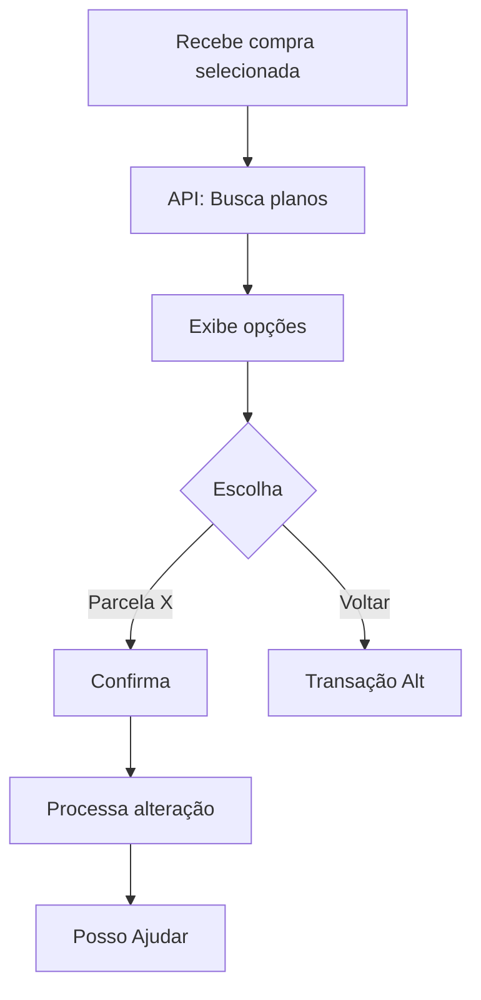

### Componentes

| Tipo | Quantidade |
| --- | --- |
| Total | 22 |

---

## 7. Escolha de Parcela V2 (`v2-escolhe-parc`)

Versão atualizada do fluxo de escolha de parcelas.

### Fluxograma

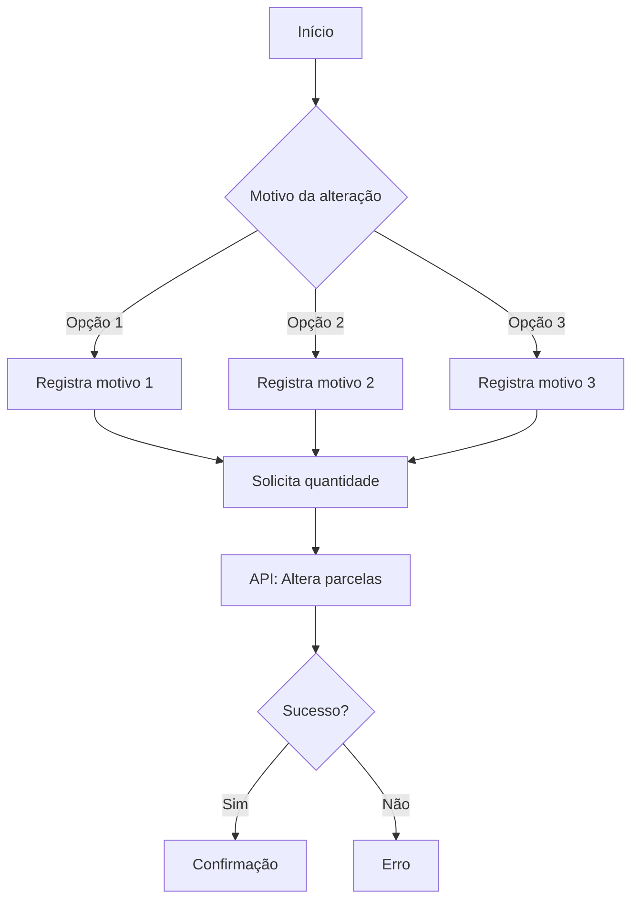

### Componentes

| Tipo | Quantidade |
| --- | --- |
| Mensagens | 1 |
| Perguntas | 2 |
| Múltipla Escolha | 1 |
| Lógicas | 11 |
| Total | 40 |

---

## 8. Transação Não Alterável (`trans-n-alterav`)

Tratamento de compras que não podem ser alteradas.

### Fluxograma

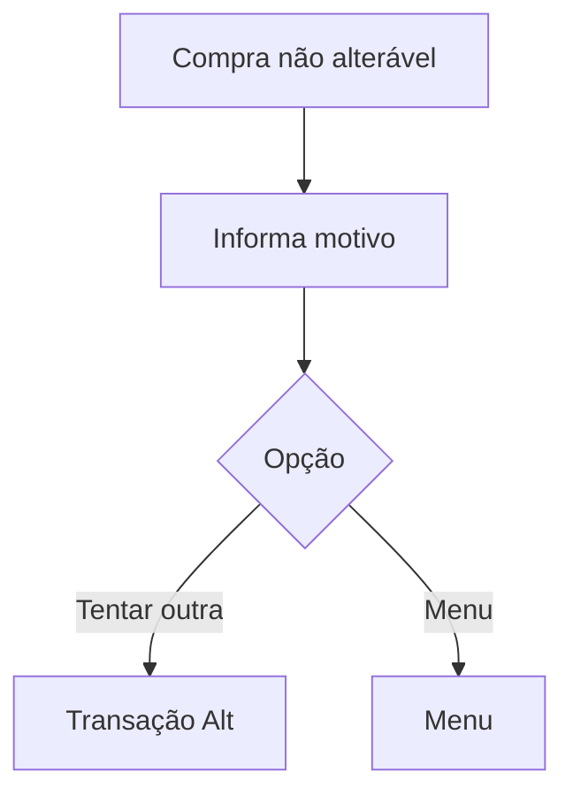

### Componentes

| Tipo | Quantidade |
| --- | --- |
| Lógicas | 3 |
| Total | 15 |

---

## 9. Antecipação de Parcelas (`antecipa-parcel`)

Antecipação de parcelas futuras.

### Fluxograma

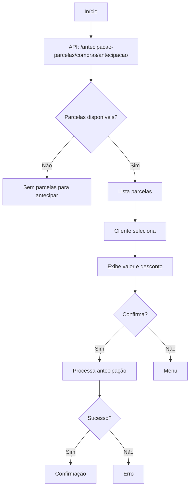

### APIs Utilizadas

| API | Método | Descrição |
| --- | --- | --- |
| `/antecipacao-parcelas/compras/antecipacao` | GET | Lista parcelas para antecipação |
| `/antecipacao-parcelas/compras/${idCompra}` | POST | Efetua antecipação |

### Componentes

| Tipo | Quantidade |
| --- | --- |
| Lógicas | 1 |
| Total | 19 |

---

## 10. Termo de Quitação (`termo-quitacao`)

Solicitação de termo de quitação anual.

### Fluxograma

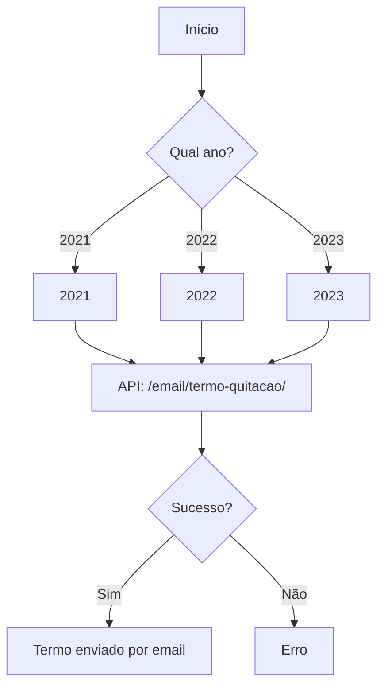

### APIs Utilizadas

| API | Método | Descrição |
| --- | --- | --- |
| `/email/termo-quitacao/` | GET | Envia termo por email |

### Componentes

| Tipo | Quantidade |
| --- | --- |
| Múltipla Escolha | 1 |
| Lógicas | 2 |
| Total | 17 |

---

## 11. Cobrança Indevida (`cobranca-indevi`)

Contestação de cobranças não reconhecidas.

### Fluxograma

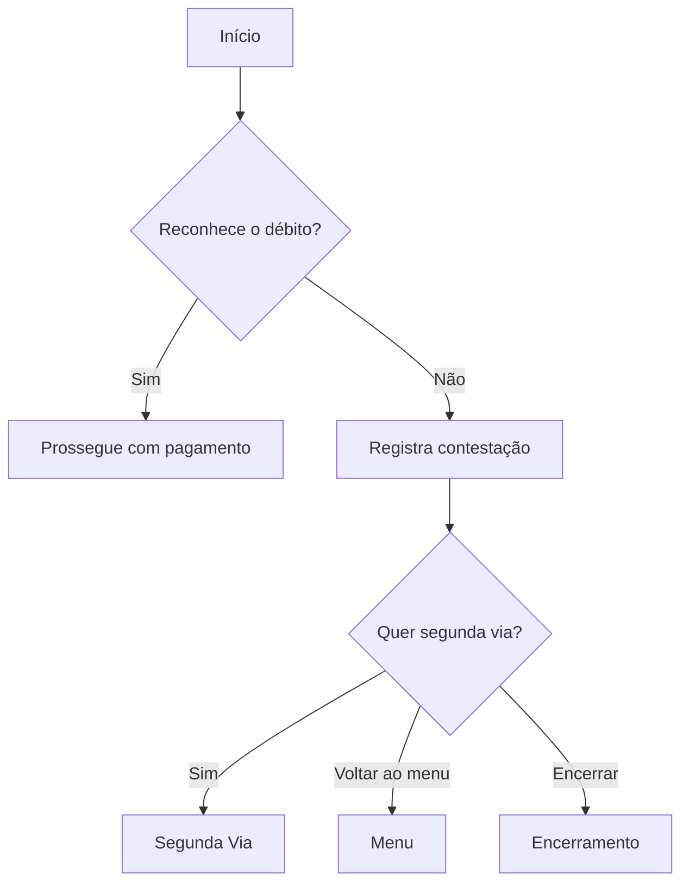

### Opções de Resposta

| Opção | Ação |
| --- | --- |
| Sim, reconheço | Prossegue com pagamento |
| Não reconheço | Registra contestação |

### Componentes

| Tipo | Quantidade |
| --- | --- |
| Mensagens | 3 |
| Múltipla Escolha | 4 |
| Lógicas | 4 |
| Total | 20 |

---

## Variáveis do Módulo Financeiro

| Variável | Descrição |
| --- | --- |
| `vars.faturaAtual` | Dados da fatura atual |
| `vars.valorFatura` | Valor da fatura |
| `vars.dataVencimento` | Data de vencimento |
| `vars.limiteTotal` | Limite total do cartão |
| `vars.limiteDisponivel` | Limite disponível |
| `vars.compras` | Lista de compras |
| `vars.idCompra` | ID da compra selecionada |
| `vars.parcelas` | Opções de parcelamento |
| `vars.parcelasSelecionadas` | Parcelas escolhidas |

---

## Próximo: [03-fluxo-cea-pay.md](./03-fluxo-cea-pay.md)
