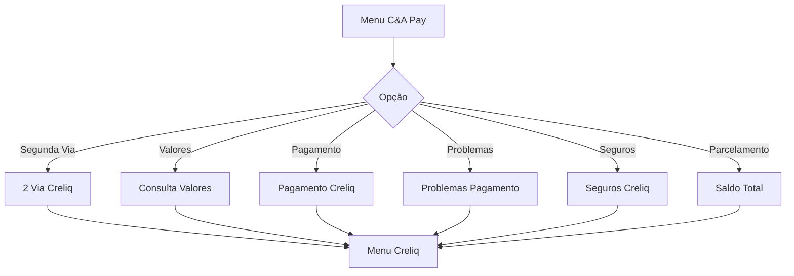
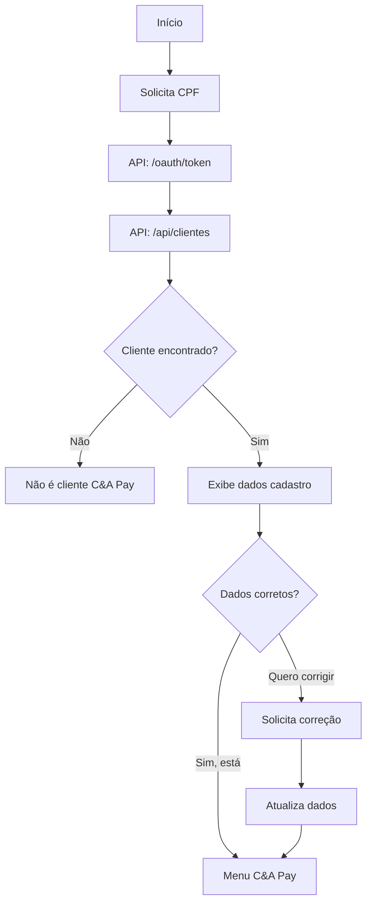
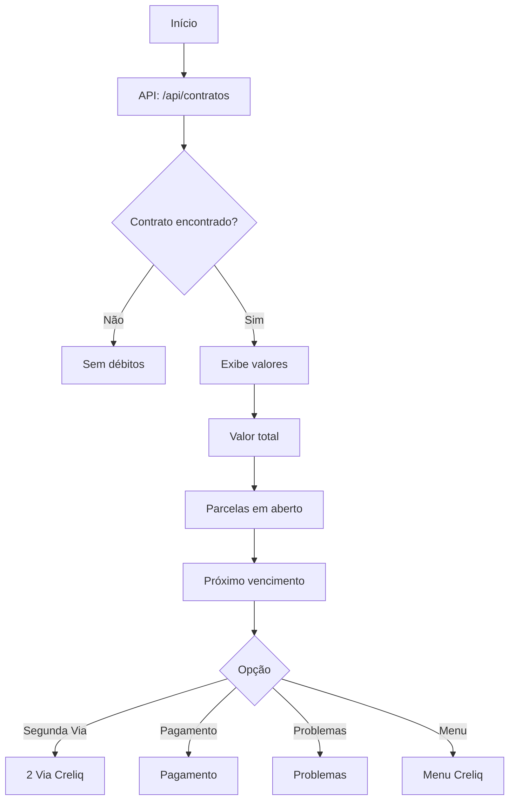
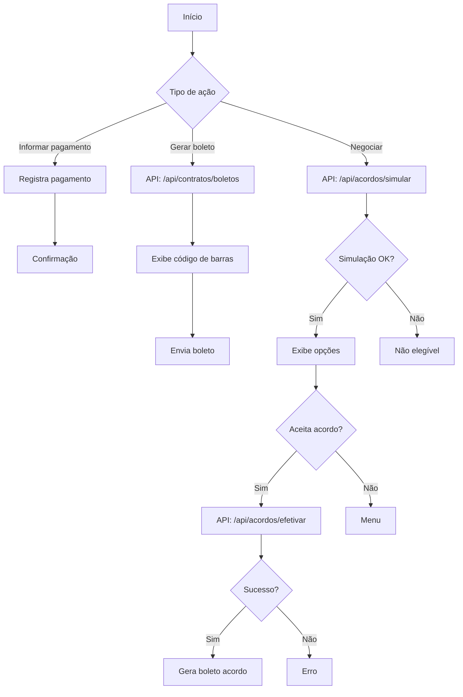
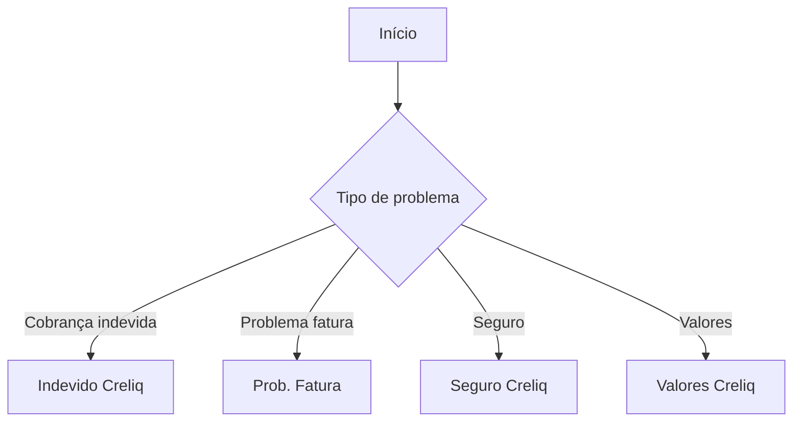
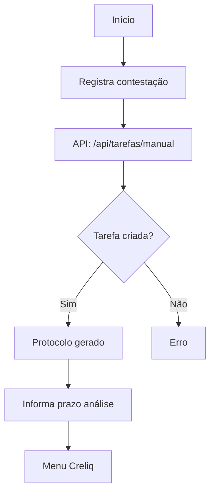
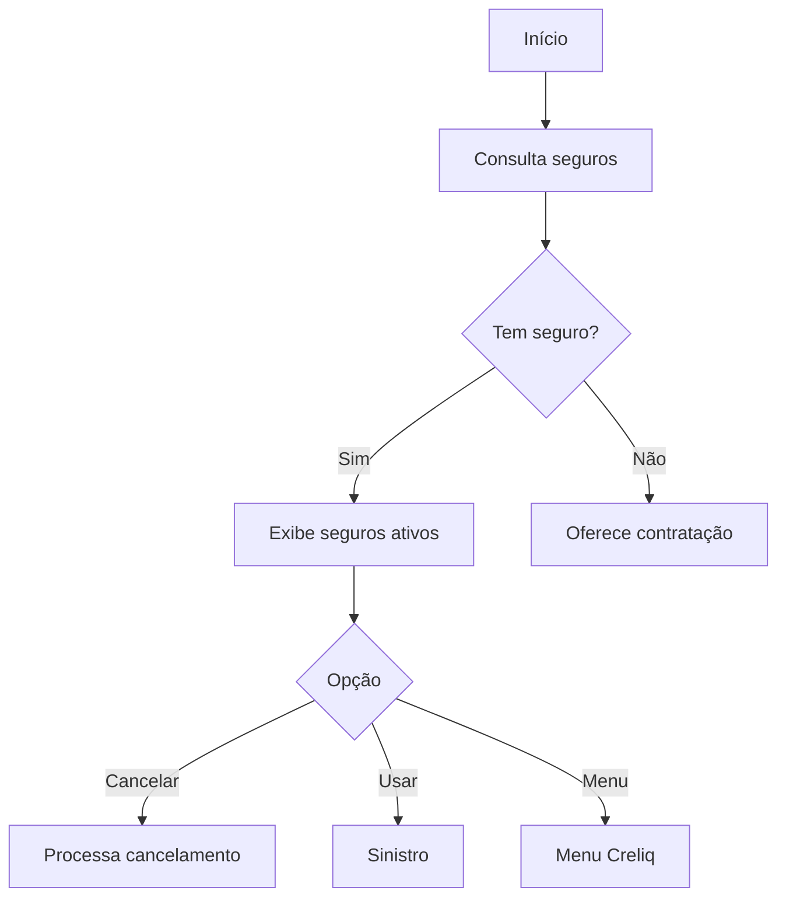
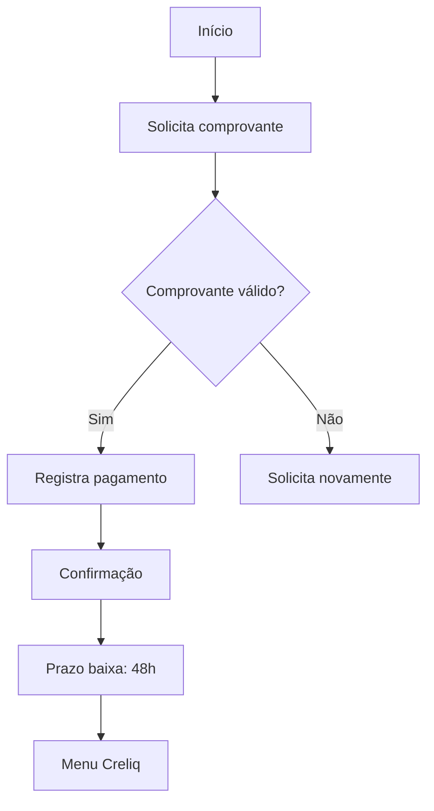
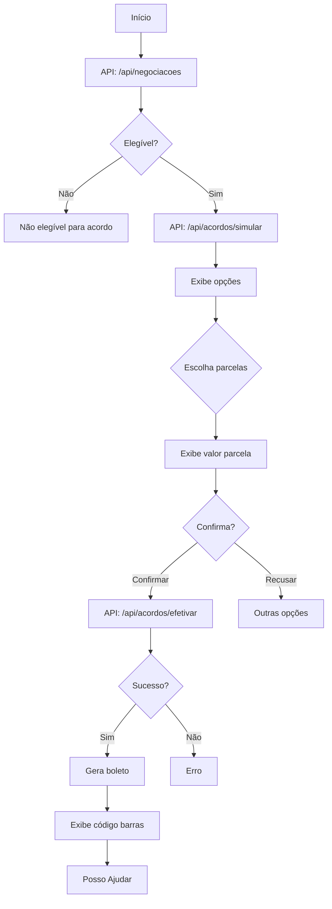

# Fluxo C&A Pay (Creliq)

## Visão Geral

O C&A Pay (anteriormente conhecido como Creliq) é a solução de crédito e parcelamento da C&A. Este módulo gerencia todas as operações relacionadas a este produto financeiro.



---

## 1. Autenticação C&A Pay (`aut-pre-creliq`)

Autenticação específica para clientes do C&A Pay.

### Fluxograma



### APIs Utilizadas

| API | Método | Descrição |
| --- | --- | --- |
| `/oauth/token` | POST | Autenticação Creliq |
| `/api/clientes` | GET | Busca dados do cliente |
| `/api/clientes/${idCliente}` | GET | Detalhes do cliente |

### Componentes

| Tipo | Quantidade |
| --- | --- |
| Mensagens | 2 |
| Perguntas | 8 |
| Múltipla Escolha | 1 |
| Lógicas | 7 |
| Total | 54 |

---

## 2. Menu C&A Pay (`menu-pre-creliq`)

Menu principal do C&A Pay.

### Opções Disponíveis

| Opção | Fluxo Destino | Descrição |
| --- | --- | --- |
| Segunda Via | `2-via-pre-creli` | Emissão de boleto |
| Valores | `valores-creliq` | Consulta de valores |
| Pagamento | `pag-pre-creliq` | Informar/realizar pagamento |
| Problemas | `prob-pag-creliq` | Problemas com pagamento |
| Seguros | `seguro-creliq` | Seguros associados |
| Parcelamento | `par-saldo-total` | Parcelamento do saldo |

### Componentes

| Tipo | Quantidade |
| --- | --- |
| Lógicas | 1 |
| Total | 43 |

---

## 3. Segunda Via C&A Pay (`2-via-pre-creli`)

Emissão de segunda via do boleto C&A Pay.

### Fluxograma

```mermaid
flowchart TD
    A[Início] --> B[API: /api/contratos]
    B --> C{Contrato encontrado?}
    C -->|Não| D[Sem débitos]
    C -->|Sim| E[API: /api/contratos/${id}/boletos]

    E --> F{Boleto disponível?}
    F -->|Sim| G[Exibe dados boleto]
    F -->|Não| H[Gera novo boleto]

    G --> I[Envia código de barras]
    H --> I
    I --> J[Posso Ajudar]
```

### APIs Utilizadas

| API | Método | Descrição |
| --- | --- | --- |
| `/api/contratos` | GET | Lista contratos |
| `/api/contratos/boletos/${idParcela}` | GET | Busca/gera boleto |

### Componentes

| Tipo | Quantidade |
| --- | --- |
| Lógicas | 7 |
| Total | 33 |

---

## 4. Valores C&A Pay (`valores-creliq`)

Consulta de valores devidos no C&A Pay.

### Fluxograma



### Informações Exibidas

| Informação | Descrição |
| --- | --- |
| Valor Total | Soma de todas as parcelas |
| Parcelas em Aberto | Quantidade de parcelas |
| Valor Parcela | Valor de cada parcela |
| Próximo Vencimento | Data da próxima parcela |

### Componentes

| Tipo | Quantidade |
| --- | --- |
| Total | 43 |

---

## 5. Pagamento C&A Pay (`pag-pre-creliq`)

Gerenciamento de pagamentos do C&A Pay.

### Fluxograma



### APIs Utilizadas

| API | Método | Descrição |
| --- | --- | --- |
| `/api/contratos` | GET | Lista contratos |
| `/api/contratos/boletos/${idParcela}` | GET | Gera boleto |
| `/api/acordos/simular` | POST | Simula acordo |
| `/api/acordos/efetivar` | POST | Efetiva acordo |
| `/api/acordos` | GET | Lista acordos |

### Componentes

| Tipo | Quantidade |
| --- | --- |
| Lógicas | 6 |
| Total | 104 |

---

## 6. Problemas com Pagamento (`prob-pag-creliq`)

Tratamento de problemas com pagamentos do C&A Pay.

### Fluxograma



### Opções de Problemas

| Problema | Fluxo | Descrição |
| --- | --- | --- |
| Cobrança indevida | `indevido-creliq` | Contestação |
| Problema na fatura | `prob-fat-creliq` | Erros na fatura |
| Seguro | `seguro-creliq` | Problemas com seguro |
| Valores incorretos | `valores-creliq` | Verificar valores |

### Componentes

| Tipo | Quantidade |
| --- | --- |
| Total | 14 |

---

## 7. Cobrança Indevida C&A Pay (`indevido-creliq`)

Contestação de cobranças no C&A Pay.

### Fluxograma



### APIs Utilizadas

| API | Método | Descrição |
| --- | --- | --- |
| `/api/tarefas/manual` | POST | Cria tarefa de contestação |

### Componentes

| Tipo | Quantidade |
| --- | --- |
| Total | 10 |

---

## 8. Seguro C&A Pay (`seguro-creliq`)

Gerenciamento de seguros associados ao C&A Pay.

### Fluxograma



### Componentes

| Tipo | Quantidade |
| --- | --- |
| Total | 13 |

---

## 9. Problema na Fatura (`prob-fat-creliq`)

Tratamento de problemas específicos com fatura.

### Componentes

| Tipo | Quantidade |
| --- | --- |
| Total | 8 |

---

## 10. Informar Pagamento (`inf-pag-creliq`)

Registro de pagamento realizado.

### Fluxograma



### Componentes

| Tipo | Quantidade |
| --- | --- |
| Total | 12 |

---

## 11. Parcelamento Saldo Total (`par-saldo-total`)

Negociação e parcelamento do saldo devedor total.

### Fluxograma Detalhado



### APIs Utilizadas

| API | Método | Descrição |
| --- | --- | --- |
| `/api/negociacoes` | GET | Verifica elegibilidade |
| `/api/acordos/simular` | POST | Simula condições |
| `/api/acordos/efetivar` | POST | Formaliza acordo |
| `/api/contratos/boletos/${idParcela}` | GET | Gera boleto |

### Opções de Parcelamento

| Parcelas | Condições |
| --- | --- |
| À vista | Desconto máximo |
| 2x | Desconto reduzido |
| 3x | Sem desconto |
| 4x+ | Juros aplicados |

### Componentes

| Tipo | Quantidade |
| --- | --- |
| Mensagens | 7 |
| Perguntas | 5 |
| Múltipla Escolha | 3 |
| Lógicas | 26 |
| Total | 64 |

---

## Variáveis do Módulo C&A Pay

| Variável | Descrição |
| --- | --- |
| `vars.idCliente` | ID do cliente Creliq |
| `vars.idContrato` | ID do contrato |
| `vars.idParcela` | ID da parcela |
| `vars.valorTotal` | Valor total devido |
| `vars.qtdParcelas` | Quantidade de parcelas |
| `vars.valorParcela` | Valor de cada parcela |
| `vars.codigoBarras` | Código de barras do boleto |
| `vars.acordoSimulado` | Dados do acordo simulado |
| `vars.acordoEfetivado` | Dados do acordo efetivado |
| `vars.tokenCreliq` | Token de autenticação Creliq |

---

## Base URLs

| Variável | URL |
| --- | --- |
| `[[api-hub-creliq]]` | `https://api-hub.fintalk.io/ceapay/cobransaas` |

---

## Próximo: [04-fluxo-emprestimos.md](./04-fluxo-emprestimos.md)
