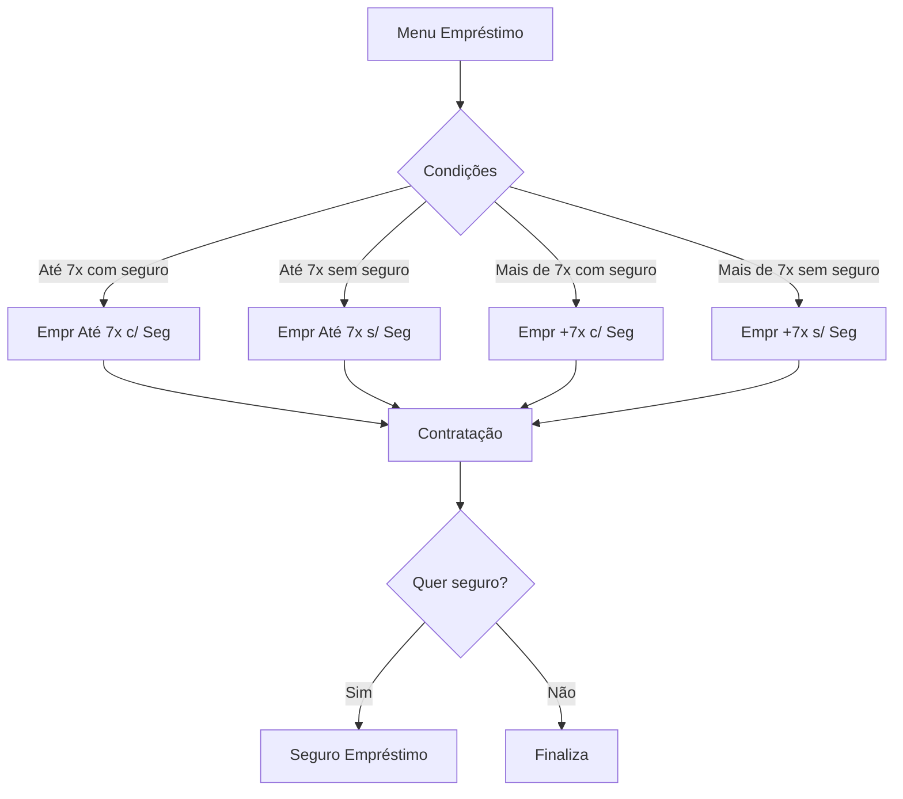
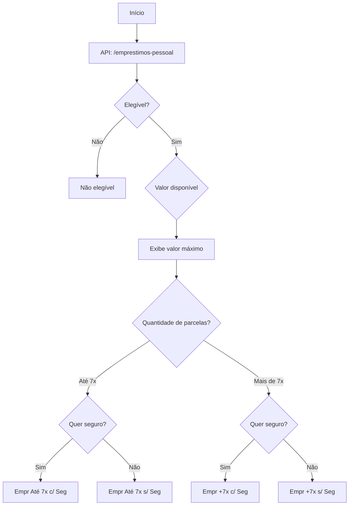
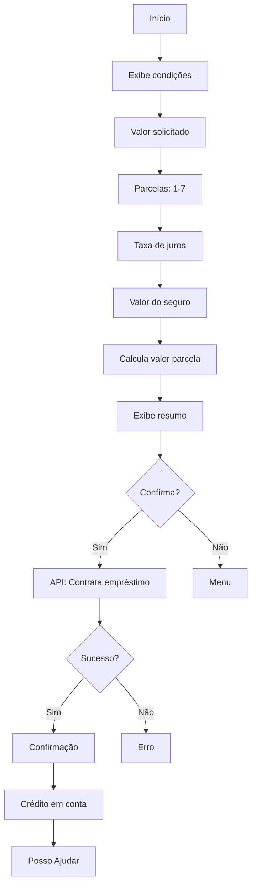
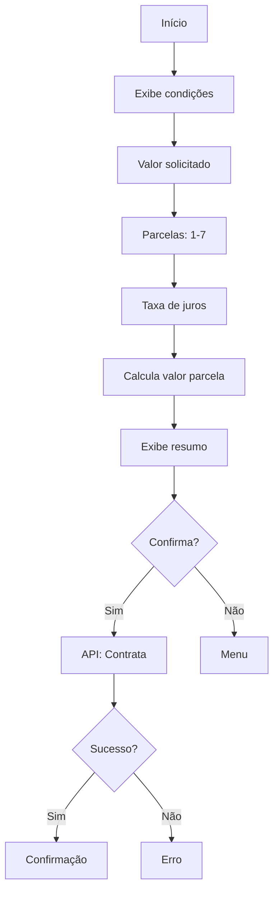
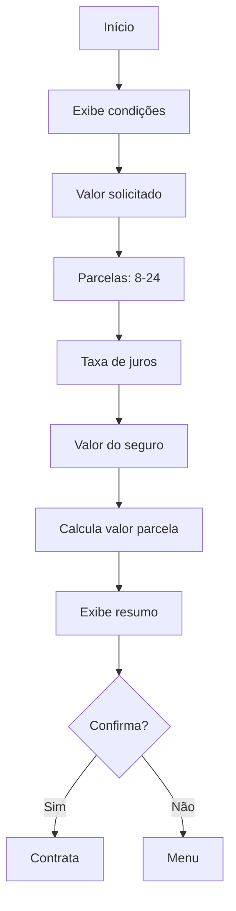
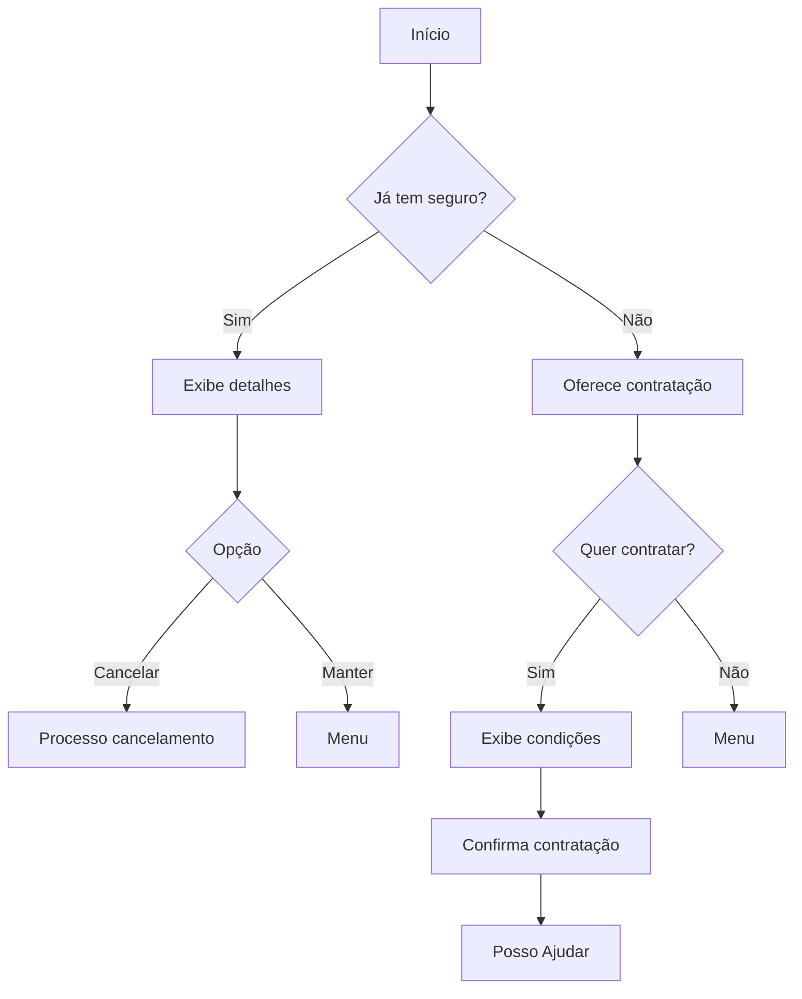
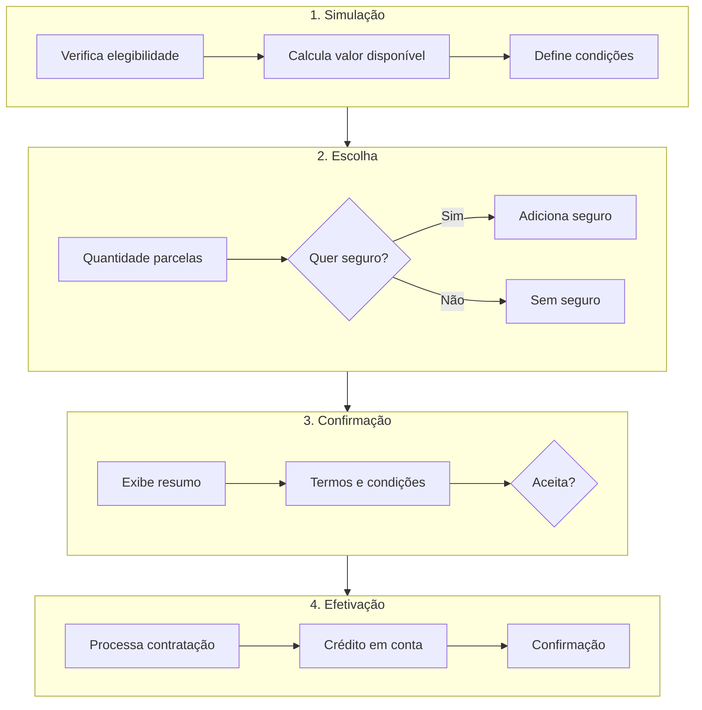

# Fluxo de Empréstimos do Bot C&A

## Visão Geral

O módulo de empréstimos gerencia o Empréstimo Pessoal C&A, incluindo simulação, contratação e opções de seguro.

---

## 1. Menu de Empréstimos (`emprestimo`)

Ponto de entrada para solicitação de empréstimo pessoal.

### Fluxograma

### APIs Utilizadas

| API | Método | Descrição |
| --- | --- | --- |
| `/emprestimos-pessoal` | GET | Verifica elegibilidade e condições |
| `/emprestimos-pessoal/compras/${idCompra}` | GET | Detalhes do empréstimo |

### Componentes

| Tipo | Quantidade |
| --- | --- |
| Mensagens | 1 |
| Total | 16 |

---

## 2. Empréstimo Até 7x com Seguro (`empr-ate7-c-seg`)

Contratação de empréstimo em até 7 parcelas com seguro incluso.

### Fluxograma

### Informações Exibidas

| Informação | Descrição |
| --- | --- |
| Valor Solicitado | Valor do empréstimo |
| Quantidade Parcelas | 1 a 7 parcelas |
| Taxa de Juros | % ao mês |
| Valor Seguro | Valor mensal do seguro |
| CET | Custo Efetivo Total |
| Valor Parcela | Valor de cada parcela |
| Valor Total | Valor total a pagar |

### Componentes

| Tipo | Quantidade |
| --- | --- |
| Lógicas | 4 |
| Total | 51 |

---

## 3. Empréstimo Até 7x sem Seguro (`empr-ate7-s-seg`)

Contratação de empréstimo em até 7 parcelas sem seguro.

### Fluxograma

### Diferenças do com Seguro

| Aspecto | Com Seguro | Sem Seguro |
| --- | --- | --- |
| Valor parcela | Maior | Menor |
| Proteção | Sim | Não |
| CET | Maior | Menor |

### Componentes

| Tipo | Quantidade |
| --- | --- |
| Lógicas | 4 |
| Total | 38 |

---

## 4. Empréstimo +7x com Seguro (`empr-mai7-c-seg`)

Contratação de empréstimo acima de 7 parcelas com seguro.

### Fluxograma

### Opções de Parcelas

| Parcelas | Disponibilidade |
| --- | --- |
| 8x | Disponível |
| 10x | Disponível |
| 12x | Disponível |
| 18x | Disponível |
| 24x | Disponível |

### Componentes

| Tipo | Quantidade |
| --- | --- |
| Lógicas | 4 |
| Total | 37 |

---

## 5. Empréstimo +7x sem Seguro (`empr-mai7-s-seg`)

Contratação de empréstimo acima de 7 parcelas sem seguro.

### Componentes

| Tipo | Quantidade |
| --- | --- |
| Lógicas | 2 |
| Total | 29 |

---

## 6. Seguro de Empréstimo (`seguro-emprest`)

Informações e contratação do seguro de empréstimo.

### Coberturas do Seguro

| Cobertura | Descrição |
| --- | --- |
| Morte | Quitação do saldo devedor |
| Invalidez | Quitação do saldo devedor |
| Desemprego | Pagamento de parcelas |
| Incapacidade | Pagamento temporário |

### Fluxograma

### Componentes

| Tipo | Quantidade |
| --- | --- |
| Lógicas | 1 |
| Total | 14 |

---

## Fluxo Completo de Contratação

---

## Variáveis do Módulo Empréstimo

| Variável | Descrição |
| --- | --- |
| `vars.valorEmprestimo` | Valor solicitado |
| `vars.qtdParcelas` | Quantidade de parcelas |
| `vars.taxaJuros` | Taxa de juros mensal |
| `vars.valorParcela` | Valor de cada parcela |
| `vars.valorTotal` | Valor total a pagar |
| `vars.cet` | Custo Efetivo Total |
| `vars.comSeguro` | Se inclui seguro |
| `vars.valorSeguro` | Valor do seguro |
| `vars.idCompraEmprestimo` | ID da operação |

---

## Regras de Negócio

### Elegibilidade

| Critério | Requisito |
| --- | --- |
| Conta ativa | Sim |
| Limite disponível | > R$ 100 |
| Adimplência | Sem atrasos |
| Tempo de conta | > 6 meses |

### Limites

| Parâmetro | Valor |
| --- | --- |
| Valor mínimo | R$ 100,00 |
| Valor máximo | Conforme limite |
| Parcelas mínimas | 1 |
| Parcelas máximas | 24 |

### Taxa de Juros

| Parcelas | Taxa (exemplo) |
| --- | --- |
| 1-7x | X% a.m. |
| 8-12x | Y% a.m. |
| 13-24x | Z% a.m. |

*Taxas sujeitas à aprovação de crédito*

---

## Próximo: [05-apis-integracoes.md](./05-apis-integracoes.md)
