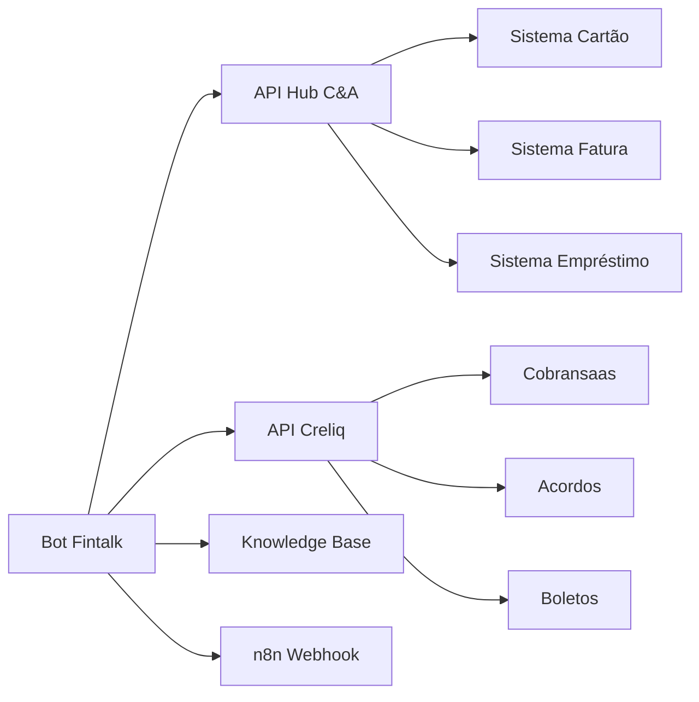
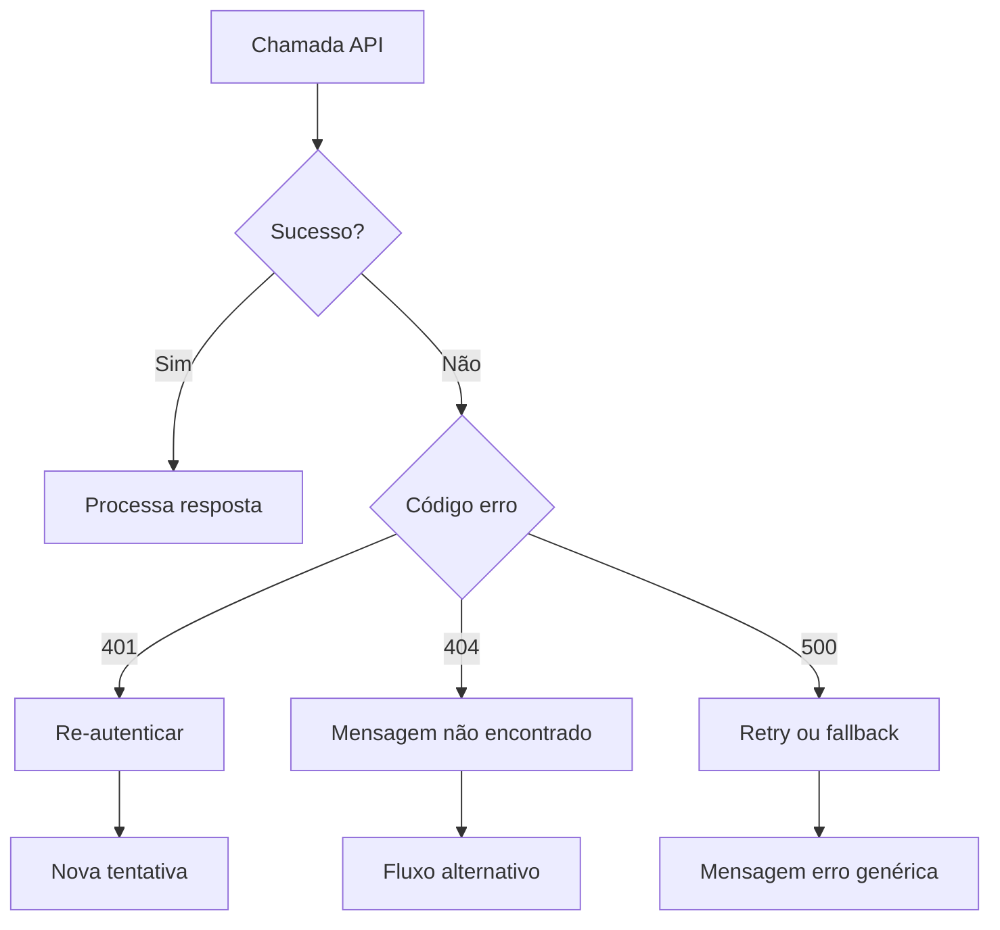

# APIs e Integrações do Bot C&A

## Visão Geral da Arquitetura



---

## Endpoints Base

| Variável | URL | Descrição |
| --- | --- | --- |
| `[[api-hub]]` | `https://api.cea.com.br/whatsapp-bff-rfs/v1/api` | API principal C&A |
| `[[api-hub-creliq]]` | `https://api-hub.fintalk.io/ceapay/cobransaas` | API C&A Pay |
| `[[av-api]]` | `https://proxy-cea-ura.fintalk.io/prd` | Proxy URA |

---

## Catálogo de APIs

### 1. APIs de Autenticação

#### POST `/autorizacao`
Inicia processo de autenticação e envia código SMS.

**Parâmetros:**
```json
{
  "cpf": "string - CPF do cliente",
  "celular": "string - Celular para SMS"
}
```

**Resposta:**
```json
{
  "success": true,
  "token": "string",
  "nome": "string",
  "celular": "string"
}
```

---

#### POST `/autorizacao/validar-codigo`
Valida código SMS informado pelo cliente.

**Parâmetros:**
```json
{
  "cpf": "string",
  "codigo": "string - Código SMS"
}
```

---

### 2. APIs de Cliente

#### GET `/cliente`
Retorna dados do cliente autenticado.

**Resposta:**
```json
{
  "nome": "string",
  "cpf": "string",
  "celular": "string",
  "email": "string",
  "dataNascimento": "string"
}
```

---

#### GET `/cliente/conta`
Retorna informações da conta do cartão.

**Query params:**
- `idStatusConta`: 0
- `statusConta`: Normal

**Resposta:**
```json
{
  "limiteTotal": 5000.00,
  "limiteDisponivel": 3500.00,
  "limiteUtilizado": 1500.00,
  "statusConta": "Normal"
}
```

---

#### GET `/cliente/creliq`
Verifica se cliente é do C&A Pay.

**Resposta:**
```json
{
  "isCreliq": true,
  "idCliente": "string"
}
```

---

#### GET `/cliente/pagamentos`
Lista pagamentos realizados pelo cliente.

---

#### GET `/cliente/atraso`
Verifica se cliente tem parcelas em atraso.

---

### 3. APIs de Fatura

#### GET `/faturas/ultima`
Retorna a última fatura do cliente.

**Resposta:**
```json
{
  "idFatura": "string",
  "valor": 250.00,
  "dataVencimento": "2024-01-15",
  "status": "ABERTA",
  "codigoBarras": "string"
}
```

---

#### GET `/faturas/ultima-pdf`
Gera PDF da última fatura.

**Resposta:**
```json
{
  "url": "string - URL do PDF"
}
```

---

#### GET `/faturas/contas/`
Lista faturas por conta.

---

#### GET `/faturas/dias/vencimento`
Lista dias disponíveis para vencimento.

**Resposta:**
```json
{
  "diasDisponiveis": [5, 10, 15, 20, 25],
  "diaAtual": 15
}
```

---

### 4. APIs de Compras e Parcelamento

#### GET `/compras/meses-anteriores`
Lista compras dos meses anteriores.

**Resposta:**
```json
{
  "compras": [
    {
      "idCompra": "string",
      "descricao": "string",
      "valor": 500.00,
      "parcelas": 3,
      "parcelaAtual": 1,
      "valorParcela": 166.67
    }
  ]
}
```

---

#### GET `/compras/planos-pagamentos`
Lista opções de parcelamento para compra.

---

#### GET `/v2/compras/planos-pagamentos`
Versão 2 - opções de parcelamento.

---

#### GET `/compras/${idCompra}`
Detalhes de uma compra específica.

---

#### PUT `/v2/compras/${idCompra}`
Altera parcelamento de uma compra.

---

### 5. APIs de Antecipação

#### GET `/antecipacao-parcelas/compras/antecipacao`
Lista parcelas disponíveis para antecipação.

**Resposta:**
```json
{
  "parcelas": [
    {
      "idParcela": "string",
      "numero": 3,
      "valor": 150.00,
      "valorComDesconto": 142.50,
      "desconto": 5
    }
  ]
}
```

---

#### POST `/antecipacao-parcelas/compras/${idCompra}`
Efetua antecipação de parcela.

---

### 6. APIs de Empréstimo

#### GET `/emprestimos-pessoal`
Verifica elegibilidade e condições de empréstimo.

**Resposta:**
```json
{
  "elegivel": true,
  "valorMaximo": 5000.00,
  "taxaJuros": 2.99,
  "parcelasDisponiveis": [1, 2, 3, 6, 12, 18, 24]
}
```

---

#### GET `/emprestimos-pessoal/compras/${idCompra}`
Detalhes de um empréstimo contratado.

---

### 7. APIs de Seguros

#### GET `/seguros`
Lista seguros do cliente.

**Resposta:**
```json
{
  "seguros": [
    {
      "idSeguro": "string",
      "nome": "Seguro Celular",
      "status": "ATIVO",
      "valorMensal": 19.90
    }
  ]
}
```

---

#### POST `/seguros`
Contrata novo seguro.

---

#### DELETE `/seguros/v2/cancelar/${idSeguro}`
Cancela um seguro.

---

### 8. APIs de Cartão

#### GET `/cartao/atual/status`
Retorna status do cartão.

**Resposta:**
```json
{
  "status": "ATIVO",
  "tipo": "CARTAO_CEA",
  "ultimosDigitos": "1234"
}
```

---

#### POST `/cartao/bloquear`
Bloqueia o cartão.

---

#### POST `/cartao/cancelar`
Cancela o cartão definitivamente.

---

### 9. APIs de Termo de Quitação

#### GET `/email/termo-quitacao/`
Envia termo de quitação por email.

**Query params:**
- `ano`: Ano do termo (2021, 2022, 2023)

---

## APIs C&A Pay (Creliq)

### Autenticação Creliq

#### POST `/oauth/token`
Autenticação OAuth para APIs Creliq.

**Query params:**
- `grant_type`: client_credentials

**Headers:**
- `Authorization`: Basic {credentials}

---

### Clientes

#### GET `/api/clientes`
Lista clientes Creliq.

---

#### GET `/api/clientes/${idCliente}`
Detalhes do cliente Creliq.

---

### Contratos

#### GET `/api/contratos`
Lista contratos do cliente.

**Resposta:**
```json
{
  "contratos": [
    {
      "idContrato": "string",
      "valorTotal": 1500.00,
      "parcelasAbertas": 5,
      "valorParcela": 300.00,
      "proximoVencimento": "2024-01-20"
    }
  ]
}
```

---

#### GET `/api/contratos/${idContrato}`
Detalhes de um contrato.

---

#### GET `/api/contratos/boletos/${idParcela}`
Gera boleto para parcela.

**Resposta:**
```json
{
  "codigoBarras": "string",
  "linhaDigitavel": "string",
  "valor": 300.00,
  "vencimento": "2024-01-20"
}
```

---

### Acordos e Negociações

#### GET `/api/negociacoes`
Verifica elegibilidade para acordo.

---

#### POST `/api/acordos/simular`
Simula condições de acordo.

**Parâmetros:**
```json
{
  "idContrato": "string",
  "parcelas": 6
}
```

**Resposta:**
```json
{
  "opcoes": [
    {
      "parcelas": 1,
      "valorParcela": 1200.00,
      "desconto": 20
    },
    {
      "parcelas": 3,
      "valorParcela": 450.00,
      "desconto": 10
    },
    {
      "parcelas": 6,
      "valorParcela": 250.00,
      "desconto": 0
    }
  ]
}
```

---

#### POST `/api/acordos/efetivar`
Efetiva acordo negociado.

**Parâmetros:**
```json
{
  "idContrato": "string",
  "parcelas": 3,
  "valorEntrada": 0
}
```

---

#### GET `/api/acordos`
Lista acordos do cliente.

---

### Tarefas

#### POST `/api/tarefas/manual`
Cria tarefa manual (contestação, etc).

**Parâmetros:**
```json
{
  "tipo": "CONTESTACAO",
  "descricao": "string",
  "idCliente": "string"
}
```

---

## APIs Externas

### Knowledge Base

#### POST `https://kb-prd.fintalk.io/questions`
Análise de intenção via Knowledge Base.

**Parâmetros:**
```json
{
  "question": "string - Mensagem do cliente",
  "botName": "cea-prd"
}
```

**Resposta:**
```json
{
  "intent": "segunda_via",
  "confidence": 0.95,
  "answer": "string"
}
```

---

### n8n Webhook

#### POST `https://n8n-prd-webhook.fintalk.io/webhook/fintalk/async`
Webhook para processamento assíncrono.

**Parâmetros:**
```json
{
  "action": "string",
  "data": {}
}
```

---

## Códigos de Resposta

| Código | Descrição |
| --- | --- |
| 200 | Sucesso |
| 400 | Parâmetros inválidos |
| 401 | Não autenticado |
| 403 | Não autorizado |
| 404 | Recurso não encontrado |
| 500 | Erro interno |

---

## Headers Comuns

| Header | Valor | Descrição |
| --- | --- | --- |
| `Authorization` | Bearer {token} | Token de autenticação |
| `Content-Type` | application/json | Tipo de conteúdo |
| `X-Api-Key` | {api-key} | Chave da API |

---

## Tratamento de Erros



---

## Próximo: [06-entidades-variaveis.md](./06-entidades-variaveis.md)
