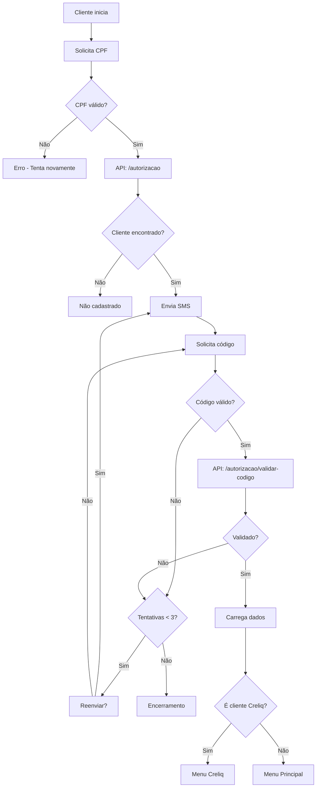
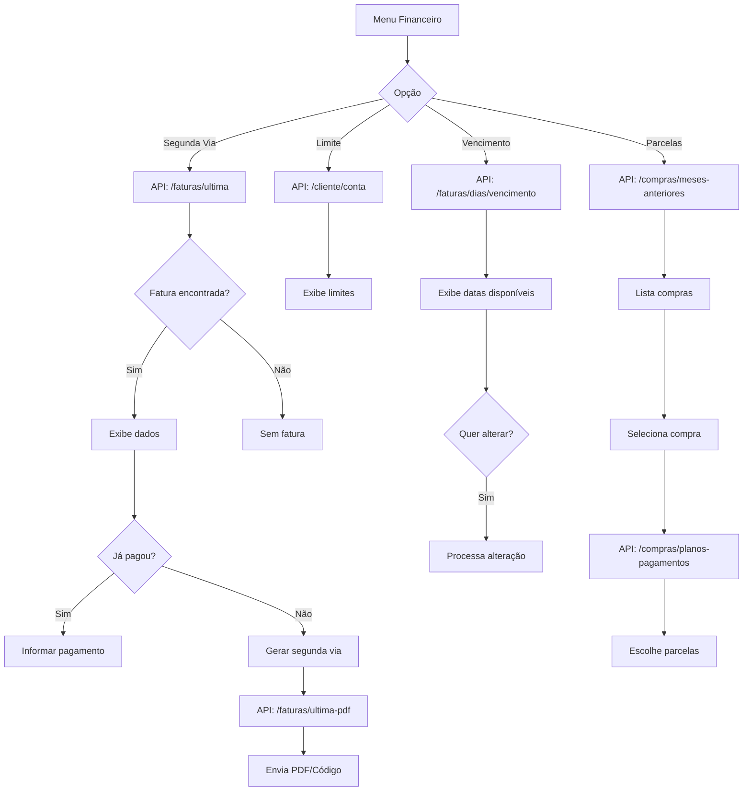
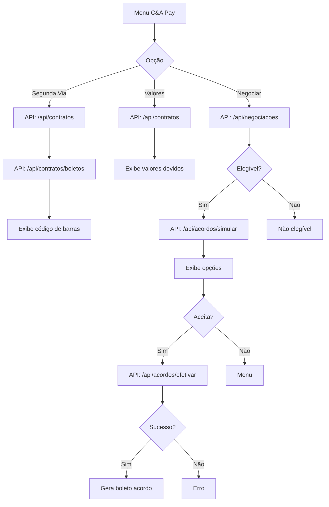
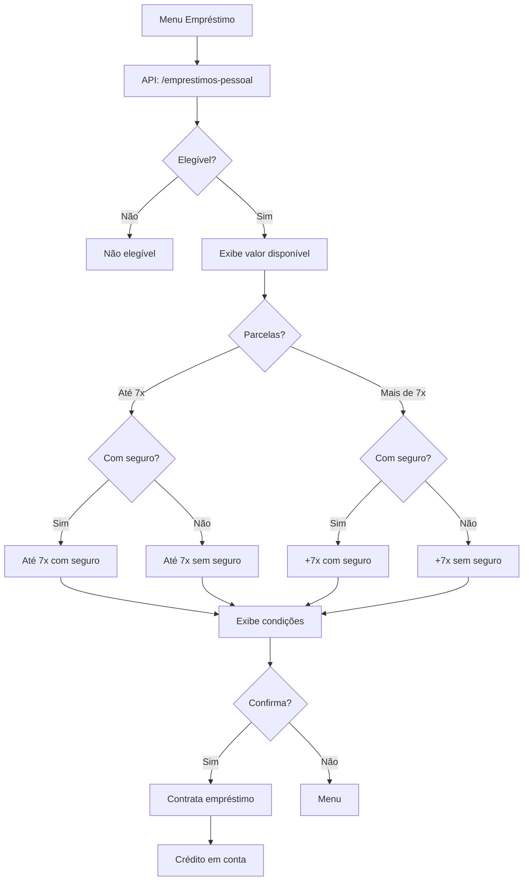
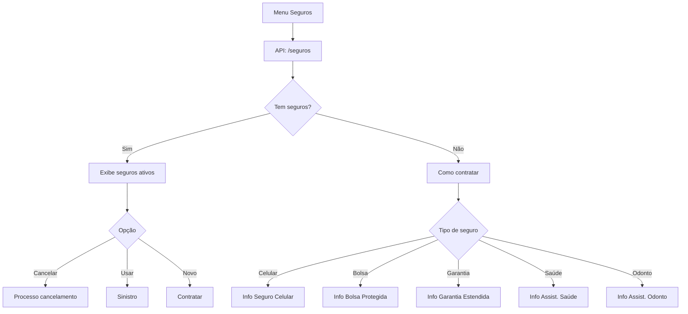

# Fluxograma Geral do Bot C&A

## Arquitetura Completa do Bot

```mermaid
flowchart TB
    subgraph ENTRADA["📥 ENTRADA"]
        P[principal]
        PRED[preditivo]
    end

    subgraph AUTH["🔐 AUTENTICAÇÃO"]
        A[autenticacao]
        AC[aut-pre-creliq]
    end

    subgraph MENU["📋 NAVEGAÇÃO"]
        M[menu]
        MC[menu-pre-creliq]
        PA[posso-ajudar]
        FB[fb-inteligente]
    end

    subgraph FINANCEIRO["💰 FINANCEIRO CARTÃO"]
        SV[segunda-via]
        DV[data-vencimento]
        AV[alterar-vencime]
        LD[lim-disponivel]
        TA[transacao-alt]
        TNA[trans-n-alterav]
        EP[escolhe-parcela]
        V2EP[v2-escolhe-parc]
        AP[antecipa-parcel]
        TQ[termo-quitacao]
        CI[cobranca-indevi]
    end

    subgraph CRELIQ["💳 C&A PAY"]
        VIA2[2-via-pre-creli]
        VC[valores-creliq]
        PC[pag-pre-creliq]
        PPC[prob-pag-creliq]
        IC[indevido-creliq]
        PFC[prob-fat-creliq]
        SC[seguro-creliq]
        IPC[inf-pag-creliq]
        PST[par-saldo-total]
    end

    subgraph EMPRESTIMO["💵 EMPRÉSTIMO"]
        EMP[emprestimo]
        E7CS[empr-ate7-c-seg]
        E7SS[empr-ate7-s-seg]
        EM7CS[empr-mai7-c-seg]
        EM7SS[empr-mai7-s-seg]
        SE[seguro-emprest]
    end

    subgraph SEGUROS["🛡️ SEGUROS"]
        SEG[seguros]
        SCEL[seguro-celular]
        BP[bolsa-protegida]
        GE[garantia-estend]
        PP[protecao-premia]
        PARP[parcela-premiad]
        PPF[parc-prem-facil]
        AS[assist-saude]
        AO[assist-odonto]
        BPA[bol-prot-assist]
    end

    subgraph CARTOES["💳 CARTÕES"]
        CAR[cartoes]
        PD[pedid-devoluc]
    end

    subgraph FAQ_NPS["❓ FAQ & NPS"]
        FAQ[faq]
        FAQF[faq-fatura]
        NPS[nps]
        NPSF[nps-fintalk]
        LGPD[lgpd]
    end

    subgraph OFERTAS["🎁 OFERTAS"]
        OPF[oft-prod-finan]
    end

    %% Fluxo de entrada
    P --> A
    PRED --> A

    %% Autenticação
    A --> M
    A --> AC
    AC --> MC

    %% Menu principal
    M --> SV
    M --> DV
    M --> LD
    M --> FB
    M --> PA

    %% Menu Creliq
    MC --> VIA2
    MC --> VC
    MC --> PC
    MC --> PPC

    %% Financeiro
    DV --> AV
    TA --> EP
    TA --> TNA
    TA --> V2EP

    %% Creliq
    PPC --> IC
    PPC --> PFC
    PPC --> SC
    VC --> VIA2
    VC --> PC

    %% Empréstimo
    M --> EMP
    EMP --> E7CS
    EMP --> E7SS
    EMP --> EM7CS
    EMP --> EM7SS
    E7CS --> SE

    %% Seguros
    M --> SEG
    FAQ --> SCEL
    FAQ --> BP
    FAQ --> GE
    FAQ --> PP
    FAQ --> AS
    FAQ --> AO

    %% Cartões
    M --> CAR

    %% Saídas
    SV --> PA
    LD --> PA
    SEG --> PA
    CAR --> PA
    EMP --> PA

    PA --> NPS
    PA --> OPF
    OPF --> NPS
```

---

## Fluxo de Autenticação

---

## Fluxo Financeiro - Cartão C&A

---

## Fluxo C&A Pay (Creliq)

---

## Fluxo de Empréstimo

---

## Fluxo de Seguros

---

## Legenda dos Fluxos

| Símbolo | Significado |
| --- | --- |
| 📥 | Ponto de entrada |
| 🔐 | Autenticação |
| 📋 | Menu/Navegação |
| 💰 | Financeiro Cartão |
| 💳 | C&A Pay (Creliq) |
| 💵 | Empréstimo |
| 🛡️ | Seguros |
| ❓ | FAQ e NPS |
| 🎁 | Ofertas |

---

## Estatísticas do Bot

| Métrica | Valor |
| --- | --- |
| Total de Fluxos | 52 |
| Total de Blocos | ~1.700 |
| APIs Integradas | 30+ |
| Entidades NLU | 10 |
| Tipos de Bloco | 10 |

### Distribuição por Tipo de Bloco

| Tipo | Quantidade |
| --- | --- |
| Logic | 252 |
| Message | 52 |
| Multiple | 40 |
| ToAnotherBlock | 31 |
| Question | 29 |
| AI123 | 9 |
| Advanced | 7 |
| ABTest | 3 |
| Bubble | 1 |
| Entry | 1 |

---

## Produtos Atendidos

### Cartão C&A
- Segunda via de fatura
- Alteração de vencimento
- Consulta de limite
- Parcelamento de compras
- Antecipação de parcelas
- Termo de quitação

### C&A Pay
- Consulta de valores
- Segunda via de boleto
- Negociação de dívidas
- Parcelamento de saldo

### Empréstimo Pessoal
- Simulação
- Contratação (1-24 parcelas)
- Com/sem seguro

### Seguros
- Seguro Celular
- Bolsa Protegida
- Garantia Estendida
- Proteção Premiada
- Parcela Premiada
- Assistência Saúde
- Assistência Odontológica

---

## Navegação

- [README.md](./README.md)
- [01-fluxos-principais.md](./01-fluxos-principais.md)
- [05-apis-integracoes.md](./05-apis-integracoes.md)
