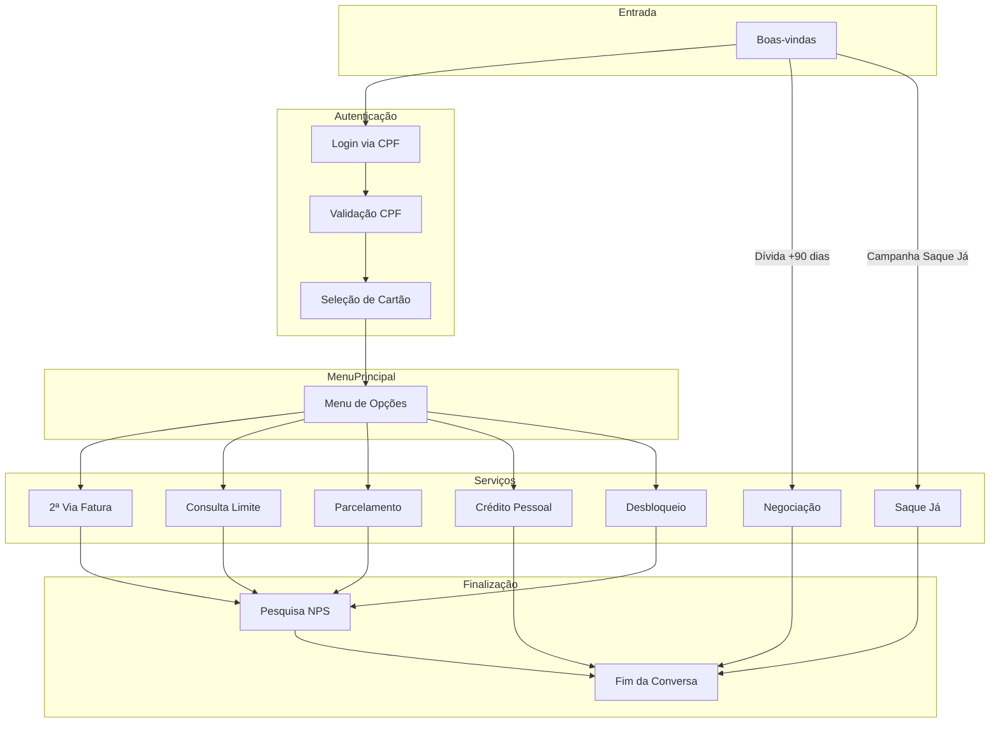
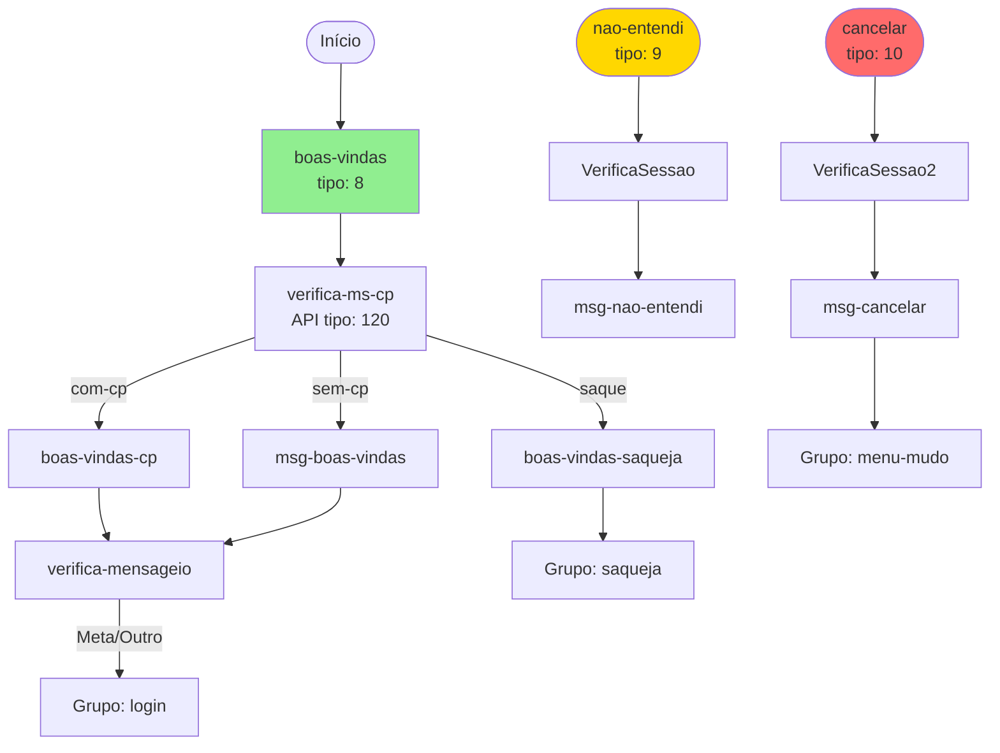
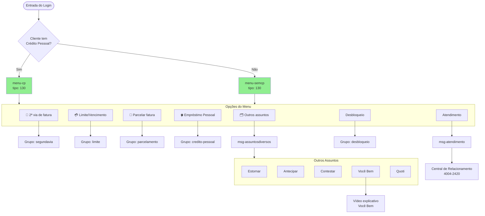
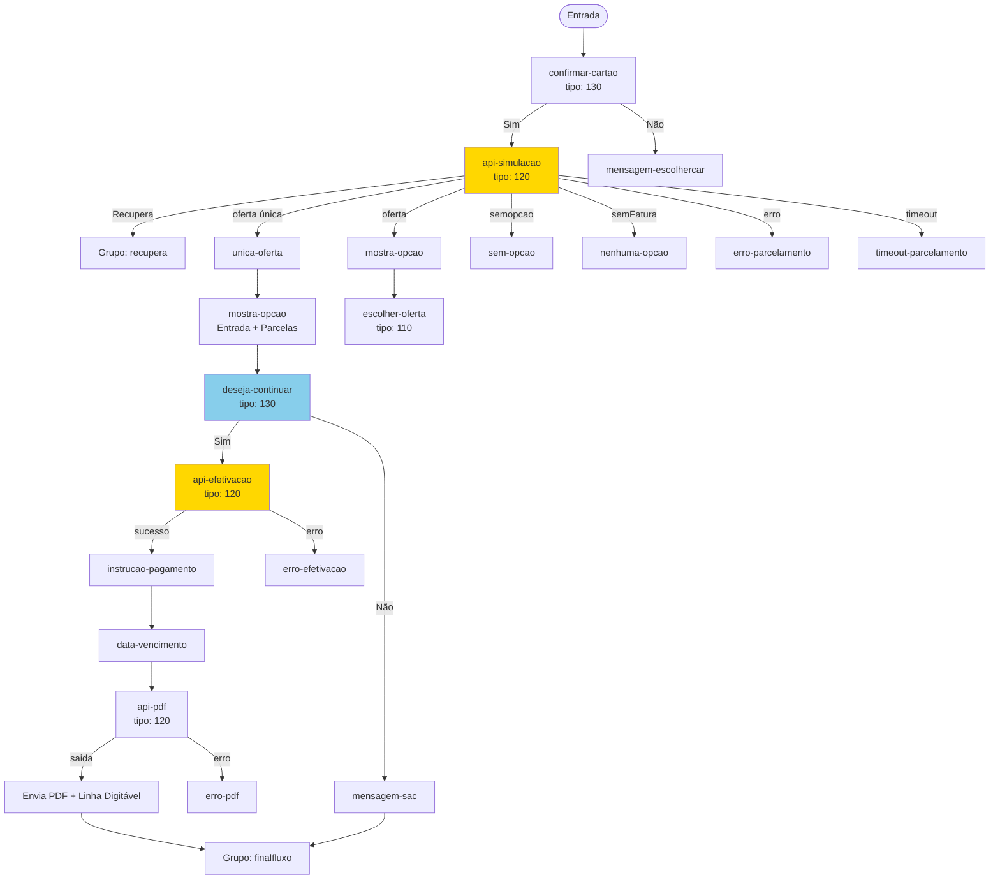
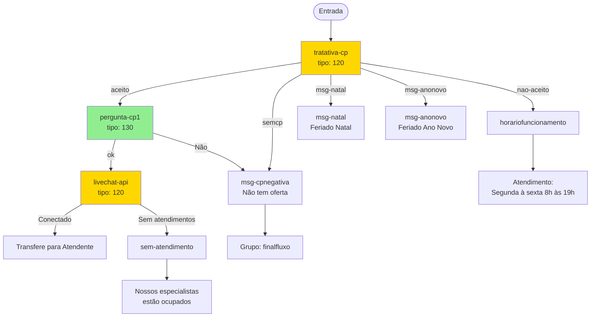
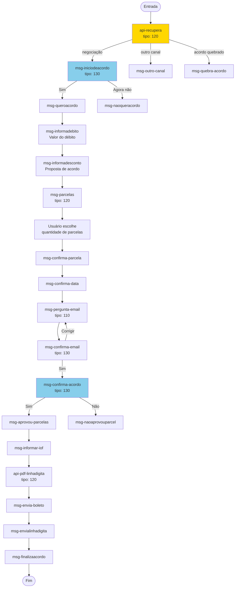
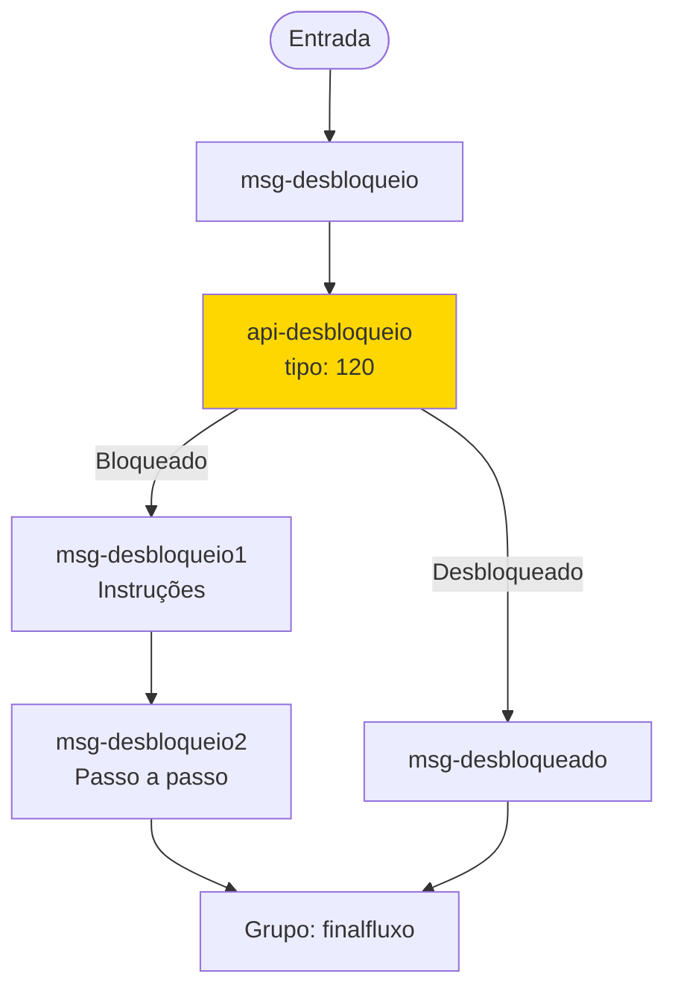
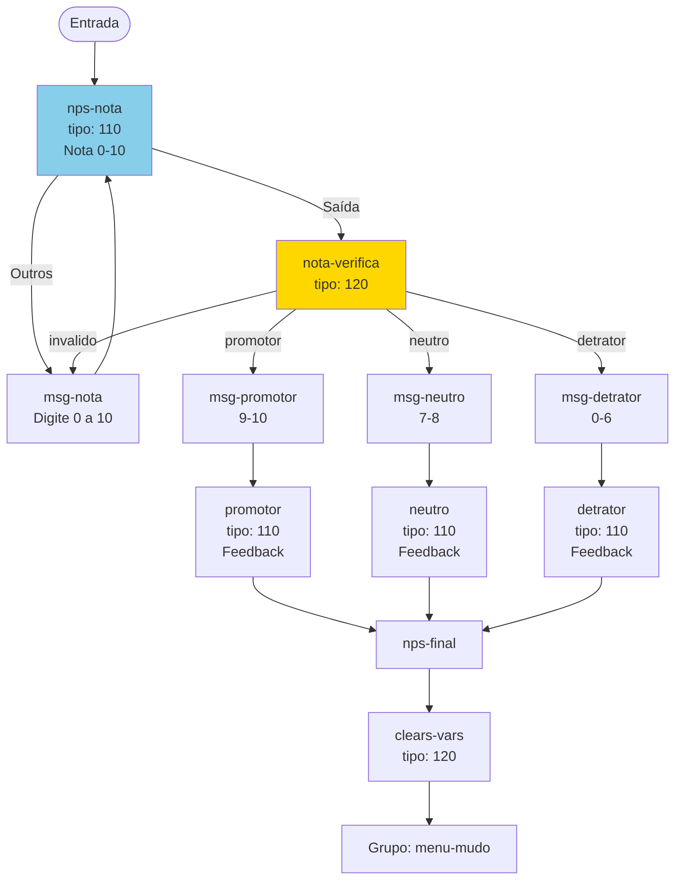
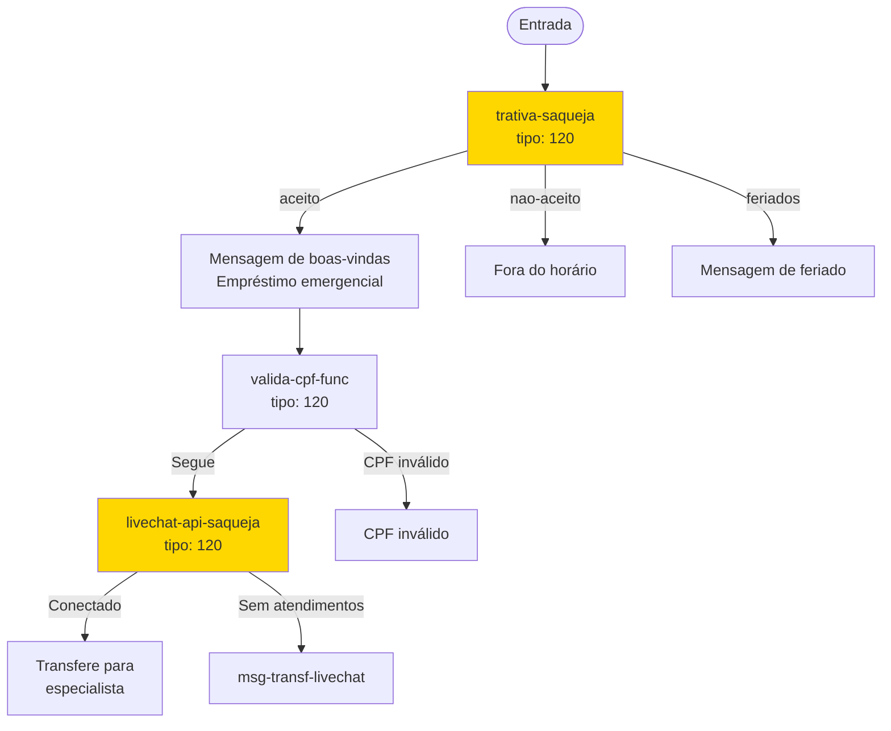

# Documentação do Bot Afinz - Assistente Virtual

## Visão Geral

O **Bot Afinz** (agent0059-prd) é um assistente virtual de atendimento ao cliente da empresa Afinz, uma fintech de serviços financeiros. O bot opera via WhatsApp e oferece autoatendimento para diversas funcionalidades relacionadas a cartão de crédito e empréstimo pessoal.

### Informações Técnicas
- **Nome do Bot**: agent0059-prd
- **Plataforma**: Fintalk
- **Canal Principal**: WhatsApp
- **Total de Grupos**: 21
- **Total de Blocos**: ~550
- **Entidades**: 14

---

## Arquitetura do Bot

### Tipos de Blocos

| Tipo | Nome | Descrição | Quantidade |
| --- | --- | --- | --- |
| 1 | Intent Diversa | Intents para reconhecimento de padrões diversos | 2 |
| 2 | Intent Resposta | Respostas automáticas a padrões reconhecidos | 9 |
| 7 | Enviar para Grupo | Redireciona para outro grupo de fluxo | 65 |
| 8 | Boas-vindas | Intent de início de conversa | 1 |
| 9 | Não Entendi (Fallback) | Tratamento quando não reconhece a mensagem | 1 |
| 10 | Cancelar | Intent de cancelamento de conversa | 1 |
| 100 | Mensagem | Envio de mensagem de texto | 190 |
| 110 | Pergunta/Input | Captura de dados do usuário | 15 |
| 120 | Chamada API/Script | Execução de lógica e chamadas externas | 201 |
| 130 | Menu/Carousel | Apresentação de opções ao usuário | 26 |
| 303 | Broadcast/Pesquisa | Envio de pesquisas e broadcasts | 26 |

### Entidades de Reconhecimento

| Entidade | Descrição | Exemplos |
| --- | --- | --- |
| `base-positiva` | Confirmações positivas | "sim" |
| `base-negativa` | Negações | "nao" |
| `cep-padrao` | Padrão de CEP | Regex para 8 dígitos |
| `xingamentos` | Palavras ofensivas | (filtro de moderação) |
| `bomdia`, `boatarde`, `boanoite` | Saudações | "bom dia", "boa tarde" |
| `ola` | Cumprimentos | "oi" |
| `segundavia` | Solicitação de 2ª via | "segunda-via" |
| `limite` | Consulta de limite | "limite" |
| `parcelamento` | Parcelamento de fatura | "parcelar" |
| `creditopessoal` | Empréstimo pessoal | "credito pessoal" |
| `desbloqueiocartao` | Desbloqueio | "desbloquear cartao" |

---

## Fluxo Geral do Bot


---

## Grupos e Fluxos

### 1. Principal (`principal`)
**Ponto de entrada do bot**



**Mensagens Principais:**
- **Boas-vindas**: "Olá! Sou o *Assistente Virtual da Afinz* e estou aqui para te ajudar. 😊"
- **Não entendi**: "Desculpa, não consegui entender. Pode repetir com outras palavras?"
- **Cancelar**: "Ok! Vou finalizar a nossa conversa por aqui, mas pode contar comigo sempre que precisar!"

---

### 2. Login (`login`)
**Autenticação do usuário via CPF**

```mermaid
flowchart TD
    Start([Entrada]) --> CPF[cpf<br/>Captura CPF<br/>tipo: 110]

    CPF -->|Saída| VerificaSessao[verifica-sessao-ccp2]
    CPF -->|Outros| VerificaSessao2[verifica-sessao-ccp2-copy-3]

    VerificaSessao --> ValidaCPF[valida-cpf-func<br/>tipo: 120]

    ValidaCPF -->|Segue| RefreshSessao[refresh-sessao-cpf]
    ValidaCPF -->|CPF inválido| MsgCPFInvalido[msg-cpfinvalido]
    ValidaCPF -->|CPF digitos dif| MsgCPFDigitos[msg-cpfdigitos]

    RefreshSessao --> TentativasAPI[tentativas-api]
    TentativasAPI --> APILogin[api-login<br/>tipo: 120]

    APILogin -->|OK| Saudacao[saudacao<br/>Oi, {{user.name}}!]
    APILogin -->|NúmeroDiferente| MsgProvisoria[msg-provisoria]
    APILogin -->|Timeout| TimeoutHandler[timeout]
    APILogin -->|Erro| ErrorHandler[error]

    Saudacao --> TratativaSaqueJa[tratativa-saqueja]
    TratativaSaqueJa -->|saqueJa| EnviaSaqueJa[Grupo: saqueja]
    TratativaSaqueJa -->|Saída| ValidaCPF2[valida-cpf]

    ValidaCPF2 -->|segue| VerificaCPDireto[verifica-cpdireto]
    ValidaCPF2 -->|escolhe-cartao| EscolherCartao[escolher-cartao]
    ValidaCPF2 -->|nenhum-cartao| ContasBloqueadas[contas-bloqueadas]

    VerificaCPDireto -->|cp-direto-sucesso| CPDireto[Grupo: cp-direto]
    VerificaCPDireto -->|segue| EscolheuCartao[escolheu-cartao]

    EscolheuCartao -->|com-cp| Menu[Grupo: menu]
    EscolheuCartao -->|sem-cp| MenuSemCP[Grupo: menu-semcp]
    EscolheuCartao -->|bloqueado| Bloqueio[Grupo: desbloqueio]

    MsgCPFInvalido --> CPF
    MsgCPFDigitos --> CPF

    TimeoutHandler -->|Tentar| TimeoutLogin[timeout-login]
    TimeoutHandler -->|Timeout| MsgErro[msg-errocpf]

    TimeoutLogin --> APILogin
    MsgErro --> ContadorFallback[contador-fallback]
    ContadorFallback -->|Não pergunta| MsgFinal[msg-final]
    ContadorFallback -->|Pergunta Mais| CPF

    style CPF fill:#87CEEB
    style APILogin fill:#FFD700
    style ValidaCPF fill:#FFD700
```

**Variáveis Capturadas:**
- `user.cpf` - CPF do usuário
- `user.name` - Nome do cliente
- `vars.firstName` - Primeiro nome
- `vars.cartao` - Final do cartão selecionado

---

### 3. Menu Principal (`menu`)
**Menu de opções para clientes autenticados**



**Opções Disponíveis:**
| Opção | Descrição | Destino |
| --- | --- | --- |
| 🧾 2ª via de fatura | Consulta e envio de boleto | Grupo `segundavia` |
| 💳 Limite/Vencimento | Informações do cartão | Grupo `limite` |
| 🤏 Parcelar fatura | Parcelamento de fatura | Grupo `parcelamento` |
| 🍀 Empréstimo Pessoal | Solicitação de CP | Grupo `credito-pessoal` |
| Atendimento | Encaminhamento para humano | LiveChat ou Central |
| Desbloqueio | Desbloqueio de cartão | Grupo `desbloqueio` |
| 🗂️ Outros assuntos | Submenu de opções | Estornar, Antecipar, etc. |

---

### 4. Segunda Via de Fatura (`segundavia`)
**Consulta e envio de 2ª via de boleto**

```mermaid
flowchart TD
    Start([Entrada]) --> Msg2Via[msg-2via<br/>Vou verificar a 2ª via...]
    Msg2Via --> APIConsultaFatura[api-consultafatura<br/>tipo: 120]

    APIConsultaFatura -->|escolhe-fatura| EscolheFatura[escolhe-fatura<br/>tipo: 110]
    APIConsultaFatura -->|sem-fatura| SemFatura[sem-fatura<br/>Não tem faturas]
    APIConsultaFatura -->|Timeout| TimeoutFatura[timeout-busca-fatura]
    APIConsultaFatura -->|erro| ErroFatura[erro-fatura]

    EscolheFatura --> VerificaPosicao[verifica-posicao<br/>tipo: 120]

    VerificaPosicao -->|atual| VerificaOpcao[verifica-opcao]
    VerificaPosicao -->|outras| VerificaOpcao

    VerificaOpcao -->|segue| VerificaValor[verifica-valor]
    VerificaOpcao -->|opcao-invalida| EscolheFatura

    VerificaValor -->|segue| APIFaturaPDF[api-faturapdf-copy-1<br/>tipo: 120]
    VerificaValor -->|valorzerado| ValorZerado[valor-zerado]

    APIFaturaPDF -->|fatura-nao-paga| MsgEntregaFatura[msg-entregafatura]
    APIFaturaPDF -->|fatura-paga| MsgFaturaPaga[msg-faturapaga]

    MsgEntregaFatura --> BuscaPDFBoleto[busca-pdf-boleto<br/>tipo: 120]

    BuscaPDFBoleto -->|saida| LinhaDigitavel[linha-digitavel]
    BuscaPDFBoleto -->|Timeout| TimeoutBoleto[timeout-busca-boleto]
    BuscaPDFBoleto -->|erro| ErroBoleto[erro-boleto]

    LinhaDigitavel --> CodigoBarras[codigo-barras<br/>{{vars.linhaDigitavel}}]
    CodigoBarras --> PerguntaOutraFatura[pergunta-outrafatura<br/>tipo: 130]

    PerguntaOutraFatura -->|Sim| EscolheFatura
    PerguntaOutraFatura -->|Não| FinalFluxo[Grupo: finalfluxo]

    TimeoutFatura --> APIConsultaFatura

    style APIConsultaFatura fill:#FFD700
    style BuscaPDFBoleto fill:#FFD700
    style PerguntaOutraFatura fill:#87CEEB
```

**Mensagens:**
- **Fatura atual**: "Prontinho! Aqui está a *2ª via da sua fatura*..."
- **Fatura paga**: "Identifiquei que a fatura do seu cartão com vencimento em... já foi paga!"
- **Sem fatura**: "Identifiquei que você não tem faturas disponíveis. 😃"

---

### 5. Parcelamento de Fatura (`parcelamento`)
**Parcelamento de faturas em atraso**



**Mensagem de Oferta:**
```
Entrada de *R$ {{vars.dadosParcelamento.ValorAdesao}}*
+ {{vars.dadosParcelamento.QtdParcelas}} parcelas de *R$ {{vars.dadosParcelamento.ValorParcela}}*
```

---

### 6. Crédito Pessoal (`credito-pessoal`)
**Solicitação de empréstimo pessoal**



**Horário de Funcionamento:**
- Segunda à sexta: 8h às 19h
- Feriados: Sem atendimento

---

### 7. Recuperação/Acordo (`recupera`)
**Negociação de dívidas em atraso (+90 dias)**



**Mensagem Inicial:**
```
*{{first_name}}*, verifiquei que você tem um débito com mais de 90 dias de atraso.
Que tal fazer um acordo agora?
```

---

### 8. Desbloqueio de Cartão (`desbloqueio`)
**Instruções para desbloqueio via App**



**Mensagem:**
```
O *desbloqueio* do seu cartão Afinz Visa é feito no nosso App de forma fácil e rápida!
Vou te ajudar! É só seguir as orientações abaixo. 😉
```

---

### 9. NPS - Pesquisa de Satisfação (`nps`)
**Coleta de feedback do cliente**



**Classificação NPS:**
| Nota | Classificação | Mensagem |
| --- | --- | --- |
| 9-10 | Promotor | "Uau, adorei!! Fico feliz em te ajudar! 😍" |
| 7-8 | Neutro | "Legal! Com a sua ajuda posso ficar ainda melhor. 😉" |
| 0-6 | Detrator | "Poxa, sinto muito que sua experiência não tenha sido positiva. 😔" |

---

### 10. Saque Já / Empréstimo Emergencial (`saqueja`)
**Fluxo específico para empréstimo emergencial**



---

## Integrações e APIs

### Endpoints Identificados

| Serviço | URL | Descrição |
| --- | --- | --- |
| Core Services PRD | `https://core-services.afinz.com.br` | Backend principal |
| Core Services DEV | `https://core-services-dev.afinz.com.br` | Ambiente de desenvolvimento |
| Fintalk Chat | `https://fintalkchat.abaionline.com.br` | LiveChat com atendentes |

### APIs por Funcionalidade

#### 1. Login e Autenticação
- **Bloco**: `api-login`
- **Saídas**: OK, NúmeroDiferente, Timeout, Erro
- **Variáveis retornadas**: `user.name`, `vars.firstName`, lista de cartões

#### 2. Validação de CPF
- **Bloco**: `valida-cpf`, `valida-cpf-func`
- **Saídas**: segue, escolhe-cartao, nenhum-cartao, nao-encontrou, timeout, erro
- **Função**: Valida CPF e retorna cartões vinculados

#### 3. Consulta de Fatura
- **Bloco**: `api-consultafatura`
- **Saídas**: escolhe-fatura, sem-fatura, Timeout, erro
- **Dados retornados**: Lista de faturas com valores e vencimentos

#### 4. Busca de PDF/Boleto
- **Saídas**: saida, Timeout, erro
- **Bloco**: `busca-pdf-boleto`, `api-faturapdf`
- **Dados retornados**: URL do PDF, linha digitável

#### 7. Recuperação de Dívidas
- **Bloco**: `api-simulacao`
- **Saídas**: Recupera, oferta proposta ativa, oferta única, oferta, semopcao, semFatura, erro, timeout
- **Dados retornados**: `vars.dadosParcelamento`, `vars.ofertasParcelamento`

#### 6. Efetivação de Parcelamento
- **Bloco**: `api-efetivacao`
- **Saídas**: sucesso, erro
- **Função**: Confirma o parcelamento selecionado

- **Bloco**: `api-recupera`
- **Saídas**: negociação, outro canal, acordo quebrado
- **Função**: Verifica status de negociação

#### 8. Notificações
#### 5. Simulação de Parcelamento
- **Bloco**: `notification`
- **Endpoint**: `/chat_bot/notification/request`
- **Função**: Envio de notificações push

#### 9. LiveChat
- **Saídas**: Conectado, Sem atendimentos
- **Bloco**: `livechat-api`, `livechat-api-saqueja`
- **URL**: `https://fintalkchat.abaionline.com.br`

---

## Variáveis Globais

### Variáveis de Usuário (`user.`)

| Variável | Tipo | Descrição |
| --- | --- | --- |
| `user.name` | String | Nome completo do cliente |
| `user.cpf` | String | CPF do cliente |
| `user.phone` | String | Telefone do cliente |

### Variáveis de Sessão (`vars.`)

| Variável | Tipo | Descrição |
| --- | --- | --- |
| `vars.firstName` | String | Primeiro nome do cliente |
| `vars.cartao` | String | Final do cartão selecionado (4 dígitos) |
| `vars.faturas` | Array | Lista de faturas disponíveis |
| `vars.linhaDigitavel` | String | Código de barras para pagamento |
| `vars.dadosParcelamento` | Object | Dados da simulação de parcelamento |
| `vars.ofertasParcelamento` | Array | Lista de ofertas de parcelamento |
| `vars.opcaoescolhida` | String | Opção de parcelamento escolhida |
| `vars.email` | String | E-mail do cliente (para acordos) |

---

## Informações de Contato

- **Central de Relacionamento**: 4004-2420
- **Site**: afinz.com.br/app
- **Link Cobrança**: https://bit.ly/AfinzCobranca

---

## Observações Técnicas

1. **Timeout Handling**: Todos os blocos de API possuem tratamento de timeout com retry automático
2. **Validação de CPF**: Utiliza função `isValidCPF()` para validação de dígitos
3. **Sessão**: Mantém sessão ativa com verificações periódicas (`verifica-sessao-*`)
4. **Horário de Atendimento**: Crédito Pessoal funciona apenas em dias úteis (8h-19h)
5. **Feriados**: Tratamento especial para Natal e Ano Novo
6. **NPS**: Pesquisa de satisfação ao final de cada fluxo

---

*Documentação gerada a partir do arquivo **`bot-afinz.json`*
*Última atualização: Janeiro 2026*
